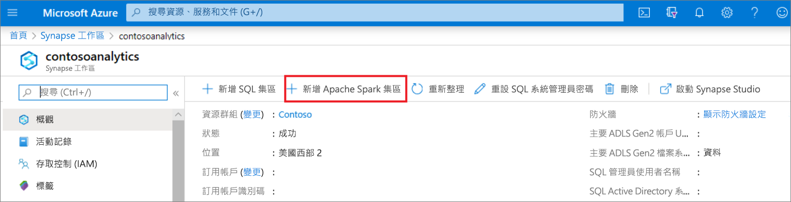
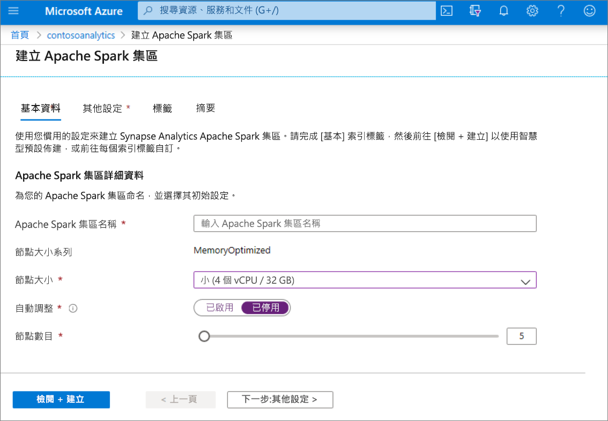
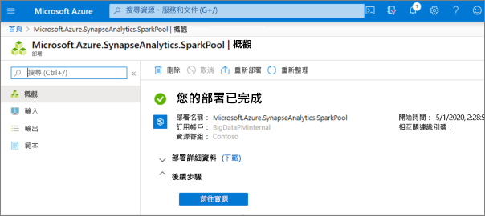
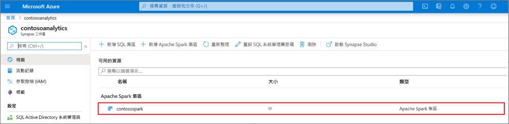
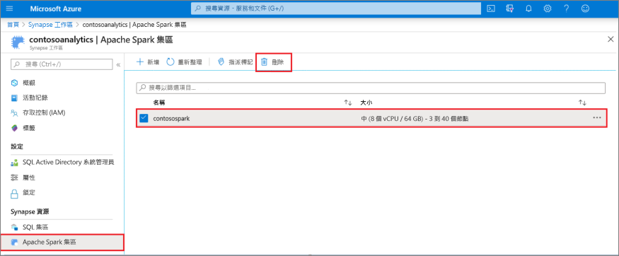
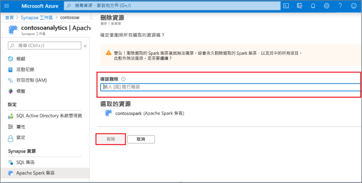

# 快速入門：使用 Azure 入口網站建立新的無伺服器 Apache Spark 集區

Azure Synapse Analytics 提供各種分析引擎，協助您內嵌、轉換、模型化、分析及散發您的資料。 Apache Spark 集區提供開放原始碼的巨量資料計算功能。 在 Synapse 工作區中建立 Apache Spark 集區後，就可以載入、模型化、處理及散發資料，以取得更快速的分析見解。

在本快速入門中，您會了解如何使用 Azure 入口網站在 Synapse 工作區中建立 Apache Spark 集區。

> [!IMPORTANT]
> 無論使用與否，Spark 執行個體都是按分鐘計費。 當您使用完 Spark 執行個體之後，請務必將其關閉，或設定短暫的逾時時間。 如需詳細資訊，請參閱本文的 **清除資源** 一節。

如果您沒有 Azure 訂用帳戶，請[在開始前建立免費帳戶](https://azure.microsoft.com/free/)。

## 必要條件

- Azure 訂用帳戶 - [建立免費帳戶](https://azure.microsoft.com/free/)
- [Synapse Analytics 工作區](quickstart-create-workspace.md)

## 登入 Azure 入口網站

登入 [Azure 入口網站](https://portal.azure.com/)

## 瀏覽至 Synapse 工作區 
1. 在搜尋列中輸入服務名稱 (或直接輸入資源名稱)，瀏覽至要建立 Apache Spark 集區的 Synapse 工作區。

1. 從工作區清單中，輸入要開啟之工作區的名稱 (或名稱的一部分)。 在此範例中，我們將使用名為 **contosoanalytics** 的工作區。

## 建立新的 Apache Spark 集區

1. 在您要建立 Apache Spark 集區的 Synapse 工作區中，選取 [新增 Apache Spark 集區]。
    
2. 在 [基本] 索引標籤中輸入下列詳細資料：

    |設定 | 建議的值 | 描述 |
    | :------ | :-------------- | :---------- |
    | **Apache Spark 集區名稱** | 有效的集區名稱 | 這是 Apache Spark 集區將擁有的名稱。 |
    | **節點大小** | 小 (4 個虛擬 CPU/32 GB) | 將此設為最小的大小，以降低本快速入門的成本 |
    | **Autoscale** | 已停用 | 本快速入門不需要自動調整 |
    | **節點數目** | 5 | 本快速入門使用小型大小來限制成本 |

    
    > [!IMPORTANT]
    > 請注意，Apache Spark 集區可以使用的名稱有特定限制。 名稱只可包含字母或數字，字元數必須為 15 或更少，且必須以字母開頭，不能包含保留字組，而且名稱在工作區中必須是唯一的。

3. 選取 [下一步：其他設定] 並檢閱預設設定。 請勿修改任何預設設定。
    ![顯示「建立 Apache Spark 集區」頁面的螢幕擷取畫面，其中已選取 [其他設定] 索引標籤。](media/quickstart-create-apache-spark-pool/create-spark-pool-portal-03.png)

4. 選取 [下一步：標記]。 請勿新增任何標籤。
    ![Apache Spark 集區建立流程 - [其他設定] 索引標籤。](media/quickstart-create-apache-spark-pool/create-spark-pool-03-tags.png)

5. 選取 [檢閱 + 建立]。

6. 請根據先前輸入的內容確定詳細資料正確無誤，然後選取 [建立]。
    ![Apache Spark 集區建立流程 - [檢閱設定] 索引標籤。](media/quickstart-create-apache-spark-pool/create-spark-pool-portal-05.png)

7. 此時，資源佈建流程將會啟動，並在完成後提供指示。
    

8. 佈建完成之後，瀏覽回工作區時會顯示新建立的 Apache Spark 集區項目。
    

9. 此時，沒有正在執行中的資源，Spark 不會產生費用，您已建立想建立的 Spark 執行個體中繼資料。

## 清除資源

請遵循下列步驟，從工作區中刪除 Apache Spark 集區。
> [!WARNING]
> 刪除 Apache Spark 集區將會從工作區移除分析引擎， 表示引擎無法再連線到集區，且使用此 Apache Spark 集區的所有查詢、管線和筆記本將無法再使用。

若確定要刪除 Apache Spark 集區，請執行下列動作：

1. 瀏覽至工作區中的 Apache Spark 集區刀鋒視窗。
2. 選取要刪除的 Apache Spark 集區 (在此案例中為 **contosospark**)。
3. 按下 [刪除]。
 
4. 確認刪除，然後按 [刪除] 按鈕。
 
5. 當流程成功完成時，Apache Spark 集區就不會再列入工作區資源中。

## 後續步驟

- 請參閱[快速入門：建立 Apache Spark 筆記本](quickstart-apache-spark-notebook.md)。
- 請參閱[快速入門：使用 Azure 入口網站建立專用的 SQL 集區](quickstart-create-sql-pool-portal.md)。
