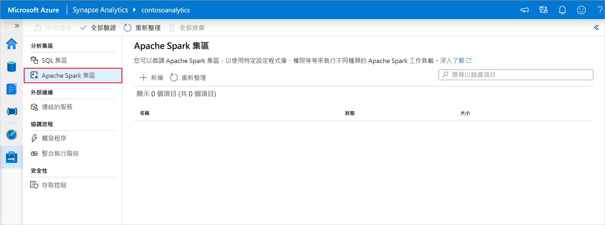
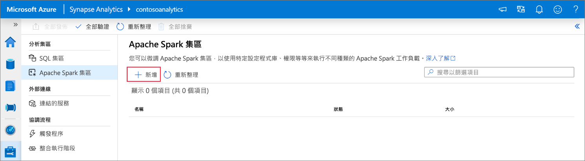
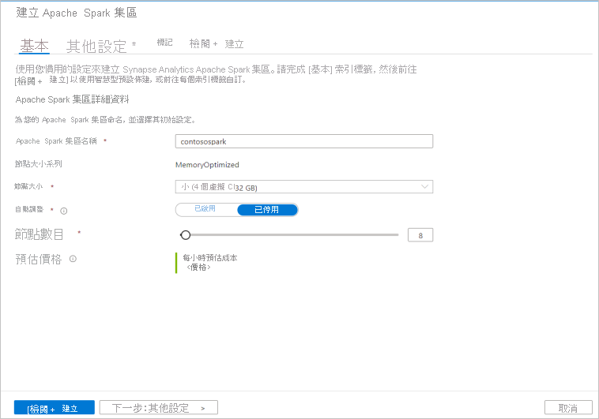
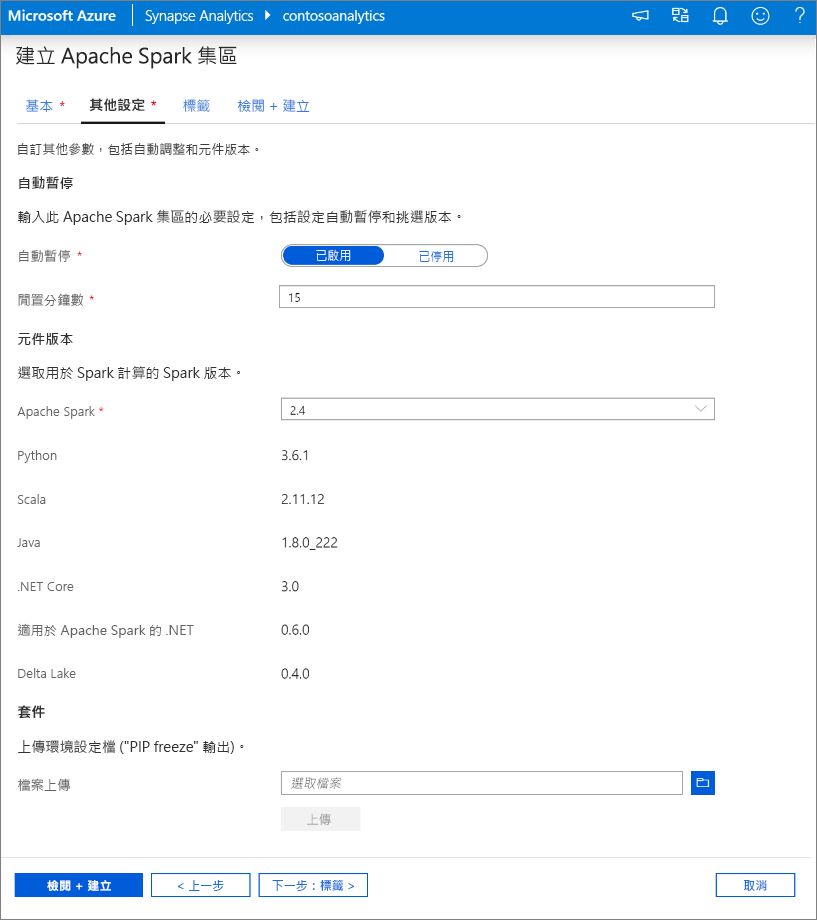
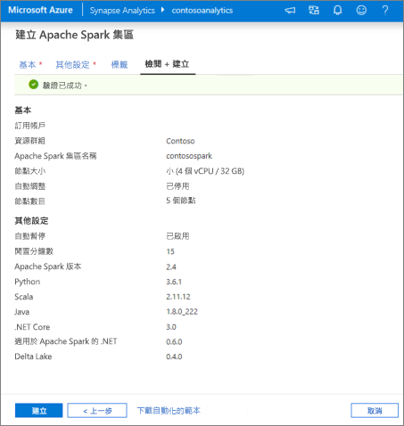
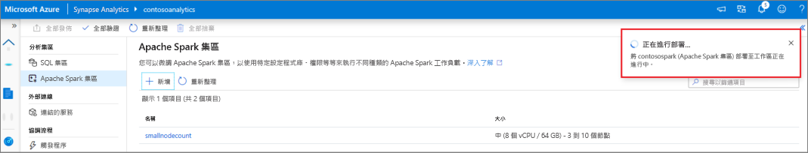
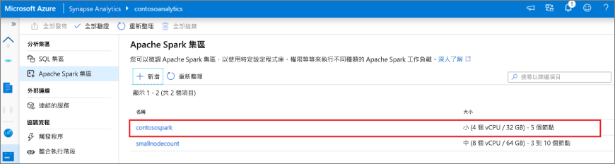
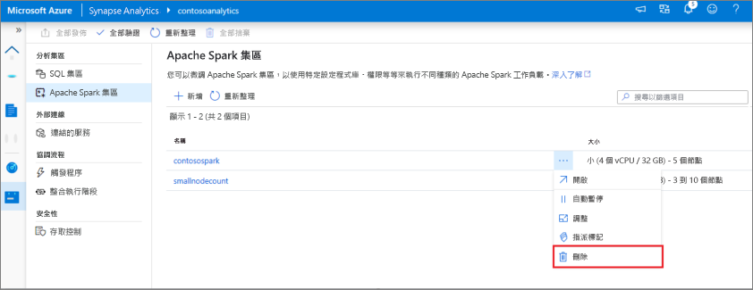
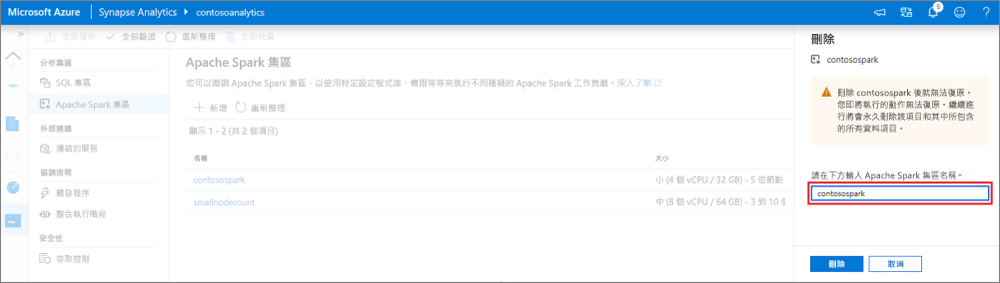

# 快速入門：使用 Synapse Studio 建立 Apache Spark 集區 (預覽)

Azure Synapse Analytics 提供各種分析引擎，協助您內嵌、轉換、模型化、分析及處理您的資料。 Apache Spark 集區提供開放原始碼的巨量資料計算功能。 在 Synapse 工作區中建立 Apache Spark 集區後，就可以載入、模型化、處理和提供資料，以取得深入解析。  

本快速入門說明使用 Synapse Studio 在 Synapse 工作區中建立 Azure Synapse 集區的步驟。

> [!IMPORTANT]
> 無論使用與否，Spark 執行個體都是按分鐘計費。 當您使用完 Spark 執行個體之後，請務必將其關閉，或設定短暫的逾時時間。 如需詳細資訊，請參閱本文的**清除資源**一節。

如果您沒有 Azure 訂用帳戶，請[在開始前建立免費帳戶](https://azure.microsoft.com/free/)。

## 必要條件

- Azure 訂用帳戶 - [建立免費帳戶](https://azure.microsoft.com/free/)
- [Synapse 工作區](./quickstart-create-workspace.md)

## 登入 Azure 入口網站

登入 [Azure 入口網站](https://portal.azure.com/)

## 瀏覽至 Synapse 工作區

1. 在搜尋列中輸入服務名稱 (或直接輸入資源名稱)，瀏覽至要建立 Apache Spark 集區的 Synapse 工作區。

1. 從工作區清單中，輸入要開啟之工作區的名稱 (或名稱的一部分)。 在此範例中，我們將使用名為 **contosoanalytics** 的工作區。

## 啟動 Synapse Studio 

1. 從工作區總覽中，選取 [啟動 Synapse Studio]，以開啟將建立 Apache Spark 集區的位置。 直接在搜尋列中輸入服務名稱或資源名稱。
![已反白顯示 [啟動 Synapse Studio] 的 Azure 入口網站 Synapse 工作區總覽。](media/quickstart-create-apache-spark-pool/create-spark-pool-studio-20.png)

## 在 Synapse Studio 中建立 Apache Spark 集區

1. 在 Synapse Studio 首頁上，選取 [管理] 圖示，以瀏覽至左側導覽中的 [管理中樞]。
![已反白顯示 [管理中樞] 區段的 Synapse Studio 首頁。](media/quickstart-create-apache-spark-pool/create-spark-pool-studio-21.png)

1. 進入管理中樞後，請瀏覽至 [Apache Spark 集區] 區段，以查看工作區中目前可用的 Apache Spark 集區清單。

1. 選取 [+ 新增]，隨即顯示新的 Apache Spark 集區建立精靈。 

1. 在 [基本資料] 索引標籤中輸入下列詳細資料：

    | 設定 | 建議的值 | 描述 |
    | :------ | :-------------- | :---------- |
    | **Apache Spark 集區名稱** | contosospark | 這是 Apache Spark 集區將擁有的名稱。 |
    | **節點大小** | 小 (4 個虛擬 CPU/32 GB) | 將此設為最小的大小，以降低本快速入門的成本 |
    | **Autoscale** | 已停用 | 在本快速入門中，我們不需要自動調整 |
    | **節點數目** | 8 | 在本快速入門中，使用小型大小來限制成本|
    
    
    > [!IMPORTANT]
    > 請注意，Apache Spark 集區可以使用的名稱有特定限制。 名稱只可包含字母或數字，字元數必須為 15 或更少，且必須以字母開頭，不能包含保留字組，而且名稱在工作區中必須是唯一的。

1. 在下一個索引標籤 ([其他設定]) 中，保留所有預設值，然後按 [檢閱 + 建立] (我們不會新增任何標籤)。
 

1. 我們目前不會新增任何標籤，因此請選取 [檢閱 + 建立]。

1. 在 [檢閱 + 建立] 索引標籤中，請根據先前輸入的內容確定詳細資料正確無誤，然後按 [建立]。 
 

1. Apache Spark 集區將會開始佈建程序。

1. 佈建完成後，新的 Apache Spark 集區會出現在清單中。

## 使用 Synapse Studio 清理 Apache Spark 集區資源

請遵循下列步驟，使用 Synapse Studio 從工作區中刪除 Apache Spark 集區。
> [!WARNING]
> 刪除 Spark 集區將會從工作區移除分析引擎。 引擎無法再連線到集區，且使用此 Spark 集區的所有查詢、管線和筆記本將無法再使用。

若確定要刪除 Apache Spark 集區，請執行下列動作：

1. 在 Synapse Studio 中，瀏覽至管理中樞內的 Apache Spark 集區。
1. 選取要刪除之 Apache 集區旁的省略號 (在此案例中為 **contosospark**)，以顯示 Apache Spark 集區的命令。

1. 按下 [刪除]。
1. 確認刪除，然後按 [刪除] 按鈕。
 
1. 當流程成功完成時，Apache Spark 集區就不會再列入工作區資源中。 

## 後續步驟

- 請參閱[快速入門：使用 Web 工具在 Synapse Studio 中建立 Apache Spark 集區](quickstart-apache-spark-notebook.md)。
- 請參閱[快速入門：使用 Azure 入口網站建立 Apache Spark 集區](quickstart-create-apache-spark-pool-portal.md)。
