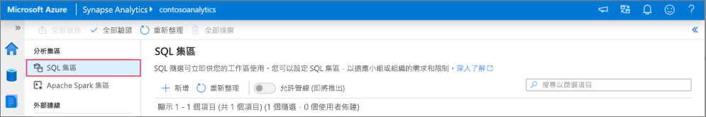
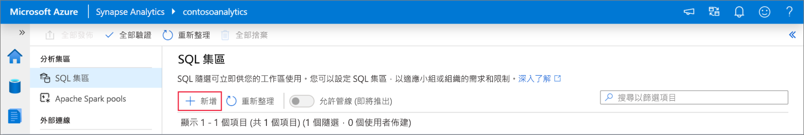
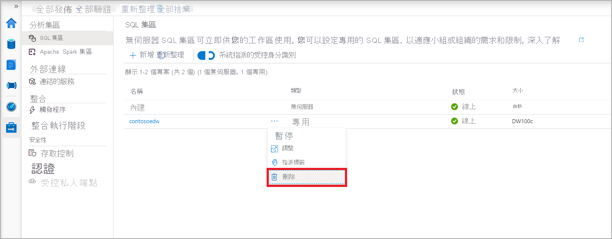
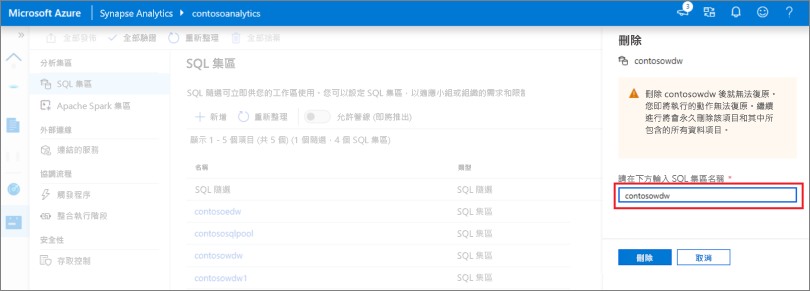

# 快速入門：使用 Synapse Studio 建立 Synapse SQL 集區 (預覽)

Azure Synapse Analytics 提供各種分析引擎，協助您內嵌、轉換、模型化及分析您的資料。 SQL 集區提供以 T-SQL 為基礎的計算和儲存功能。 在 Synapse 工作區中建立 SQL 集區後，就可以載入、模型化、處理及提供資料，以提供更快速的分析見解。

本快速入門說明使用 Synapse Studio 在 Synapse 工作區中建立 SQL 集區的步驟。

如果您沒有 Azure 訂用帳戶，[請在開始前建立免費帳戶](https://azure.microsoft.com/free/)。

## Prerequisites

- Azure 訂用帳戶 - [建立免費帳戶](https://azure.microsoft.com/free/)
- [Synapse 工作區](quickstart-create-workspace.md)

## 登入 Azure 入口網站

登入 [Azure 入口網站](https://portal.azure.com/)

## 瀏覽至 Synapse 工作區

1. 在搜尋列中輸入服務名稱 (或直接輸入資源名稱)，瀏覽至要建立 SQL 集區的 Synapse 工作區。

1. 從工作區清單中，輸入要開啟之工作區的名稱 (或名稱的一部分)。 在此範例中，我們將使用名為 **contosoanalytics** 的工作區。

## 啟動 Synapse Studio

1. 從工作區總覽中，選取 [啟動 Synapse Studio]，以開啟將建立 SQL 集區的位置。 直接在搜尋列中輸入服務名稱或資源名稱。
![已反白顯示 [啟動 Synapse Studio] 的 Azure 入口網站 Synapse 工作區總覽。](media/quickstart-create-apache-spark-pool/create-spark-pool-studio-20.png)

## 在 Synapse Studio 中建立 SQL 集區

1. 在 Synapse Studio 首頁上，選取 [管理] 圖示，以瀏覽至左側導覽中的 [管理中樞]。
![已反白顯示 [管理中樞] 區段的 Synapse Studio 首頁。](media/quickstart-create-apache-spark-pool/create-spark-pool-studio-21.png)

1. 進入管理中樞後，請瀏覽至 [SQL 集區] 區段，以查看工作區中目前可用的 SQL 集區清單。

1. 選取 [+ 新增] 命令，隨即顯示新的 SQL 集區建立精靈。 

1. 在 [基本資料] 索引標籤中輸入下列詳細資料：

    | 設定 | 建議的值 | 描述 |
    | :------ | :-------------- | :---------- |
    | **SQL 集區名稱** | contosoedw | 這是 SQL 集區將擁有的名稱。 |
    | **效能等級** | DW100c | 將此設為最小的大小，以降低本快速入門的成本 |

    ![SQL 集區建立流程 - [基本資料] 索引標籤。](media/quickstart-create-sql-pool/create-sql-pool-studio-24.png)
    > [!IMPORTANT]
    > 請注意，SQL 集區可以使用的名稱有特定限制。 名稱不能包含特殊字元、必須是 15 個或更少的字元、不能包含保留字，而且必須是工作區中唯一的名稱。

4. 在下一個索引標籤中的 [其他設定]，選取 [無] 以佈建沒有資料的 SQL 集區。 保留選取的預設定序。
![SQL 集區建立流程 - [其他設定] 索引標籤。](media/quickstart-create-sql-pool/create-sql-pool-studio-25.png)

1. 我們目前不會新增任何標籤，因此請選取 [下一步：檢閱 + 建立]。

1. 在 [檢閱 + 建立] 索引標籤中，請根據先前輸入的內容確定詳細資料正確無誤，然後按 [建立]。 
![SQL 集區建立流程 - [檢閱設定] 索引標籤。](media/quickstart-create-sql-pool/create-sql-pool-studio-26.png)

1. 此時，資源佈建流程將會啟動。

1. 佈建完成之後，瀏覽回工作區時會顯示新建立的 SQL 集區項目。
 

1. 建立 SQL 集區之後，就可以在工作區中使用該集區來載入資料、處理資料流、從資料湖讀取等。

## 使用 Synapse Studio 清理 SQL 集區    

請遵循下列步驟，使用 Synapse Studio 從工作區中刪除 SQL 集區。
> [!WARNING]
> 刪除 SQL 集區將會從工作區移除分析引擎。 引擎無法再連線到集區，且使用此 SQL 集區的所有查詢、管線和指令碼將無法再使用。

若要刪除 SQL 集區，請執行下列動作：

1. 在 Synapse Studio 中，瀏覽至管理中樞內的 SQL 集區。
1. 選取要刪除之 SQL 集區中的省略號 (在此案例中為 **contosoedw**) 以顯示 SQL 集區的命令：
1. 按下 [刪除]。
1. 確認刪除，然後按 [刪除] 按鈕。
 
1. 當流程成功完成時，SQL 集區就不會再列入工作區資源中。

## 後續步驟 
- 請參閱[快速入門：建立 Apache Spark 筆記本](quickstart-apache-spark-notebook.md)。
- 請參閱[快速入門：使用 Azure 入口網站來建立 Synapse SQL 集區](quickstart-create-sql-pool-portal.md)。