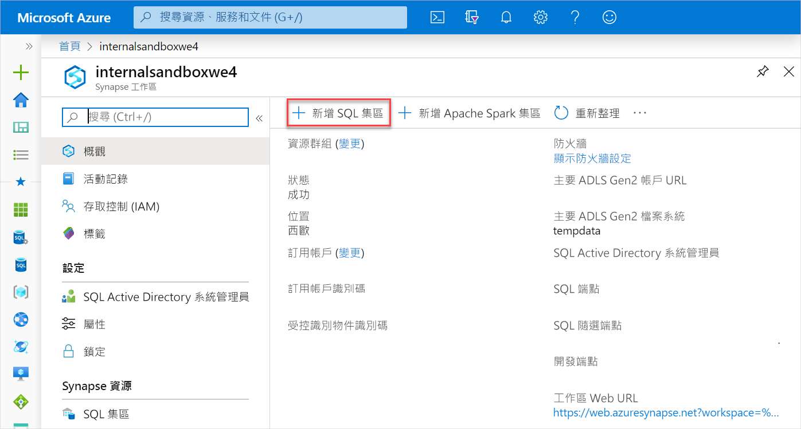
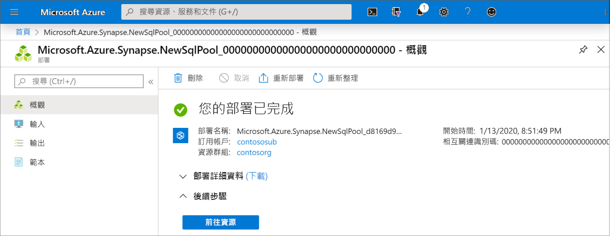

# 快速入門：建立 Synapse SQL 集區

Azure Synapse Analytics 提供各種分析引擎，協助您內嵌、轉換、塑造、分析和處理您的資料。 SQL 集區提供以 T-SQL 為基礎的計算和儲存功能。 在 Synapse 工作區中建立 Spark 集區後，就可以載入、模型化、處理和提供資料，以取得深入解析。

在本快速入門中，您會了解如何使用 Azure 入口網站在 Synapse 工作區中建立 SQL 集區。

如果您沒有 Azure 訂用帳戶，[請在開始前建立免費帳戶](https://azure.microsoft.com/free/)。

## Prerequisites

[Synapse 工作區](quickstart-create-workspace.md)

## 登入 Azure 入口網站

登入 [Azure 入口網站](https://portal.azure.com/)

## 建立新的 SQL 集區

1. 在您要建立 SQL 集區的 Synapse 工作區中，按一下頂端功能列中的 [新增 SQL 集區]  命令。

2. 在 [基本資料]  索引標籤中輸入下列詳細資料：

    | 設定 | 建議的值 | 描述 |
    | :------ | :-------------- | :---------- |
    | **SQL 集區名稱** | 任何有效名稱 | SQL 集區的名稱。 |
    | **效能等級** | DW100c | 設定為最小的大小，以降低本快速入門的成本 |
    ||||
  
    ![SQL 集區建立流程 - [基本資料] 索引標籤。](media/quickstart-create-sql-pool/quickstart-create-sql-pool-02.png)
    > [!IMPORTANT]
    > 請注意，SQL 集區可以使用的名稱有特定限制。 名稱不能包含特殊字元、必須是 15 個或更少的字元、不能包含保留字，而且必須是工作區中唯一的名稱。

3. 按一下 **[下一步**其他設定]。
4. 選取 [無]  以佈建不含資料的 SQL 集區。 保留選取預設定序。
![SQL 集區建立流程 - [其他設定] 索引標籤。](media/quickstart-create-sql-pool/quickstart-create-sql-pool-03.png)

5. 按一下 [檢閱 + 建立]  。
6. 請根據先前輸入的內容確定詳細資料正確無誤，然後按一下 [建立]  。
![SQL 集區建立流程 - [檢閱設定] 索引標籤。](media/quickstart-create-sql-pool/quickstart-create-sql-pool-04.png)

7. 此時，資源佈建流程將會啟動。
 

8. 佈建完成之後，瀏覽回工作區時會顯示新建立的 SQL 集區項目。
 

## 清除資源

請遵循下列步驟，從工作區中刪除 SQL 集區。
> [!WARNING]
> 從工作區刪除 SQL 集區會一併移除分析引擎及儲存在該集區資料庫中的資料。 表示引擎無法再連線到 SQL 集區，且讀取或寫入到此 SQL 集區的所有筆記本將無法再使用。

如果您想要刪除 SQL 集區，請完成下列步驟：

1. 瀏覽至工作區刀鋒視窗中的 SQL 集區刀鋒視窗
1. 選取要刪除的 SQL 集區 (在此案例中為 **contosoedw**)
1. 將其選取，然後按下 [刪除]  。
1. 確認刪除，然後按 [刪除]  按鈕。
 
1. 當流程成功完成時，SQL 集區就不會再列入工作區資源中。

建立 SQL 集區之後，就可以在工作區中用該集區來載入資料、處理資料流、從資料湖讀取等。

## 後續步驟

- 請參閱[快速入門：使用 Web 工具在 Synapse Studio 中建立 Apache Spark 集區](quickstart-apache-spark-notebook.md)。
- 請參閱[快速入門：使用 Azure 入口網站建立 Apache Spark 集區](quickstart-create-apache-spark-pool.md)。
