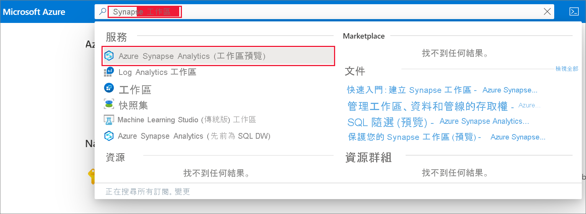
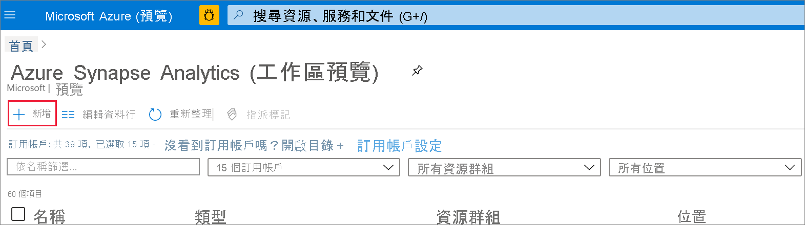
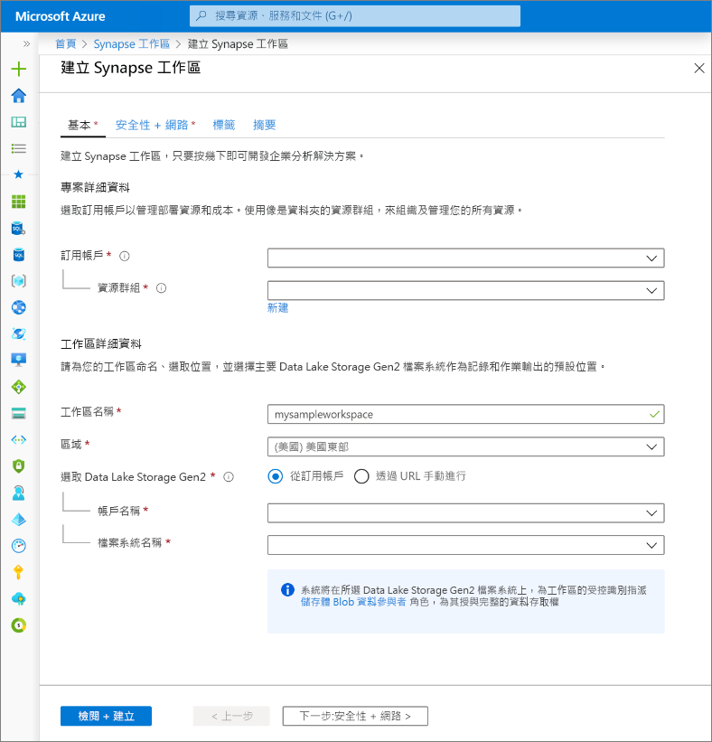
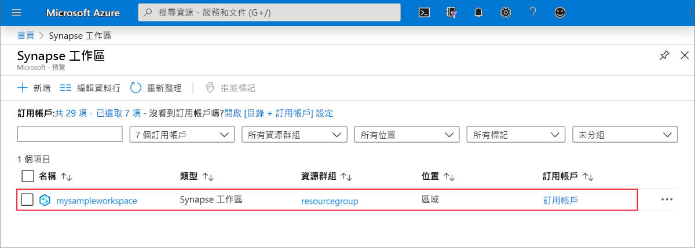
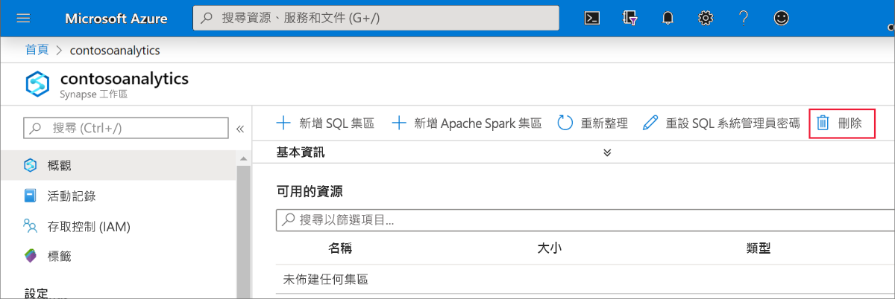
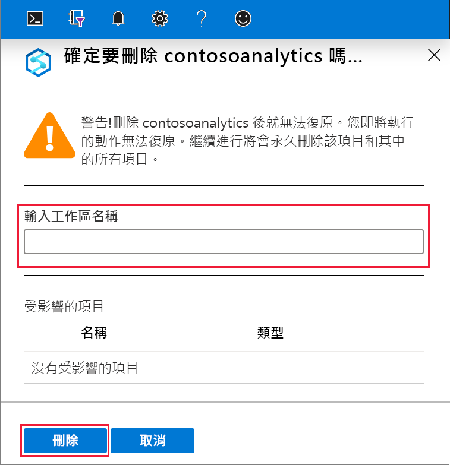

# 快速入門：建立 Azure Synapse Analytics 工作區 (預覽)

本快速入門說明如何使用 Azure 入口網站來建立 Azure Synapse 工作區。

如果您沒有 Azure 訂用帳戶，請[在開始前建立免費帳戶](https://azure.microsoft.com/free/)。

## 必要條件

- [Azure Data Lake Storage Gen2 儲存體帳戶](../storage/common/storage-account-create.md?toc=/azure/synapse-analytics/toc.json&bc=/azure/synapse-analytics/breadcrumb/toc.json)

## 登入 Azure 入口網站

登入 [Azure 入口網站](https://portal.azure.com/)

## 使用 Azure 入口網站建立 Azure Synapse 工作區

1. 在 [Microsoft Azure 搜尋] 窗格中，輸入 **Synapse 工作區**，然後選取此服務。

2. 在 [Synapse 工作區] 頁面上，按一下 [+ 新增]。

3. 在 **Azure Synapse 工作區**表單中填寫下列資訊︰

    | 設定 | 建議的值 | 描述 |
    | :------ | :-------------- | :---------- |
    | **訂用帳戶** | *您的訂用帳戶* | 如需訂用帳戶的詳細資訊，請參閱[訂用帳戶](https://account.windowsazure.com/Subscriptions)。 |
    | **資源群組** | *任何資源群組* | 如需有效的資源群組名稱，請參閱[命名規則和限制](/azure/architecture/best-practices/resource-naming?toc=/azure/synapse-analytics/toc.json&bc=/azure/synapse-analytics/breadcrumb/toc.json&view=azure-sqldw-latest)。 |
    | **工作區名稱** | mysampleworkspace | 指定工作區的名稱，此名稱也會用於連線端點。|
    | **區域** | 美國東部 2 | 指定工作區的位置。|
    | **Data Lake Storage Gen2** | 帳戶：`storage account name`   檔案系統：`root file system to use` | 指定要當作主要儲存體使用的 ADLS Gen2 儲存體帳戶名稱，以及要使用的檔案系統。|
    ||||

    

    您可以從下列選項選取儲存體帳戶：
    - 您的訂用帳戶中可用的 ADLS Gen2 帳戶清單
    - 使用帳戶名稱手動輸入

    > [!IMPORTANT]
    > Azure Synapse 工作區必須能夠讀取和寫入選取的 ADLS Gen2 帳戶。 此外，對於您連結為主要儲存體帳戶的任何儲存體帳戶，您必須已在建立儲存體帳戶時啟用 [階層式命名空間]。
    >
    > 在 ADLS Gen2 選項欄位下，會有注意事項說明系統將在所選 Data Lake Storage Gen2 檔案系統上，為工作區的受控識別指派**儲存體 Blob 資料參與者**角色，為其授與完整的資料存取權。

4. (選用) 修改任何**安全性 + 網路預設值**索引標籤：
5. (選用) 在 [標籤] 索引標籤中新增任何標籤。
6. [摘要] 索引標籤會執行必要的驗證，以確保可以成功建立工作區。 驗證成功之後，請按 [建立![工作區佈建流程 - 確認] 索引標籤。](media/quickstart-create-synapse-workspace/create-workspace-05.png)
7. 一旦資源佈建流程成功完成，您會在 Synapse 工作區清單中看到已建立工作區的項目。 

## 清除資源

請遵循下列步驟來刪除 Azure Synapse 工作區。
> [!WARNING]
> 刪除 Azure Synapse 工作區將會移除分析引擎和儲存在包含 SQL 集區和工作區繼資料之資料庫中的資料。 您無法再連線到 SQL 端點以及 Apache Spark 端點。 系統將刪除所有程式碼成品 (查詢、筆記本、作業定義和管線)。
>
> 刪除工作區**不會**影響連結到工作區之 Data Lake Store Gen2 中的資料。

如果想刪除 Azure Synapse 工作區，請完成下列步驟：

1. 瀏覽至要刪除的 Azure Synapse 工作區。
1. 在命令列中按 [刪除]。
 
1. 確認刪除，然後按 [刪除] 按鈕。
 
1. 當流程成功完成時，Azure Synapse 工作區就不會再列入工作區清單中。

## 後續步驟

接下來，您可以[建立 SQL 集區](quickstart-create-sql-pool-studio.md)或 [建立 Apache Spark 集區](quickstart-create-apache-spark-pool-studio.md)，以開始分析和探索您的資料。
