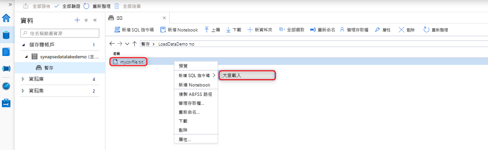
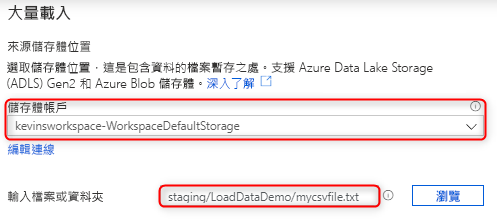
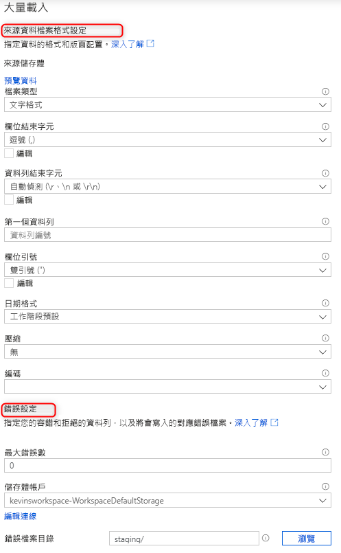
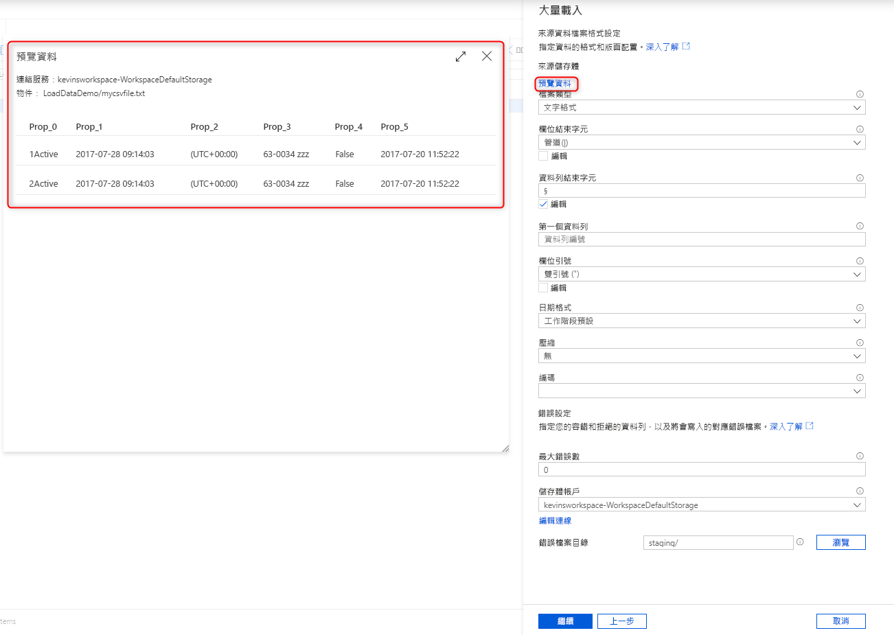
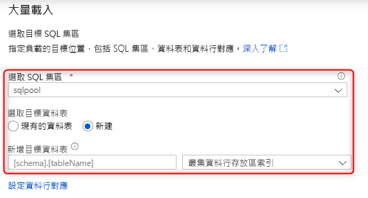
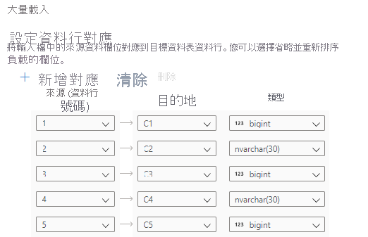
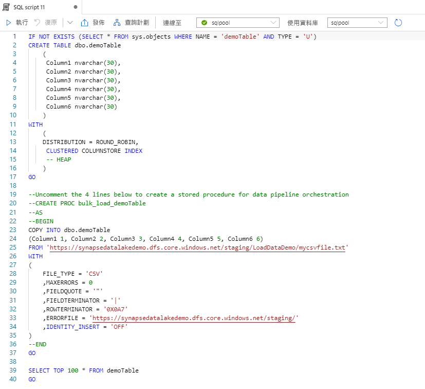

# 快速入門：使用 Synapse SQL 進行大量載入

在 Synapse Studio 中使用「大量載入」精靈時，載入資料的作業變得輕鬆無比。 此精靈會引導您使用 [COPY 陳述式](https://docs.microsoft.com/sql/t-sql/statements/copy-into-transact-sql?view=azure-sqldw-latest)來建立 T-SQL 指令碼，以大量載入資料。 

## 大量載入精靈的進入點

您現在只要在 Synapse Studio 內的下欄區域按一下滑鼠右鍵，即可使用 SQL 集區輕鬆地大量載入資料：

- 連結到工作區的 Azure 儲存體帳戶所擁有的檔案或資料夾 

## 必要條件

- 此精靈會產生使用 Azure AD 傳遞來進行驗證的 COPY 陳述式。 [Azure AD 使用者必須可存取](https://docs.microsoft.com/azure/synapse-analytics/sql-data-warehouse/quickstart-bulk-load-copy-tsql-examples#d-azure-active-directory-authentication-aad)至少具有 ADLS Gen2 帳戶儲存體 Blob 資料參與者 Azure 角色的工作區。

- 如果您要建立要作為載入目的地的新資料表，則必須擁有所需的 [COPY 陳述式使用權限](https://docs.microsoft.com/sql/t-sql/statements/copy-into-transact-sql?view=azure-sqldw-latest#permissions)和建立資料表權限。

- 與 ADLS Gen2 帳戶相關聯的連結服務**必須能夠存取所要載入的檔案**/**資料夾**。 例如，如果連結的服務驗證機制是受控識別，則工作區受控識別必須至少有儲存體帳戶的儲存體 Blob 讀者權限。

- 如果您的工作區已啟用 VNet，請確定與來源資料和錯誤檔案位置的 ADLS Gen2 帳戶連結服務相關聯的整合式執行階段已啟用互動式撰寫。 自動結構描述偵測、預覽來源檔案內容，以及在精靈內瀏覽 ADLS Gen2 儲存體帳戶，都需要互動式撰寫功能。

### 步驟

1. 從 [來源儲存位置] 面板中，選取儲存體帳戶和您要載入的檔案或資料夾：

2. 選取檔案格式設定，包括想要在其中寫入遭拒絕資料列 (錯誤檔案) 的儲存體帳戶。 目前僅支援 CSV 和 Parquet 檔案。

    

3. 您可以選取 [預覽資料] 來查看 COPY 陳述式會如何剖析檔案，以協助您設定檔案格式設定。 每當您變更檔案格式設定時，請選取 [預覽資料] 以查看 COPY 陳述式會如何使用更新後的設定來剖析檔案： 

4. 選取您要用來載入的 SQL 集區，包括載入的適用對象是現有資料表還是新資料表：

5. 選取 [設定資料行對應]，以確定您具有適當的資料行對應。 在新的資料表中，設定資料行對應對於更新目標資料行資料類型很重要：

6. 選取 [開啟指令碼] 就會產生 T-SQL 指令碼，其中包含要從資料湖載入的 COPY 陳述式：

## 後續步驟

- 如需 COPY 功能的詳細資訊，請參閱 [COPY 陳述式](https://docs.microsoft.com/sql/t-sql/statements/copy-into-transact-sql?view=azure-sqldw-latest#syntax)一文
- 參閱[資料載入概觀](https://docs.microsoft.com/azure/synapse-analytics/sql-data-warehouse/design-elt-data-loading#what-is-elt)一文
