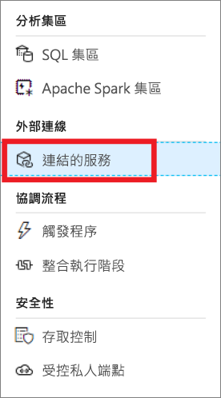
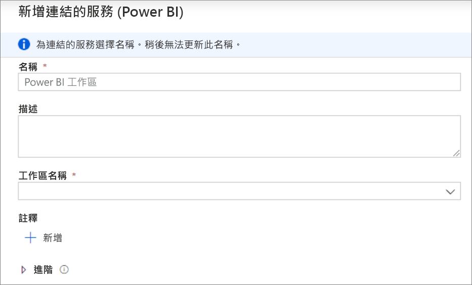
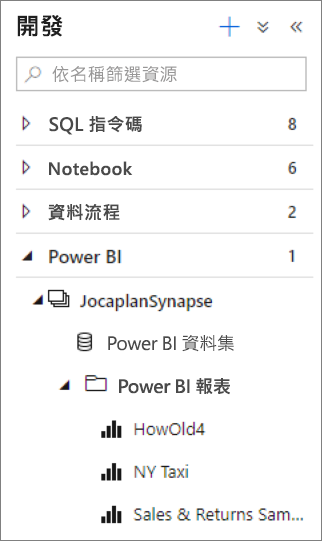
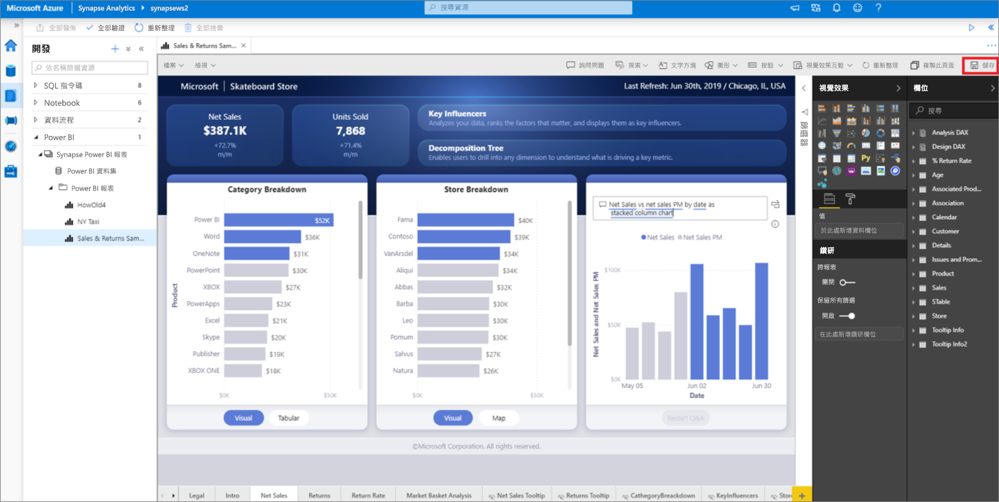

# 快速入門：將 Power BI 工作區連結至 Synapse Analytics 工作區 (預覽)

在本快速入門中，您將了解如何將 Power BI 工作區連線至 Synapse Analytics 工作區，以從 Synapse Studio (預覽) 建立新的 Power BI 報表和資料集。

如果您沒有 Azure 訂用帳戶，[請在開始前建立免費帳戶](https://azure.microsoft.com/free/)。

## 必要條件

- [建立 Azure Synapse 工作區和相關聯的儲存體帳戶](quickstart-create-workspace.md)
- [Power BI Professional 或 Premium 工作區](https://docs.microsoft.com/power-bi/service-create-the-new-workspaces)

## 將 Power BI 工作區連結至您的 Synapse 工作區

1. 從 Synapse Studio 開始，按一下 [管理]。

    ![在 Synapse Studio 中按一下 [管理]。](media/quickstart-link-powerbi/synapse-studio-click-manage.png)

2. 在 [外部連線] 底下，按一下 [連結服務]。

    

3. 按一下 [+ 新增]。

    ![[+ 新增連結服務] 會醒目提示。](media/quickstart-link-powerbi/new-highlighted.png)

4. 按一下 [Power BI]，然後按一下 [繼續]。

    

5. 輸入連結服務的名稱，然後從下拉式清單中選取工作區。

    

6. 按一下 [建立]。

## 在 Synapse Studio 中檢視 Power BI 工作區

當您的工作區連結後，您就可以從 Synapse Studio 瀏覽 Power BI 資料集，以及編輯/建立新的 Power BI 報表。

1. 按一下 [開發]。

    ![在 Synapse Studio 中按一下 [開發]。](media/quickstart-link-powerbi/synapse-studio-click-develop.png)

2. 展開 Power BI 和您要使用的工作區。

    

您可以在 [開發] 索引標籤頂端按一下 **+** ，以建立新的報表。您可以按一下報表名稱以編輯現有的報表。 所有儲存的變更都會寫回 Power BI 工作區。

## 後續步驟

深入了解[對儲存在 Azure 儲存體上的檔案建立 Power BI 報表](sql/tutorial-connect-power-bi-desktop.md)。
