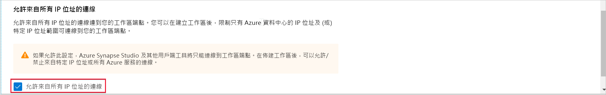
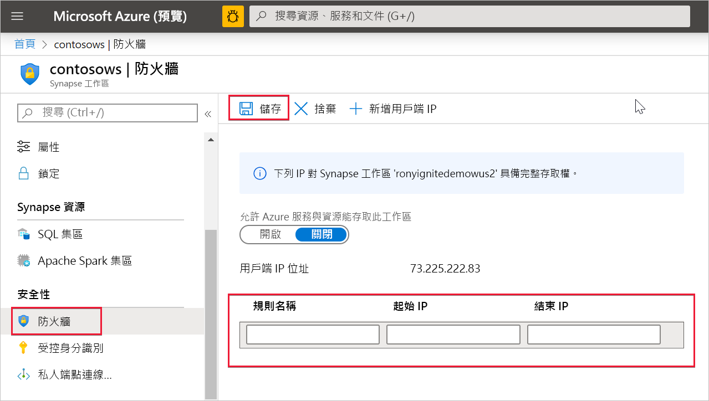

# Azure Synapse Analytics IP 防火牆規則

本文將說明 IP 防火牆規則，並教您如何在 Azure Synapse Analytics 中進行設定。

## IP 防火牆規則

IP 防火牆規則會根據每個要求的來源 IP 位址，授與或拒絕 Synapse 工作區存取權。 您可以設定工作區的 IP 防火牆規則。 在工作區層級上設定的 IP 防火牆規則會套用到工作區的所有公用端點 (專用 SQL 集區、無伺服器 SQL 集區和開發)。

## 建立和管理 IP 防火牆規則

有兩種方式可將 IP 防火牆規則新增至 Synapse 工作區。 若要將 IP 防火牆新增至您的工作區，請選取 [安全性 + 網路]，並在建立工作區時，核取 [允許從所有 IP 位址進行連線]。

![反白顯示 [安全性 + 網路] 按鈕的螢幕擷取畫面。](./media/synpase-workspace-ip-firewall/ip-firewall-1.png)

您也可以在建立工作區之後，將 IP 防火牆規則新增至 Synapse 工作區。 從 Azure 入口網站的 [安全性] 底下，選取 [防火牆]。 若要新增 IP 防火牆規則，請提供名稱、起始 IP 和結束 IP。 完成時選取 [儲存]  。

## 從您自己的網路連線到 Synapse

您可以使用 Synapse Studio 連線到您的 Synapse 工作區。 您也可以使用 SQL Server Management Studio (SSMS) 連線到您工作區中的 SQL 資源 (專用 SQL 集區和無伺服器 SQL 集區)。

請確定您網路和本機電腦上的防火牆已為 Synapse Studio 允許 TCP 通訊埠 80、443 和 1443 上的傳出通訊。

此外，您還需要為 Synapse Studio 允許 UDP 連接埠 53 上的傳出通訊。 若要使用 SSMS 和 Power BI 這類工具進行連線，您必須允許 TCP 通訊埠 1433 上的傳出通訊。

如果您使用預設的重新導向連線原則設定，您可能需要允許其他連接埠上的傳出通訊。 您可以在[這裡](../../azure-sql/database/connectivity-architecture.md#connection-policy)深入了解連線原則。

## 後續步驟

建立 [Azure Synapse 工作區](../quickstart-create-workspace.md)

建立具有[受控工作區虛擬網路](./synapse-workspace-managed-vnet.md)的 Azure Synapse 工作區