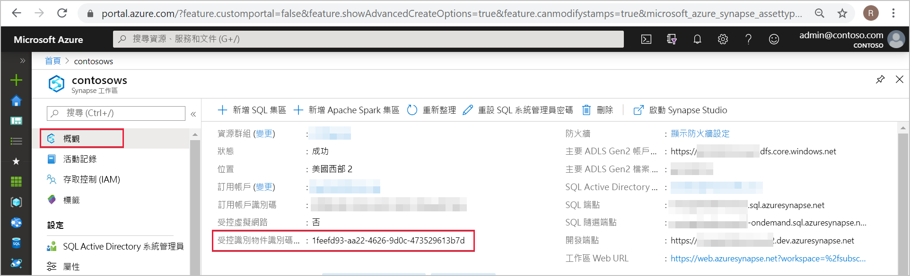
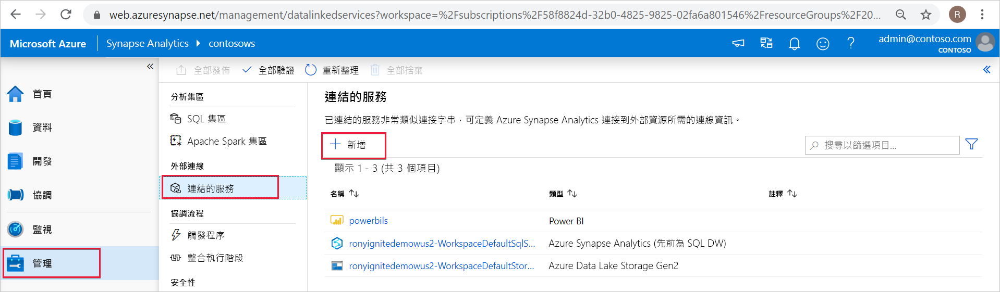
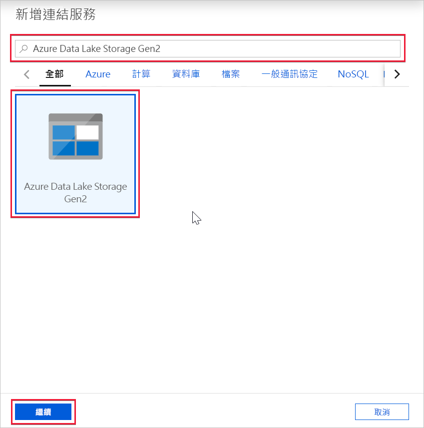
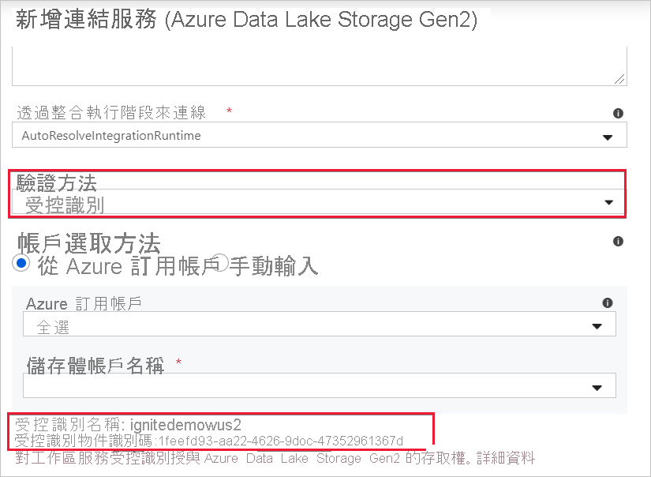

# Azure Synapse 工作區的受控識別 (預覽)

在本文中，您將了解 Azure Synapse 工作區中的受控識別。

## 受控身分識別

適用於 Azure 資源的受控識別是 Azure Active Directory 的一項功能。 這項功能會在 Azure AD 中將自動受控識別提供給 Azure 服務。 您可以使用受控識別功能向支援 Azure AD 驗證的任何服務進行驗證。

先前稱為「受控服務識別」(MSI) 的服務，其新名稱為「Azure 資源適用受控識別」。 若要深入了解，請參閱[受控識別](../../active-directory/managed-identities-azure-resources/overview.md?toc=/azure/synapse-analytics/toc.json&bc=/azure/synapse-analytics/breadcrumb/toc.json)。

## Azure Synapse 工作區的受控識別

建立工作區時會為 Azure Synapse 工作區建立系統指派的受控識別。

>[!NOTE]
>本文件的其餘部分會將此工作區受控識別稱為受控識別。

Azure Synapse 會使用受控識別來協調管線。 受控識別的生命週期直接繫結至 Azure Synapse 工作區。 如果您刪除 Azure Synapse 工作區，則受控識別也會遭到清除。

工作區受控識別需要可在管線中執行作業的權限。 在授與權限時，您可以使用物件識別碼或 Azure Synapse 工作區名稱來尋找受控識別。

## 在 Azure 入口網站中擷取受控識別

您可以在 Azure 入口網站中擷取受控識別。 請在 Azure 入口網站中開啟 Azure Synapse 工作區，然後從左側導覽中選取 [概觀]  。 受控識別的物件識別碼隨即會顯示在主畫面中。

當您從 Azure Synapse Studio 建立可支援受控識別驗證的連結服務時，系統也會顯示受控識別資訊。

請啟動 **Azure Synapse Studio**，然後從左側導覽中選取 [管理]  索引標籤。 然後選取 [連結服務]  ，並選擇 [+ 新增]  選項來建立新的連結服務。

在 [新增連結服務]  視窗中，輸入 *Azure Data Lake Storage Gen2*。 從下面的清單選取 [Azure Data Lake Storage Gen2]  資源類型，然後選擇 [繼續]  。

在下一個視窗中，針對 [驗證方法]  選擇 [受控識別]  。 您便會看到受控識別的**名稱**和**物件識別碼**。

## 後續步驟

深入了解[授與權限給 Azure Synapse 工作區受控識別](./how-to-grant-workspace-managed-identity-permissions.md)
