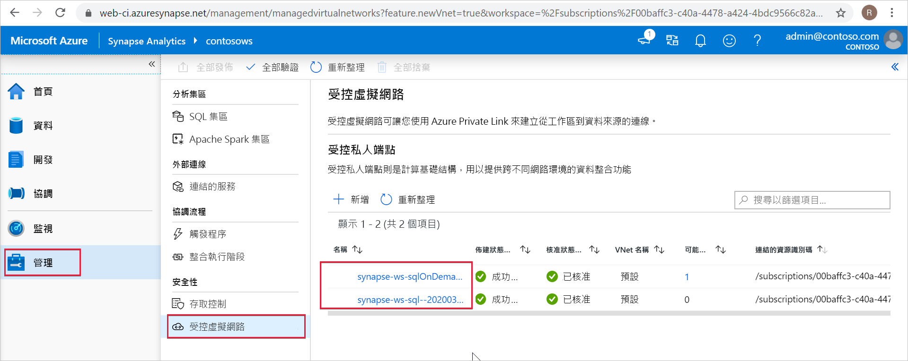

# Synapse 受控私人端點 (預覽)

本文會說明 Azure Synapse Analytics 中的受控私人端點。

## 受控私人端點

受控私人端點是在受控工作區 Microsoft Azure 虛擬網路中建立的私人端點，其會建立 Azure 資源的私人連結。 Azure Synapse 會代表您管理這些私人端點。

Azure Synapse 支援私人連結。 私人連結可讓您安全地從 Azure 虛擬網路存取 Azure 服務 (例如 Azure 儲存體、Azure Cosmos DB 和 Azure SQL 資料倉儲) 和 Azure 託管的客戶/合作夥伴服務。

使用私人連結時，您的虛擬網路和工作區之間的流量會完全流經 Microsoft 骨幹網路。 Private Link 可保護您免受資料外洩風險。 您可以建立私人端點來建立資源的私人連結。

私人端點會使用您虛擬網路中的私人 IP 位址，有效地將服務帶入您的虛擬網路中。 私人端點會對應至 Azure 中的特定資源，而不是整個服務。 客戶可以限制其組織所核准之特定資源的連線能力。 深入了解[私人連結和私人端點](https://docs.microsoft.com/azure/private-link/)。

>[!IMPORTANT]
>只有在具有受控工作區虛擬網路的 Azure Synapse 工作區中，才支援受控私人端點。

>[!NOTE]
>來自受控工作區虛擬網路的所有輸出流量 (除了透過受控的私人端點以外) 未來都會遭到封鎖。 建議您建立受控私人端點，以連線到工作區外部的所有 Azure 資料來源。 

當您在 Azure Synapse 中建立受控私人端點時，會以「擱置」狀態建立私人端點連線。 已起始核准工作流程。 私人連結資源的擁有者會負責核准或拒絕連線。

如果擁有者核准連線，就會建立私人連結。 否則，系統將不會建立私人連結。 無論是哪一種情況，受控私人端點都會以連線狀態來更新。

只有處於已核准狀態的受控私人端點可以將流量傳送到指定的私人連結資源。

## 適用於 SQL 集區的受控私人端點和 SQL 隨選

SQL 集區和 SQL 隨選是 Azure Synapse 工作區中的分析功能。 這些功能會使用未部署到[受控工作區虛擬網路](./synapse-workspace-managed-vnet.md)中的多租用戶基礎結構。

建立工作區時，Azure Synapse 會在該工作區中，在 SQL 集區和 SQL 隨選中建立兩個受控私人端點。 

這兩個受控私人端點會列在 Azure Synapse Studio 中。 選取左側導覽中的 [管理]，然後選取 [受控虛擬網路] 以在 Studio 中查看。

以 SQL 集區為目標的受控私人端點稱為 *synapse-ws-sql--\<workspacename\>* ，而以 SQL 隨選為目標的受控私人端點則稱為 *synapse-ws-sqlOnDemand--\<workspacename\>* 。

建立 Azure Synapse 工作區時，系統會自動為您建立這兩個受控私人端點。 這兩個受控私人端點不會收費。

## 後續步驟

[建立資料來源的受控私人端點](./how-to-create-managed-private-endpoints.md)
