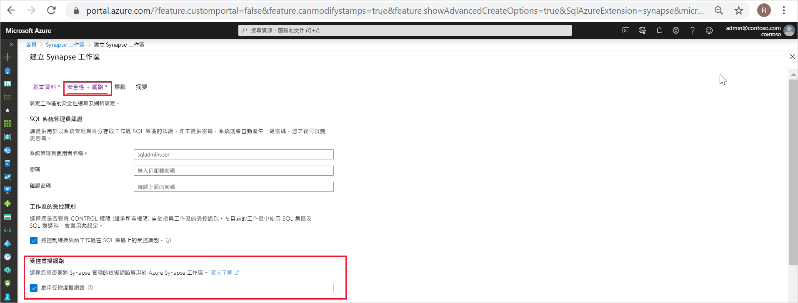
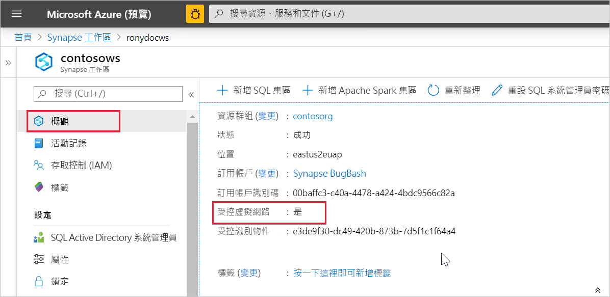

# Azure Synapse Analytics 受控虛擬網路

本文會說明 Azure Synapse Analytics 中的受控虛擬網路。

## 受控工作區虛擬網路

建立您的 Azure Synapse 工作區時，可以選擇將其與 Microsoft Azure 虛擬網路建立關聯。 與您工作區相關聯的虛擬網路是由 Azure Synapse 管理。 此虛擬網路稱為 *受控工作區虛擬網路*。

受控工作區虛擬網路可以四種方式提供價值：

- 透過受控工作區虛擬網路，您可以將管理虛擬網路的負擔轉至 Azure Synapse。
- 您不需要在自己的虛擬網路上設定輸入 NSG 規則，以允許 Azure Synapse 管理進入您虛擬網路的流量。 這些 NSG 規則的設定錯誤會導致客戶的服務中斷。
- 您不需要根據尖峰負載來建立 Spark 叢集的子網路。
- 受控工作區虛擬網路以及受控私人端點可防止資料外洩。 您只能在具有相關聯受控工作區虛擬網路的工作區中建立受控私人端點。

使用與其相關聯的受控工作區虛擬網路來建立工作區，可確保您的工作區與其他工作區之間的網路隔離。 Azure Synapse 會在工作區中提供各種分析功能：資料整合、無伺服器 Apache Spark 集區、專用 SQL 集區，以及無伺服器 SQL 集區。

如果您的工作區具有受控工作區虛擬網路，則系統會在其中部署資料整合和 Spark 資源。 受控工作區虛擬網路也會提供 Spark 活動的使用者層級隔離，因為每個 Spark 叢集都在自己的子網路中。

專用 SQL 集區和無伺服器 SQL 集區均為多租用戶功能，因此位於受控工作區虛擬網路之外。 專用 SQL 集區與無伺服器 SQL 集區工作區內部通訊會使用 Azure 私人連結。 建立具有相關聯受控工作區虛擬網路的工作區時，系統會自動為您建立這些私人連結。

>[!IMPORTANT]
>建立工作區之後，您就無法變更此工作區組態。 例如，您無法重新設定沒有相關聯受控工作區虛擬網路的工作區，並將虛擬網路與其建立關聯。 同樣地，您無法重新設定具有相關聯受控工作區虛擬網路的工作區，並將虛擬網路與其取消關聯。

## 建立具有受控工作區虛擬網路的 Azure Synapse 工作區

如果您尚未這麼做，請註冊網路資源提供者。 註冊資源提供者可將您的訂用帳戶設定為可搭配資源提供者使用。 當您[註冊](https://docs.microsoft.com/azure/azure-resource-manager/management/resource-providers-and-types)時，請從資源提供者清單中選擇 [Microsoft.Network]。

若要建立具有相關聯受控工作區虛擬網路的 Azure Synapse 工作區，請選取 Azure 入口網站中的 [網路] 索引標籤，然後勾選 [啟用受控虛擬網路] 核取方塊。

如果未勾選此核取方塊，則您的工作區將不會有與其相關聯的虛擬網路。

>[!IMPORTANT]
>您只能在具有受控工作區虛擬網路的工作區中使用私人連結。

您可以從 Azure 入口網站選取 **概觀**，以檢查您的 Azure Synapse 工作區是否與受控工作區虛擬網路相關聯。

## 後續步驟

建立 [Azure Synapse 工作區](../quickstart-create-workspace.md)

深入了解[受控私人端點](./synapse-workspace-managed-private-endpoints.md)

[建立資料來源的受控私人端點](./how-to-create-managed-private-endpoints.md)
