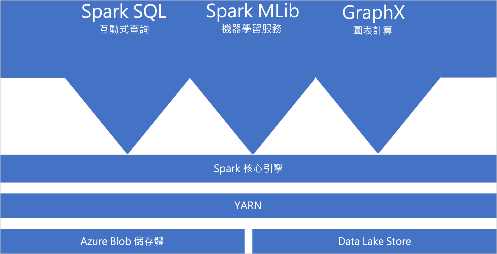
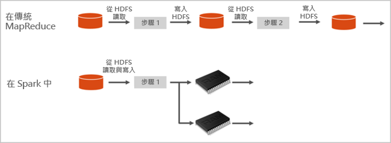

# Azure Synapse Analytics 中的 Apache Spark

Apache Spark 是一個平行處理架構，可支援記憶體內部處理，以大幅提升巨量資料分析應用程式的效能。 Azure Synapse Analytics 中的 Apache Spark 是 Microsoft 在雲端中的其中一種 Apache Spark 實作。 Azure Synapse 可讓您輕鬆地在 Azure 中建立和設定無伺服器 Apache Spark 集區。 Azure Synapse 中的 Spark 集區與 Azure 儲存體和 Azure Data Lake Generation 2 Storage 相容。 因此，您可以使用 Spark 集區來處理儲存於 Azure 的資料。

## 什麼是 Apache Spark

Apache Spark 提供用於記憶體內部叢集運算的基本項目。 Spark 作業可將資料載入並快取到記憶體，以便重複查詢。 記憶體內部運算的速度比磁碟型應用程式更快。 Spark 也會與多種程式設計語言整合，讓您處理分散式資料集 (像是本機集合)。 您不需要將一切建構成對應和縮減作業。

Azure Synapse 中的 Spark 集區提供完全受控的 Spark 服務。 這裡列出在 Azure Synapse Analytics 中建立 Spark 集區的優點。

| 特徵 | 描述 |
| --- | --- |
| 速度與效率 |若少於 60 個節點，Spark 執行個體大約會在 2 分鐘內啟動，而超過 60 個節點大約需要 5 分鐘。 根據預設，執行個體會在最後一個作業執行後的 5 分鐘關閉，除非該作業是透過筆記本連線保持運作。 |
| 容易建立 |您可以使用 Azure 入口網站、Azure PowerShell 或 Synapse Analytics .NET SDK，在幾分鐘內就能於 Azure Synapse 中建立新的 Spark 集區。 請參閱[開始使用 Azure Synapse Analytics 中的 Spark 集區](../quickstart-create-apache-spark-pool-studio.md)。 |
| 容易使用 |Synapse Analytics 包括衍生自 [Nteract](https://nteract.io/) 的自訂筆記本。 您可以使用這些 Notebook 來進行互動式的資料處理和視覺化。|
| REST API |Azure Synapse Analytics 中的 Spark 叢集包含 [Apache Livy](https://github.com/cloudera/hue/tree/master/apps/spark/java#welcome-to-livy-the-rest-spark-server)，這是是 REST-API 型 Spark 作業伺服器，可用來遠端提交及監視作業。 |
| 支援 Azure Data Lake Storage Generation 2| Azure Synapse 中的 Spark 集區可以使用 Azure Data Lake Storage Generation 2 以及 Blob 儲存體。 如需有關 Data Lake Storage 的詳細資訊，請參閱 [Azure Data Lake Storage 概觀](../../data-lake-store/data-lake-store-overview.md)。 |
| 第三方 IDE 整合 | Azure Synapse 提供 [Jetbrains' IntelliJ IDEA](https://www.jetbrains.com/idea/) 的 IDE 外掛程式，在建立應用程式並將其提交至 Spark 集區上很有幫助。 |
| 預先載入的 Anaconda 程式庫 |Azure Synapse 中的 Spark 集區隨附預先安裝的 Anaconda 程式庫。 [Anaconda](https://docs.continuum.io/anaconda/) 為機器學習、資料分析、視覺化等主題提供將近 200 個程式庫。 |
| 延展性 | Azure Synapse 集區中的 Apache Spark，可以啟用自動調整功能，讓集區可視需要而透過新增及刪除節點的方式，進行擴放。 此外，由於所有資料都儲存在 Azure 儲存體或 Data Lake Storage 內，因此您可以在不遺失資料的情況下關閉 Spark 集區。 |

依預設，Azure Synapse 中的 Spark 集區能經由集區提供下列元件。

- [Spark Core](https://spark.apache.org/docs/2.4.5/)。 包括 Spark Core、Spark SQL、GraphX 及 MLlib。
- [Anaconda](https://docs.continuum.io/anaconda/)
- [Apache Livy](https://github.com/cloudera/hue/tree/master/apps/spark/java#welcome-to-livy-the-rest-spark-server)
- [Nteract 筆記本](https://nteract.io/)

## Spark 集區架構

您可以了解 Spark 在 Azure Synapse Analytics 上的執行方式，輕鬆地了解 Spark 的元件。

Spark 應用程式會在集區上以獨立的處理序組合來執行，並由主程式 (稱為驅動程式) 中的 SparkContext 物件來協調。

SparkContext 可以連線到叢集管理員，其可在各個應用程式之間配置資源。 叢集管理員是 [Apache Hadoop YARN](https://hadoop.apache.org/docs/current/hadoop-yarn/hadoop-yarn-site/YARN.html)。 一旦連線之後，Spark 就會取得集區中節點上的執行程式，也就是為應用程式執行運算和儲存資料的處理序。 接下來，它會將您的應用程式程式碼 (由傳遞到 SparkContext 的 JAR 或 Python 檔案所定義) 傳送到執行程式。 最後，SparkContext 會將工作傳送到執行程式來執行。

SparkContext 會執行使用者的主要函式，並在節點上執行各種平行作業。 然後，SparkContext 會收集作業的結果。 節點會在檔案系統中讀取和寫入資料。 節點也會將記憶體內部已轉換的資料快取為彈性分散式資料集 (RDD)。

SparkCoNtext 會連線至 Spark 集區，並負責將應用程式轉換為有向非循環圖 (DAG)。 圖形包含在節點上的執行程式流程內執行的個別工作。 每個應用程式都會取得自己的執行程式處理序，而這些處理序會在整個應用程式的持續時間保持運作，並且在多個執行緒中執行工作。

## Azure Synapse Analytics 中的 Apache Spark 使用案例

Azure Synapse Analytics 中的 Spark 集區會啟用下列主要案例：

### 資料工程/資料準備

Apache Spark 包含許多語言功能，可支援準備和處理大量資料，使其更有價值，並可供 Azure Synapse Analytics 內的其他服務使用。 這項功能可透過多種語言 (C#、Scala、PySpark、Spark SQL) 和提供的程式庫來處理和連線。

### Machine Learning

Apache Spark 隨附 [MLlib](https://spark.apache.org/mllib/)，這是以 Spark 為基礎的機器學習程式庫，您可以從 Azure Synapse Analytics 中的 Spark 集區使用。 Azure Synapse Analytics 中的 Spark 集區也包含 Anaconda，這是一種 Python 散發套件，其中包含適用於資料科學的各種套件，包括機器學習服務。 搭配內建的 Notebooks 支援，就能擁有適用於建立機器學習應用程式的環境。

## 我該從哪裡開始

使用下列文章來深入了解 Azure Synapse Analytics 中的 Apache Spark：

- [快速入門：在 Azure Synapse 中建立 Spark 集區](../quickstart-create-apache-spark-pool-portal.md)
- [快速入門：建立 Apache Spark 筆記本](../quickstart-apache-spark-notebook.md)
- [教學課程：使用 Apache Spark 進行機器學習](./apache-spark-machine-learning-mllib-notebook.md)
- [Apache Spark 官方文件](https://spark.apache.org/docs/2.4.5/)

> [!NOTE]
> 某些 Apache Spark 官方文件會依賴使用 Spark 主控台，但 Azure Synapse Spark 不提供這項功能，而是會使用筆記本或 IntelliJ 體驗

## 後續步驟

在本概觀中，您會對 Azure Synapse Analytics 中的 Apache Spark 有一些基本了解。 前往下一篇文章，以了解如何在 Azure Synapse Analytics 中建立 Spark 集區：

- [在 Azure Synapse 中建立 Spark 集區](../quickstart-create-apache-spark-pool-portal.md)
