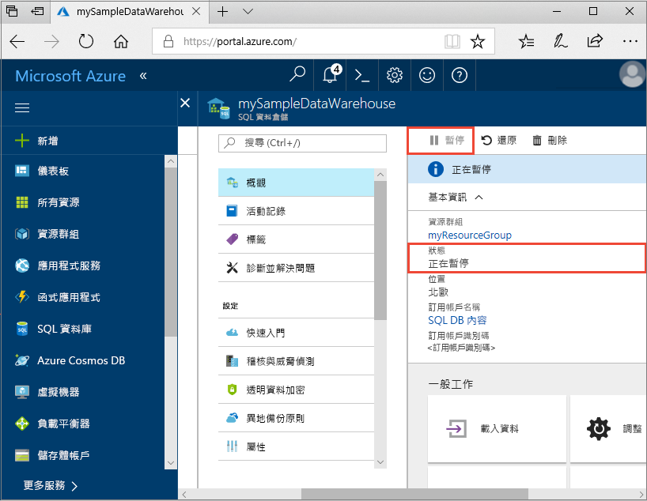
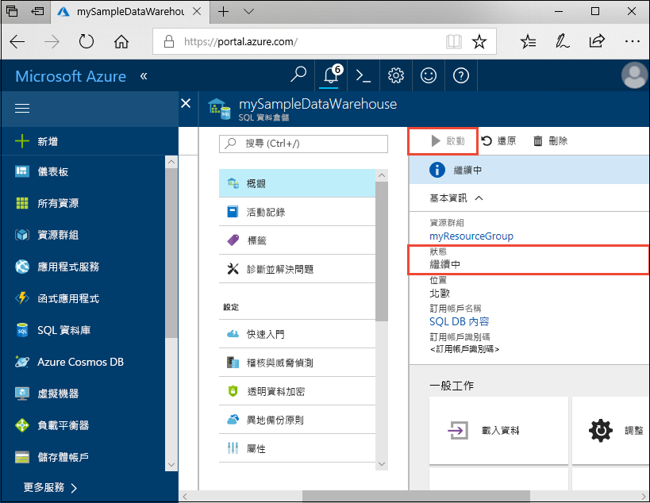

# 快速入門：透過 Azure PowerShell 暫停和繼續 Synapse SQL 集區中的計算

您可以使用 Azure 入口網站來暫停和繼續 Synapse SQL 集區 (資料倉儲) 計算資源。 如果您沒有 Azure 訂用帳戶，請在開始前建立[免費帳戶](https://azure.microsoft.com/free/)。

## 登入 Azure 入口網站

登入 [Azure 入口網站](https://portal.azure.com/)。

## 開始之前

使用[建立與連線 - 入口網站](create-data-warehouse-portal.md)建立名為 **mySampleDataWarehouse** 的 SQL 集區。 

## 暫停計算

為了降低成本，您可以隨選暫停和繼續計算資源。 例如，如果您在夜間和週末不會使用資料庫，可以在這段時間暫停，並且在白天時繼續。 
>[!NOTE]
>資料庫暫停時，系統將不會向您收取計算資源的費用。 不過，您仍需持續支付儲存體費用。 

請依照下列步驟將 SQL 集區暫停：

1. 登入 [Azure 入口網站](https://portal.azure.com/)。
2. 按一下 Azure 入口網站左側導覽頁面中的 [Azure Synapse Analytics (先前為 SQL DW)]  。
2. 從 [Azure Synapse Analytics (先前為 SQL DW)]  頁面中選取 [mySampleDataWarehouse]  ，以開啟 SQL 集區。 
3. 在 [mySampleDataWarehouse]  頁面上，留意到 [狀態]  目前為 [上線]  。

    

4. 若要暫停 SQL 集區，請按一下 [暫停]  按鈕。 
5. 螢幕會出現詢問您是否要繼續的確認問題。 按一下 [是]  。
6. 請稍候片刻，並留意到 [狀態]  將變成 [正在暫停]  。

    

7. 暫停作業完成後，狀態將會變成 [已暫停]  ，選項按鈕則會是 [繼續]  。
8. SQL 集區的計算資源現已離線。 在您繼續服務之前，將無需支付計算費用。

    

## 繼續計算

請依照下列步驟將 SQL 集區繼續。

1. 按一下 Azure 入口網站左側頁面中的 [Azure Synapse Analytics (先前為 SQL DW)]  。
2. 從 [Azure Synapse Analytics (先前為 SQL DW)]  頁面中選取 [mySampleDataWarehouse]  ，以開啟 SQL 集區頁面。 
3. 在 [mySampleDataWarehouse]  頁面上，留意到 [狀態]  目前為 [已暫停]  。

    

4. 若要繼續 SQL 集區，請按一下 [繼續]  。 
5. 螢幕會出現詢問您是否要啟動的確認問題。 按一下 [是]  。
6. 留意到 [狀態]  將變成 [正在繼續]  。

    

7. SQL 集區再度上線時，狀態將會變成 [線上]  ，選項按鈕則會是 [暫停]  。
8. SQL 集區的計算資源現已上線，且您可以使用服務。 費用計算將繼續進行。

    

## 清除資源

您需為資料倉儲單位和儲存在 SQL 集區中的資料付費。 這些計算和儲存體資源會分開計費。 

- 如果您想保留儲存體中的資料，請暫停計算。
- 如果您需要移除未來的費用，可以將 SQL 集區刪除。 

遵循下列步驟，視需要清除資源。

1. 登入 [Azure 入口網站](https://portal.azure.com)，然後按一下您的 SQL 集區。

    

1. 若要暫停計算，請按一下 [暫停]  按鈕。 

2. 若要移除 SQL 集區以免支付計算或儲存體的費用，請按一下 [刪除]  。

3. 若要移除您所建立的 SQL 伺服器，請按一下 [sqlpoolservername.database.windows.net]  ，然後按一下 [刪除]  。  

   > [!CAUTION]
   > 請謹慎使用刪除，因為刪除伺服器也會刪除所有指派給伺服器的資料庫。

5. 若要移除此資源群組，請按一下 [myResourceGroup]  ，然後按一下 [刪除資源群組]  。

## 後續步驟

現在您已暫停和繼續 SQL 集區的計算。 請繼續閱讀下一篇文章以深入了解如何[將資料載入 SQL 集區](load-data-from-azure-blob-storage-using-polybase.md)。 如需管理計算功能的其他資訊，請參閱[管理計算概觀](sql-data-warehouse-manage-compute-overview.md) 一文。 

