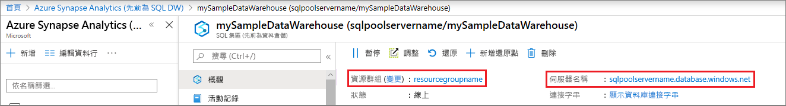

# <a name="quickstart-pause-and-resume-compute-in-synapse-sql-pool-with-azure-powershell"></a>快速入門：使用 Azure PowerShell 暫停和繼續 Synapse SQL 集區中的計算

您可以使用 Azure PowerShell 來暫停和繼續 Synapse SQL 集區 (資料倉儲) 計算資源。
如果您沒有 Azure 訂用帳戶，請在開始前建立[免費帳戶](https://azure.microsoft.com/free/)。

## <a name="before-you-begin"></a>開始之前

[!INCLUDE [updated-for-az](../../../includes/updated-for-az.md)]

本快速入門假設您已有可暫停和繼續的 SQL 集區。 若您需要建立 SQL 集區，您可以使用[建立與連線 - 入口網站](create-data-warehouse-portal.md)建立名為 **mySampleDataWarehouse** 的 SQL 集區。

## <a name="log-in-to-azure"></a>登入 Azure

使用 [Connect-AzAccount](/powershell/module/az.accounts/connect-azaccount?toc=/azure/synapse-analytics/sql-data-warehouse/toc.json&bc=/azure/synapse-analytics/sql-data-warehouse/breadcrumb/toc.json) 命令登入 Azure 訂用帳戶並遵循畫面上的指示。

```powershell
Connect-AzAccount
```

若要查看您正在使用的訂用帳戶，請執行 [Get-AzSubscription](/powershell/module/az.accounts/get-azsubscription?toc=/azure/synapse-analytics/sql-data-warehouse/toc.json&bc=/azure/synapse-analytics/sql-data-warehouse/breadcrumb/toc.json)。

```powershell
Get-AzSubscription
```

如果需要使用不同於預設值的訂用帳戶，請執行 [Set-AzContext](/powershell/module/az.accounts/set-azcontext?toc=/azure/synapse-analytics/sql-data-warehouse/toc.json&bc=/azure/synapse-analytics/sql-data-warehouse/breadcrumb/toc.json)。

```powershell
Set-AzContext -SubscriptionName "MySubscription"
```

## <a name="look-up-sql-pool-information"></a>查詢 SQL 集區資訊

找出您想要暫停和繼續之 SQL 集區的資料庫名稱、伺服器名稱和資源群組。

依照下列步驟尋找您 SQL 集區的位置資訊：

1. 登入 [Azure 入口網站](https://portal.azure.com/)。
1. 按一下 Azure 入口網站左側頁面中的 [Azure Synapse Analytics (先前為 SQL DW)]  。
1. 從 [Azure Synapse Analytics (先前為 SQL DW)]  頁面中選取 [mySampleDataWarehouse]  。 SQL 集區隨即開啟。

    

1. 記下 SQL 集區名稱，這便是資料庫名稱。 也請記下伺服器名稱與資源群組。
1. 在 PowerShell Cmdlet 中，請使用伺服器名稱的第一個部分即可。 在上圖中，完整伺服器名稱是 sqlpoolservername.database.windows.net。 在 PowerShell Cmdlet 中，我們會使用 **sqlpoolservername** 作為伺服器名稱。

## <a name="pause-compute"></a>暫停計算

為了節省成本，您可以隨選暫停和繼續計算資源。 例如，如果您在夜間和週末不會使用資料庫，可以在這段時間暫停，並且在白天時繼續。

>[!NOTE]
>資料庫暫停時，計算資源不會有費用。 不過，您仍需持續支付儲存體費用。

若要暫停資料庫，請使用 [Suspend-AzSqlDatabase](/powershell/module/az.sql/suspend-azsqldatabase?toc.json&bc=/azure/synapse-analytics/sql-data-warehouse/breadcrumb/toc.json) Cmdlet。 下列範例會暫停在伺服器 **sqlpoolservername** 上裝載的 SQL 集區 **mySampleDataWarehouse**。 此伺服器位於 Azure 資源群組 **myResourceGroup** 中。

```Powershell
Suspend-AzSqlDatabase –ResourceGroupName "myResourceGroup" `
–ServerName "nsqlpoolservername" –DatabaseName "mySampleDataWarehouse"
```

下列範例會將資料庫擷取至 $database 物件。 然後將物件輸送到 [Suspend-AzSqlDatabase](/powershell/module/az.sql/suspend-azsqldatabase?toc.json&bc=/azure/synapse-analytics/sql-data-warehouse/breadcrumb/toc.json)。 結果會儲存在物件 resultDatabase 中。 最終的命令會顯示結果。

```Powershell
$database = Get-AzSqlDatabase –ResourceGroupName "myResourceGroup" `
–ServerName "sqlpoolservername" –DatabaseName "mySampleDataWarehouse"
$resultDatabase = $database | Suspend-AzSqlDatabase
$resultDatabase
```

## <a name="resume-compute"></a>繼續計算

若要啟動資料庫，請使用 [Resume-AzSqlDatabase](/powershell/module/az.sql/resume-azsqldatabase?toc.json&bc=/azure/synapse-analytics/sql-data-warehouse/breadcrumb/toc.json) Cmdlet。 下列範例會啟動在伺服器 **sqlpoolservername** 上裝載的資料庫 **mySampleDataWarehouse**。 此伺服器位於 Azure 資源群組 **myResourceGroup** 中。

```Powershell
Resume-AzSqlDatabase –ResourceGroupName "myResourceGroup" `
–ServerName "sqlpoolservername" -DatabaseName "mySampleDataWarehouse"
```

下一個範例會將資料庫擷取至 $database 物件。 接著將物件輸送到 [Resume-AzSqlDatabase](/powershell/module/az.sql/resume-azsqldatabase?toc=/azure/synapse-analytics/sql-data-warehouse/toc.json&bc=/azure/synapse-analytics/sql-data-warehouse/breadcrumb/toc.json)，並將結果儲存在 $resultDatabase 中。 最終的命令會顯示結果。

```Powershell
$database = Get-AzSqlDatabase –ResourceGroupName "myResourceGroup" `
–ServerName "sqlpoolservername" –DatabaseName "mySampleDataWarehouse"
$resultDatabase = $database | Resume-AzSqlDatabase
$resultDatabase
```

## <a name="check-status-of-your-sql-pool-operation"></a>檢查 SQL 集區作業的狀態

若要檢查 SQL 集區的狀態，請使用 [Get-AzSqlDatabaseActivity](/powershell/module/az.sql/Get-AzSqlDatabaseActivity?toc.json&bc=/azure/synapse-analytics/sql-data-warehouse/breadcrumb/toc.json) Cmdlet。

```Powershell
Get-AzSqlDatabaseActivity -ResourceGroupName "myResourceGroup" -ServerName "sqlpoolservername" -DatabaseName "mySampleDataWarehouse"
```

## <a name="clean-up-resources"></a>清除資源

您需對資料倉儲單位和 SQL 集區上儲存的資料付費。 這些計算和儲存體資源會分開計費。

- 如果您想保留儲存體中的資料，請暫停計算。
- 如果您需要移除未來的費用，可以將 SQL 集區刪除。

遵循下列步驟，視需要清除資源。

1. 登入 [Azure 入口網站](https://portal.azure.com)，然後按一下您的 SQL 集區。

    

2. 若要暫停計算，請按一下 [暫停]  按鈕。 SQL 集區暫停時，您會看到 [啟動]  按鈕。  若要繼續計算，請按一下 [啟動]  。

3. 若要移除 SQL 集區以免支付計算或儲存體的費用，請按一下 [刪除]  。

4. 若要移除您所建立的 SQL 伺服器，請按一下 [sqlpoolservername.database.windows.net]  ，然後按一下 [刪除]  。  請謹慎使用刪除，因為刪除伺服器也會刪除所有指派給伺服器的資料庫。

5. 若要移除此資源群組，請按一下 [myResourceGroup]  ，然後按一下 [刪除資源群組]  。

## <a name="next-steps"></a>後續步驟

若要深入了解 SQL 集區，請繼續閱讀[將資料載入 SQL 集區](load-data-from-azure-blob-storage-using-polybase.md)一文。 如需管理計算功能的其他資訊，請參閱[管理計算概觀](sql-data-warehouse-manage-compute-overview.md) 一文。
