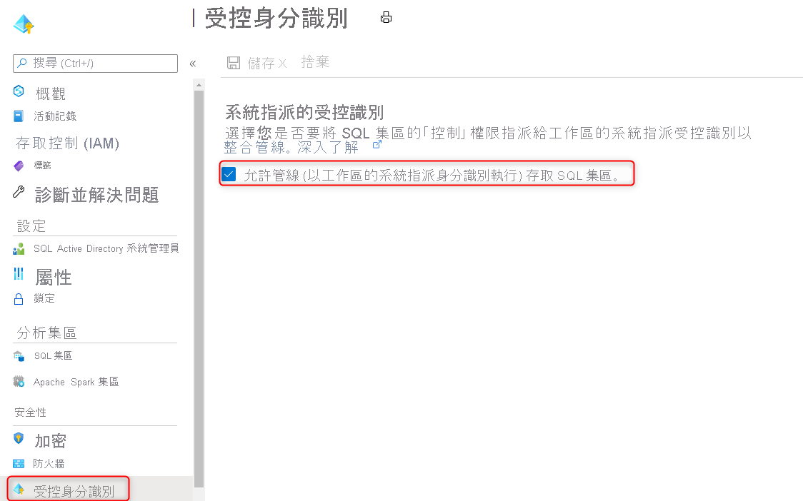

# <a name="securely-load-data-using-synapse-sql"></a>使用 Synapse SQL 安全地載入資料

本文主要說明 [COPY 陳述式](/sql/t-sql/statements/copy-into-transact-sql?view=azure-sqldw-latest)的安全驗證機制，並提供相關範例。 在 Synapse SQL 中大量載入資料時，COPY 陳述式是最具彈性且安全的方式。
## <a name="supported-authentication-mechanisms"></a>支援的驗證機制

下列矩陣說明每個檔案類型和儲存體帳戶支援的驗證方法。 這適用於來源儲存位置和錯誤檔案位置。

|                          |                CSV                |                      Parquet                       |                        ORC                         |
| :----------------------: | :-------------------------------: | :------------------------------------------------: | :------------------------------------------------: |
|  **Azure Blob 儲存體**  | SAS/MSI/SERVICE PRINCIPAL/KEY/AAD |                      SAS/KEY                       |                      SAS/KEY                       |
| **Azure Data Lake Gen2** | SAS/MSI/SERVICE PRINCIPAL/KEY/AAD | SAS (blob<sup>1</sup>)/MSI (dfs<sup>2</sup>)/SERVICE PRINCIPAL/KEY/AAD | SAS (blob<sup>1</sup>)/MSI (dfs<sup>2</sup>)/SERVICE PRINCIPAL/KEY/AAD |

1：此驗證方法需要外部位置路徑中的 .blob 端點 ( **.blob**.core.windows.net)。

2：此驗證方法需要外部位置路徑中的 .dfs 端點 ( **.dfs**.core.windows.net)。

## <a name="a-storage-account-key-with-lf-as-the-row-terminator-unix-style-new-line"></a>A. 以 LF 作為資料列結束字元的儲存體帳戶金鑰 (Unix 樣式的新行)


```sql
--Note when specifying the column list, input field numbers start from 1
COPY INTO target_table (Col_one default 'myStringDefault' 1, Col_two default 1 3)
FROM 'https://adlsgen2account.dfs.core.windows.net/myblobcontainer/folder1/'
WITH (
    FILE_TYPE = 'CSV'
    ,CREDENTIAL=(IDENTITY= 'Storage Account Key', SECRET='<Your_Account_Key>')
    --CREDENTIAL should look something like this:
    --CREDENTIAL=(IDENTITY= 'Storage Account Key', SECRET='x6RWv4It5F2msnjelv3H4DA80n0QW0daPdw43jM0nyetx4c6CpDkdj3986DX5AHFMIf/YN4y6kkCnU8lb+Wx0Pj+6MDw=='),
    ,ROWTERMINATOR='0x0A' --0x0A specifies to use the Line Feed character (Unix based systems)
)
```
> [!IMPORTANT]
>
> - 請使用十六進位值 (0x0A) 來指定換行字元/新行字元。 請注意，COPY 陳述式會將 '\n' 字串解譯為 '\r\n' (歸位換行)。

## <a name="b-shared-access-signatures-sas-with-crlf-as-the-row-terminator-windows-style-new-line"></a>B. 以 CRLF 作為資料列結束字元的共用存取簽章 (SAS) (Windows 樣式的新行)
```sql
COPY INTO target_table
FROM 'https://adlsgen2account.dfs.core.windows.net/myblobcontainer/folder1/'
WITH (
    FILE_TYPE = 'CSV'
    ,CREDENTIAL=(IDENTITY= 'Shared Access Signature', SECRET='<Your_SAS_Token>')
    --CREDENTIAL should look something like this:
    --CREDENTIAL=(IDENTITY= 'Shared Access Signature', SECRET='?sv=2018-03-28&ss=bfqt&srt=sco&sp=rl&st=2016-10-17T20%3A14%3A55Z&se=2021-10-18T20%3A19%3A00Z&sig=IEoOdmeYnE9%2FKiJDSFSYsz4AkNa%2F%2BTx61FuQ%2FfKHefqoBE%3D'),
    ,ROWTERMINATOR='\n'-- COPY command automatically prefixes the \r character when \n (newline) is specified. This results in carriage return newline (\r\n) for Windows based systems.
)
```

> [!IMPORTANT]
>
> - 請勿將 ROWTERMINATOR 指定為 '\r\n'，因為此字串會解譯為 '\r\r\n'，而可能導致剖析問題

## <a name="c-managed-identity"></a>C. 受控識別

您的儲存體帳戶連結至 VNet 時，將需要受控識別驗證。 

### <a name="prerequisites"></a>必要條件

1. 使用此[指南](/powershell/azure/install-az-ps?toc=/azure/synapse-analytics/sql-data-warehouse/toc.json&bc=/azure/synapse-analytics/sql-data-warehouse/breadcrumb/toc.json)安裝 Azure PowerShell。
2. 如果您有一般用途 v1 或 Blob 儲存體帳戶，您必須先使用此[指南](../../storage/common/storage-account-upgrade.md?toc=/azure/synapse-analytics/sql-data-warehouse/toc.json&bc=/azure/synapse-analytics/sql-data-warehouse/breadcrumb/toc.json)先升級至一般用途 v2。
3. 您必須開啟 Azure 儲存體帳戶 [防火牆與虛擬網路] 設定功能表下方的 [允許信任的 Microsoft 服務存取此儲存體帳戶]。 如需詳細資訊請參閱此[指南](../../storage/common/storage-network-security.md?toc=/azure/synapse-analytics/sql-data-warehouse/toc.json&bc=/azure/synapse-analytics/sql-data-warehouse/breadcrumb/toc.json#exceptions)。

#### <a name="steps"></a>步驟

1. 如果您有獨立的專用 SQL 集區，請使用 PowerShell 向 Azure Active Directory (AAD)註冊您的 SQL 伺服器： 

   ```powershell
   Connect-AzAccount
   Select-AzSubscription -SubscriptionId <subscriptionId>
   Set-AzSqlServer -ResourceGroupName your-database-server-resourceGroup -ServerName your-SQL-servername -AssignIdentity
   ```

   Synapse 工作區中的專用 SQL 集區不需要此步驟。

1. 如果您有 Synapse 工作區，請註冊您工作區的系統受控識別：

   1. 移至 Azure 入口網站中的 Synapse 工作區
   2. 移至受控識別刀鋒視窗 
   3. 請確定已啟用 [允許管線] 選項
   
   

1. 以此 [指南](../../storage/common/storage-account-create.md)建立 **一般用途的 v2 儲存體帳戶**。

   > [!NOTE]
   >
   > - 如果您有一般用途 v1 或 Blob 儲存體帳戶，您必須先使用此 [指南](../../storage/common/storage-account-upgrade.md)**升級至 v2**。
   > - 關於 Azure Data Lake Storage Gen2 的已知問題，請參閱此[指南](../../storage/blobs/data-lake-storage-known-issues.md)。

1. 在您的儲存體帳戶底下，瀏覽至 [存取控制 (IAM)]，然後選取 [新增角色指派]。 將 **儲存體 Blob 資料參與者** Azure 角色指派給裝載專用 SQL 集區的伺服器或工作區，且您已向 Azure Active Directory (AAD) 註冊此專用 SQL 集區。

   > [!NOTE]
   > 僅有具備「擁有者」權限的成員才能執行此步驟。 如需各種 Azure 內建角色，請參閱此[指南](../../role-based-access-control/built-in-roles.md?toc=/azure/synapse-analytics/sql-data-warehouse/toc.json&bc=/azure/synapse-analytics/sql-data-warehouse/breadcrumb/toc.json)。
   
    > [!IMPORTANT]
    > 指定 **儲存體** **Blob 資料** 的擁有者、參與者或讀取者 Azure 角色。 這些角色與 Azure 內建的擁有者、參與者和讀取者角色不同。 

    

4. 現在，您可以執行指定「受控識別」的 COPY 陳述式：

    ```sql
    COPY INTO dbo.target_table
    FROM 'https://myaccount.blob.core.windows.net/myblobcontainer/folder1/*.txt'
    WITH (
        FILE_TYPE = 'CSV',
        CREDENTIAL = (IDENTITY = 'Managed Identity'),
    )
    ```

## <a name="d-azure-active-directory-authentication"></a>D. Azure Active Directory 驗證
#### <a name="steps"></a>步驟

1. 在您的儲存體帳戶底下，瀏覽至 [存取控制 (IAM)]，然後選取 [新增角色指派]。 將 **儲存體 Blob 資料擁有者、參與者或讀取者** Azure 角色指派給您的 Azure AD 使用者。 

    > [!IMPORTANT]
    > 指定 **儲存體** **Blob 資料** 的擁有者、參與者或讀取者 Azure 角色。 這些角色與 Azure 內建的擁有者、參與者和讀取者角色不同。

    

2. 參考下列[文件](../../azure-sql/database/authentication-aad-configure.md?tabs=azure-powershell)以設定 Azure AD 驗證。 

3. 使用 Active Directory 連線至您的 SQL 集區，您現在可以在其中執行 COPY 陳述式，而無須指定任何認證：

    ```sql
    COPY INTO dbo.target_table
    FROM 'https://myaccount.blob.core.windows.net/myblobcontainer/folder1/*.txt'
    WITH (
        FILE_TYPE = 'CSV'
    )
    ```


## <a name="e-service-principal-authentication"></a>E. 服務主體驗證
#### <a name="steps"></a>步驟

1. [建立 Azure Active Directory 應用程式](../..//active-directory/develop/howto-create-service-principal-portal.md#register-an-application-with-azure-ad-and-create-a-service-principal)
2. [取得應用程式識別碼](../..//active-directory/develop/howto-create-service-principal-portal.md#get-tenant-and-app-id-values-for-signing-in)
3. [取得驗證金鑰](../../active-directory/develop/howto-create-service-principal-portal.md#authentication-two-options)
4. [取得 V1 OAuth 2.0 權杖端點](../../data-lake-store/data-lake-store-service-to-service-authenticate-using-active-directory.md?bc=%2fazure%2fsynapse-analytics%2fsql-data-warehouse%2fbreadcrumb%2ftoc.json&toc=%2fazure%2fsynapse-analytics%2fsql-data-warehouse%2ftoc.json#step-4-get-the-oauth-20-token-endpoint-only-for-java-based-applications)
5. [將讀取、寫入和執行權限指派給儲存體帳戶上的 Azure AD 應用程式](../../data-lake-store/data-lake-store-service-to-service-authenticate-using-active-directory.md?bc=%2fazure%2fsynapse-analytics%2fsql-data-warehouse%2fbreadcrumb%2ftoc.json&toc=%2fazure%2fsynapse-analytics%2fsql-data-warehouse%2ftoc.json#step-3-assign-the-azure-ad-application-to-the-azure-data-lake-storage-gen1-account-file-or-folder)
6. 現在，您可以執行 COPY 陳述式：

    ```sql
    COPY INTO dbo.target_table
    FROM 'https://myaccount.blob.core.windows.net/myblobcontainer/folder0/*.txt'
    WITH (
        FILE_TYPE = 'CSV'
        ,CREDENTIAL=(IDENTITY= '<application_ID>@<OAuth_2.0_Token_EndPoint>' , SECRET= '<authentication_key>')
        --CREDENTIAL should look something like this:
        --,CREDENTIAL=(IDENTITY= '92761aac-12a9-4ec3-89b8-7149aef4c35b@https://login.microsoftonline.com/72f714bf-86f1-41af-91ab-2d7cd011db47/oauth2/token', SECRET='juXi12sZ6gse]woKQNgqwSywYv]7A.M')
    )
    ```

> [!IMPORTANT]
>
> - 使用 OAuth 2.0 權杖端點的 **V1** 版

## <a name="next-steps"></a>後續步驟

- 參閱 [COPY 陳述式文章](/sql/t-sql/statements/copy-into-transact-sql?view=azure-sqldw-latest#syntax)以了解詳細語法
- 參閱[資料載入概觀](./design-elt-data-loading.md#what-is-elt)一文以了解載入的最佳做法
