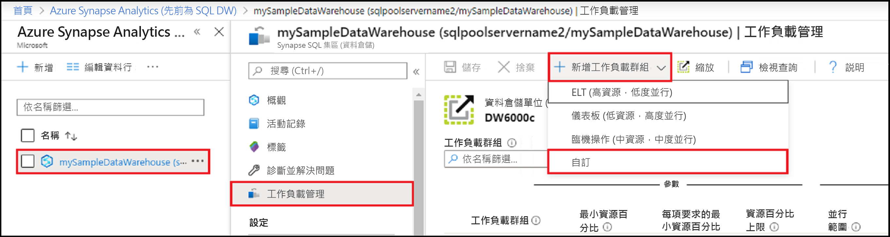
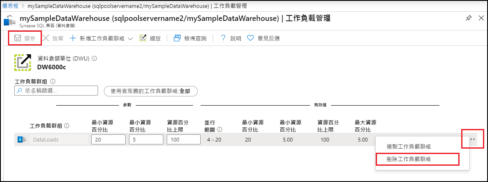

# 快速入門：使用 Azure 入口網站中的工作負載群組來設定 Synapse SQL 集區工作負載隔離

在本快速入門中，您將建立工作負載群組來保留資源，以設定[工作負載隔離](sql-data-warehouse-workload-isolation.md)。  基於本教學課程，我們將建立名為 `DataLoads` 的工作負載群組以載入資料。 工作負載群組會將 20% 的系統資源配置給資料載入。  透過 20% 的資料載入隔離，可保證資源能夠達到 SLA。  建立工作負載群組之後，[建立工作負載分類器](quickstart-create-a-workload-classifier-portal.md)，將查詢指派給此工作負載群組。

如果您沒有 Azure 訂用帳戶，請在開始前建立[免費帳戶](https://azure.microsoft.com/free/)。

## 登入 Azure 入口網站

登入 [Azure 入口網站](https://portal.azure.com/)。

> [!NOTE]
> 在 Azure Synapse Analytics 中建立 SQL 集區執行個體，可能會產生新的可計費服務。  如需詳細資訊，請參閱 [Azure Synapse Analytics 定價](https://azure.microsoft.com/pricing/details/sql-data-warehouse/)。

## Prerequisites

本快速入門假設您已擁有 Synapse SQL 中的 SQL 集區執行個體，且已有 CONTROL DATABASE 權限。 若您需要建立 SQL 資料倉儲，請使用[建立與連線 - 入口網站](create-data-warehouse-portal.md)來建立稱為 **mySampleDataWarehouse** 的資料倉儲。

>[!IMPORTANT] 
>您的 SQL 集區需要上線才可設定工作負載管理。 

## 設定工作負載隔離
建立工作負載群組，可以隔離和保留特定工作負載的 SQL 集區資源。  如需工作負載群組如何協助您達成工作負載管理的詳細資訊，請參閱[工作負載隔離](sql-data-warehouse-workload-isolation.md)概念文件。  [建立與連線 - 入口網站](create-data-warehouse-portal.md)快速入門已建立 **mySampleDataWarehouse**，並以 400 個 DWU 加以初始化。 下列步驟會在 **mySampleDataWarehouse**中建立工作負載群組。

若要建立具有 20% 隔離的工作負載群組：
1.  按一下 Azure 入口網站左側頁面中的 [Azure Synapse Analytics (先前為 SQL DW)]  。
2.  從 [Azure Synapse Analytics (先前為 SQL DW)]  頁面中選取 [mySampleDataWarehouse]  。 SQL 集區隨即開啟。
3.  按一下 [工作負載管理]  。
4.  按一下 [新增工作負載群組]  。
5.  按一下 [自訂]  。

    

6.  針對**工作負載群組**輸入 `DataLoads`。
7.  針對**最小資源百分比**輸入 `20`。
8.  針對**每要求的最小資源百分比**輸入 `5`。
9.  針對**容量資源百分比**輸入 `100`。
10.   按一下 [檔案]  。

   ![按一下 [Save] \(儲存)。](./media/quickstart-configure-workload-isolation-portal/configure-wg.png)

建立工作負載群組時，會顯示入口網站通知。  工作負載群組資源會顯示在設定值下方的圖表中。

   

## 清除資源

若要刪除在本教學課程中建立的 `DataLoads` 工作負載群組：
1. 按一下 `DataLoads` 工作負載群組右邊的 **`...`** 。
2. 按一下 [刪除工作負載群組]  。
3. 當系統提示您確認刪除工作負載群組時，按一下 [是]  。
4. 按一下 [ **儲存**]。

   

您需對資料倉儲單位和資料倉儲中儲存的資料付費。 這些計算和儲存體資源會分開計費。

- 如果您需要將資料保留在儲存體中，可以在您不使用資料倉儲時暫停計算。 暫停計算，您只需支付資料儲存體的費用。 當您準備好使用資料時，會繼續計算。
- 如果您需要移除未來的費用，可以將資料倉儲刪除。

遵循下列步驟清除資源。

1. 登入 [Azure 入口網站](https://portal.azure.com)，選取您的資料倉儲。

    

2. 若要暫停計算，請選取 [暫停]  按鈕。 資料倉儲暫停時，您會看到 [啟動]  按鈕。  若要繼續計算，請選取 [啟動]  。

3. 若要移除資料倉儲，而不再支付計算或儲存體的費用，請選取 [刪除]  。

4. 若要移除您所建立的 SQL Server，請選取上圖中的 [sqlpoolservername.database.windows.net]  ，然後選取 [刪除]  。  請謹慎使用刪除，因為刪除伺服器也會刪除所有指派給伺服器的資料庫。

5. 若要移除此資源群組，請選取 [myResourceGroup]  ，然後選取 [刪除資源群組]  。

## 後續步驟

若要使用 `DataLoads` 工作負載群組，必須建立[工作負載分類器](/sql/t-sql/statements/create-workload-classifier-transact-sql?toc=/azure/synapse-analytics/sql-data-warehouse/toc.json&bc=/azure/synapse-analytics/sql-data-warehouse/breadcrumb/toc.json&view=azure-sqldw-latest)，以將要求路由傳送至工作負載群組。  繼續參閱[建立工作負載分類器](quickstart-create-a-workload-classifier-portal.md)教學課程，以建立 `DataLoads` 的工作負載分類器。

## 另請參閱
如需如何監視工作負載以進行工作負載管理的詳細資訊，請參閱[管理和監視工作負載管理](sql-data-warehouse-how-to-manage-and-monitor-workload-importance.md)作法文章。
