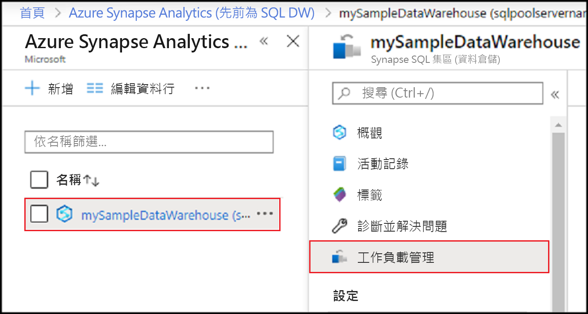
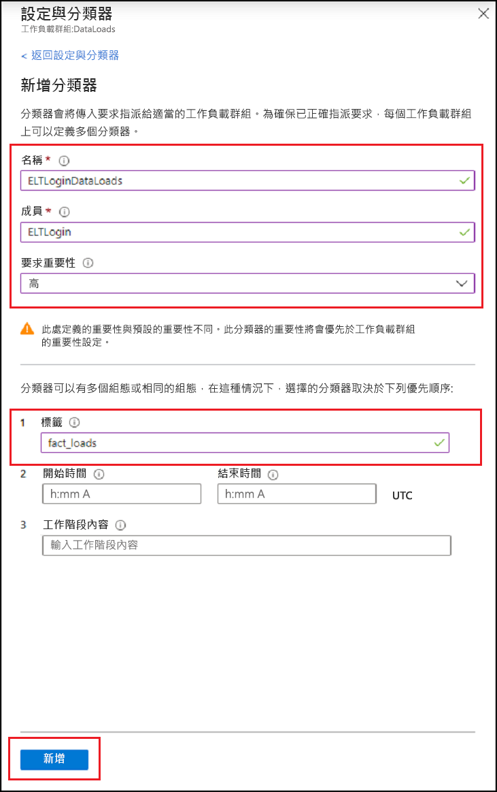
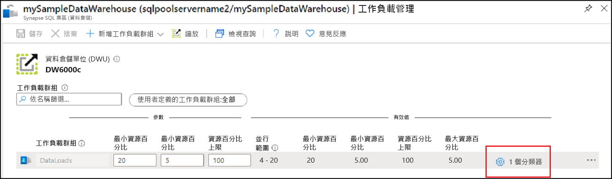

# <a name="quickstart-create-a-synapse-sql-pool-workload-classifier-using-the-azure-portal"></a>快速入門：使用 Azure 入口網站來建立 Synapse SQL 集區工作負載分類器

在本快速入門中，您將建立[工作負載分類器](sql-data-warehouse-workload-classification.md)，將查詢指派給工作負載群組。  分類器會將要求從 `ELTLogin` SQL 使用者指派給 `DataLoads` 工作負載群組群組。   遵循 [快速入門：設定工作負載隔離](quickstart-configure-workload-isolation-portal.md)教學課程，以建立 `DataLoads` 工作負載群組。  本教學課程將使用 WLM_LABEL 選項來建立工作負載分類器，以協助正確地進一步分類要求。  分類器也會將`HIGH` [工作負載重要性](sql-data-warehouse-workload-importance.md)指派給這些要求。


如果您沒有 Azure 訂用帳戶，請在開始前建立[免費帳戶](https://azure.microsoft.com/free/)。


## <a name="sign-in-to-the-azure-portal"></a>登入 Azure 入口網站

登入 [Azure 入口網站](https://portal.azure.com/)。

> [!NOTE]
> 在 Azure Synapse Analytics 中建立 SQL 集區執行個體，可能會產生新的可計費服務。  如需詳細資訊，請參閱 [Azure Synapse Analytics 定價](https://azure.microsoft.com/pricing/details/sql-data-warehouse/)。

## <a name="prerequisites"></a>Prerequisites

本快速入門假設您已擁有 Synapse SQL 中的 SQL 集區執行個體，且已有 CONTROL DATABASE 權限。 若您需要建立 SQL 資料倉儲，請使用[建立與連線 - 入口網站](create-data-warehouse-portal.md)來建立稱為 **mySampleDataWarehouse** 的資料倉儲。
<br><br>
工作負載群組 `DataLoads` 存在。  請參閱 [快速入門：設定工作負載隔離](quickstart-configure-workload-isolation-portal.md)教學課程，以建立工作負載群組。
<br><br>
>[!IMPORTANT] 
>您的 SQL 集區需要上線才可設定工作負載管理。 


## <a name="create-a-login-for-eltlogin"></a>建立適用於 ELTLogin 的登入

使用 [CREATE LOGIN](/sql/t-sql/statements/create-login-transact-sql?toc=/azure/synapse-analytics/sql-data-warehouse/toc.json&bc=/azure/synapse-analytics/sql-data-warehouse/breadcrumb/toc.json&view=azure-sqldw-latest) 來為 `ELTLogin` 在 `master` 資料庫中建立 SQL Server 驗證登入。

```sql
IF NOT EXISTS (SELECT * FROM sys.sql_logins WHERE name = 'ELTLogin')
BEGIN
CREATE LOGIN [ELTLogin] WITH PASSWORD='<strongpassword>'
END
;
```

## <a name="create-user-and-grant-permissions"></a>建立使用者並授與權限

建立登入後，必須在資料庫中建立使用者。  使用 [CREATE USER](/sql/t-sql/statements/create-user-transact-sql?toc=/azure/synapse-analytics/sql-data-warehouse/toc.json&bc=/azure/synapse-analytics/sql-data-warehouse/breadcrumb/toc.json&view=azure-sqldw-latest)，在 **mySampleDataWarehouse** 中建立 SQL 使用者 `ELTRole`。  因為我們將在本教學課程期間測試分類，請將 `ELTLogin` 權限授與 **mySampleDataWarehouse**。 

```sql
IF NOT EXISTS (SELECT * FROM sys.database_principals WHERE name = 'ELTLogin')
BEGIN
CREATE USER [ELTLogin] FOR LOGIN [ELTLogin]
GRANT CONTROL ON DATABASE::mySampleDataWarehouse TO ELTLogin 
END
;
```

## <a name="configure-workload-classification"></a>設定工作負載分類
分類可讓您根據一組規則，將要求路由傳送至工作負載群組。  在[快速入門：設定工作負載隔離](quickstart-configure-workload-isolation-portal.md)教學課程中，我們建立了 `DataLoads` 工作負載群組。  現在您將建立工作負載分類器，將查詢路由至 `DataLoads` 工作負載群組。


1.  按一下 Azure 入口網站左側頁面中的 [Azure Synapse Analytics (先前為 SQL DW)]  。
2.  從 [Azure Synapse Analytics (先前為 SQL DW)]  頁面中選取 [mySampleDataWarehouse]  。 SQL 集區隨即開啟。
3.  按一下 [工作負載管理]  。

    

4.  按一下 `DataLoads` 工作負載群組右側的 [設定和分類器]  。

    ![按一下 [建立專案]。](./media/quickstart-create-a-workload-classifier-portal/settings-classifiers.png)

5. 按一下 [分類器]  。
6. 按一下 [新增分類器]  。

    ![按一下 [新增]](./media/quickstart-create-a-workload-classifier-portal/add-wc.png)

7.  針對**名稱**輸入 `ELTLoginDataLoads`。
8.  針對**成員**輸入 `ELTLogin`。
9.  針對**要求重要性**選取 `High`。  選用  ，預設值為一般重要性。
10. 針對**標籤**輸入 `fact_loads`。
11. 按一下 [新增]  。
12. 按一下 [檔案]  。

    

## <a name="verify-and-test-classification"></a>確認並測試分類
檢查 [sys.workload_management_workload_classifiers](/sql/relational-databases/system-catalog-views/sys-workload-management-workload-classifiers-transact-sql?view=azure-sqldw-latest) 目錄檢視，確認 `ELTLoginDataLoads` 分類器是否存在。

```sql
SELECT * FROM sys.workload_management_workload_classifiers WHERE name = 'ELTLoginDataLoads'
```

檢查 [sys.workload_management_workload_classifier_details](/sql/relational-databases/system-catalog-views/sys-workload-management-workload-classifier-details-transact-sql?view=azure-sqldw-latest) 目錄檢視，確認分類器是否存在。

```sql
SELECT c.[name], c.group_name, c.importance, cd.classifier_type, cd.classifier_value
  FROM sys.workload_management_workload_classifiers c
  JOIN sys.workload_management_workload_classifier_details cd
    ON cd.classifier_id = c.classifier_id
  WHERE c.name = 'ELTLoginDataLoads'
```

將下列陳述式新增至測試類別。  請確定您是以 ``ELTLogin`` 連線，而 ``Label`` 用於查詢。
```sql
CREATE TABLE factstaging (ColA int)
INSERT INTO factstaging VALUES(0)
INSERT INTO factstaging VALUES(1)
INSERT INTO factstaging VALUES(2)
GO

CREATE TABLE testclassifierfact WITH (DISTRIBUTION = ROUND_ROBIN)
AS
SELECT * FROM factstaging
OPTION (LABEL='fact_loads')
```

使用 `ELTLoginDataLoads` 工作負載分類器，驗證已分類至 `DataLoads` 工作負載群組的 `CREATE TABLE` 陳述式。
```sql 
SELECT TOP 1 request_id, classifier_name, group_name, resource_allocation_percentage, submit_time, [status], [label], command 
FROM sys.dm_pdw_exec_requests 
WHERE [label] = 'fact_loads'
ORDER BY submit_time DESC
```


## <a name="clean-up-resources"></a>清除資源

若要刪除在本教學課程中建立的 `ELTLoginDataLoads` 工作負載分類器：

1. 按一下 `DataLoads` 工作負載群組右側的 [1 分類器]  。

    

2. 按一下 [分類器]  。
3. 按一下 `ELTLoginDataLoads` 工作負載分類器右邊的 **`...`** 。
4. 按一下 [刪除]  。
5. 按一下 [ **儲存**]。

    ![按一下 [Save] \(儲存)。](./media/quickstart-create-a-workload-classifier-portal/delete-save-wc.png)

您需對資料倉儲單位和資料倉儲中儲存的資料付費。 這些計算和儲存體資源會分開計費。

- 如果您需要將資料保留在儲存體中，可以在您不使用資料倉儲時暫停計算。 暫停計算，您只需支付資料儲存體的費用。 當您準備好使用資料時，會繼續計算。
- 如果您需要移除未來的費用，可以將資料倉儲刪除。

遵循下列步驟清除資源。

1. 登入 [Azure 入口網站](https://portal.azure.com)，選取您的資料倉儲。

    

2. 若要暫停計算，請選取 [暫停]  按鈕。 資料倉儲暫停時，您會看到 [啟動]  按鈕。  若要繼續計算，請選取 [啟動]  。

3. 若要移除資料倉儲，而不再支付計算或儲存體的費用，請選取 [刪除]  。

4. 若要移除您所建立的 SQL Server，請選取上圖中的 [sqlpoolservername.database.windows.net]  ，然後選取 [刪除]  。  請謹慎使用刪除，因為刪除伺服器也會刪除所有指派給伺服器的資料庫。

5. 若要移除此資源群組，請選取 [myResourceGroup]  ，然後選取 [刪除資源群組]  。

## <a name="next-steps"></a>後續步驟

使用 Azure 入口網站監視計量來監視您的工作負載。  如需詳細資訊，請參閱[管理和監視工作負載管理](sql-data-warehouse-how-to-manage-and-monitor-workload-importance.md)。
