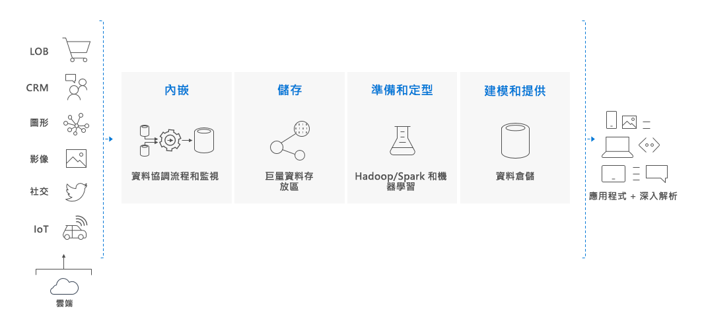

# 什麼是 Azure Synapse Analytics (先前為 SQL DW)？

> [!NOTE] 
>探索 [Azure Synapse (工作區預覽) 文件](../overview-what-is.md)。
>

Azure Synapse 是一種分析服務，可將企業資料倉儲和巨量資料分析整合在一起。 可讓您自由使用無伺服器隨選或佈建資源，隨意且大規模地查詢您的資料。 Azure Synapse 會將這兩個世界結合在一起，透過整合的經驗擷取、準備、管理和處理資料，以滿足立即的 BI 和機器學習需求。

Azure Synapse 有四個元件：

- Synapse SQL：完成以 T-SQL 為基礎的分析 - 正式推出
  - SQL 集區 (依據佈建的 DWU 付費)
  - SQL 隨選 (依據處理的 TB 量付費) (預覽)
- Spark：深入整合的 Apache Spark (預覽)
- Synapse Pipelines：混合式資料整合 (預覽)
- Studio：整合的使用者體驗。 (預覽)

## Azure Synapse 中的 Synapse SQL 集區

Synapse SQL 集區是已在 Azure Synapse 中正式推出的企業資料倉儲功能。

SQL 集區代表使用 Synapse SQL 時所佈建的分析資源集合。 SQL 集區的大小取決於資料倉儲單位 (DWU)。

使用簡單的 [PolyBase](/sql/relational-databases/polybase/polybase-guide?toc=/azure/synapse-analytics/sql-data-warehouse/toc.json&bc=/azure/synapse-analytics/sql-data-warehouse/breadcrumb/toc.json&view=azure-sqldw-latest) T-SQL 查詢匯入巨量資料，然後使用 MPP 功能來執行高效能分析。 當您進行整合及分析時，Synapse SQL 集區將會變成您企業可以信賴的真正單一版本，可為您提供更快速且更穩健的深入解析。  

## 巨量資料解決方案的重要元件

在雲端型的端對端巨量資料解決方案中，資料倉儲是重要元件。

在雲端資料解決方案中，資料會內嵌至來自各種來源的巨量資料存放區。 一旦位於巨量資料存放區中，Hadoop、Spark 和機器學習演算法就會準備及定型資料。 當資料已準備好進行複雜分析時，Synapse SQL 集區會使用 PolyBase 來查詢巨量資料存放區。 PolyBase 會使用標準 T-SQL 查詢來將資料帶入 Synapse SQL 集區資料表。

Synapse SQL 集區會將資料儲存到具有單欄式儲存體的關聯式資料表。 這種格式會大幅減少資料儲存體成本，而且可以改善查詢效能。 儲存好資料後，您就可以大規模執行分析。 相較於傳統資料庫系統，分析查詢在數秒鐘的時間內就可完成，不用到數分鐘，或者在數小時內而不用數天。

分析結果可以移至全球報告資料庫或應用程式。 商務分析師便可充分了解，以進行靈活的商務決策。

## 後續步驟

- 探索 [Azure Synapse 架構](massively-parallel-processing-mpp-architecture.md)
- 快速[建立 SQL 集區](create-data-warehouse-portal.md)
- [載入範例資料](load-data-from-azure-blob-storage-using-polybase.md)。
- 探索[影片](https://azure.microsoft.com/documentation/videos/index/?services=sql-data-warehouse)

或者，您也可以看看以下其他 Azure Synapse 資源。

- 搜尋[部落格](https://azure.microsoft.com/blog/tag/azure-sql-data-warehouse/)
- 提交[功能要求](https://feedback.azure.com/forums/307516-sql-data-warehouse)
- [建立支援票證](sql-data-warehouse-get-started-create-support-ticket.md)
- 搜尋 [Microsoft 問與答頁面](https://docs.microsoft.com/answers/topics/azure-synapse-analytics.html)
- 搜尋 [Stack Overflow 論壇](https://stackoverflow.com/questions/tagged/azure-sqldw)
