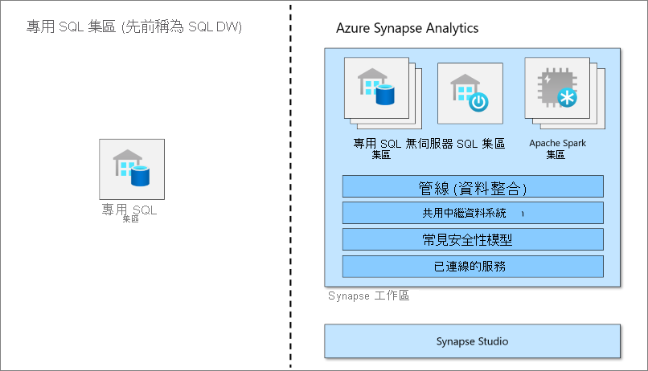

# Azure Synapse Analytics 中的專用 SQL 集區 (先前稱為 SQL DW) 是什麼？

Azure Synapse Analytics 是一種分析服務，可將企業資料倉儲和巨量資料分析整合在一起。 專用 SQL 集區 (先前稱為 SQL DW) 是在 Azure Synapse Analytics 中提供的企業資料倉儲功能。

專用 SQL 集區 (先前稱為 SQL DW) 代表使用 Synapse SQL 時所佈建的分析資源集合。 專用 SQL 集區 (先前稱為 SQL DW) 的大小取決於資料倉儲單位 (DWU)。

在您建立專用 SQL 集區後，您可以使用簡單的 [PolyBase](/sql/relational-databases/polybase/polybase-guide?toc=/azure/synapse-analytics/sql-data-warehouse/toc.json&bc=/azure/synapse-analytics/sql-data-warehouse/breadcrumb/toc.json&view=azure-sqldw-latest&preserve-view=true) T-SQL 查詢匯入巨量資料，然後使用分散式查詢引擎功能來執行高效能分析。 當您整合及分析資料時，專用 SQL 集區 (先前稱為 SQL DW) 將成為您的企業可以信賴的真正單一版本，可為您提供更快速且更穩健的深入解析。

> [!NOTE]
>探索 [Azure Synapse Analytics 文件](../overview-what-is.md)。
> 

## 巨量資料解決方案的重要元件

在雲端型的端對端巨量資料解決方案中，資料倉儲是重要元件。

在雲端資料解決方案中，資料會內嵌至來自各種來源的巨量資料存放區。 一旦位於巨量資料存放區中，Hadoop、Spark 和機器學習演算法就會準備及定型資料。 當資料已準備好進行複雜分析時，專用 SQL 集區會使用 PolyBase 來查詢巨量資料存放區。 PolyBase 會使用標準 T-SQL 查詢來將資料導入專用 SQL 集區 (先前稱為 SQL DW) 資料表中。

專用 SQL 集區 (先前稱為 SQL DW) 會將資料儲存到具有單欄式儲存體的關聯式資料表。 這種格式可大幅減少資料儲存體成本，而且可以改善查詢效能。 儲存好資料後，您就可以大規模執行分析。 相較於傳統資料庫系統，分析查詢在數秒鐘的時間內就可完成，不用到數分鐘，或者在數小時內而不用數天。

分析結果可以移至全球報告資料庫或應用程式。 商務分析師便可充分了解，以進行靈活的商務決策。

## 後續步驟

- 探索 [Azure Synapse 架構](massively-parallel-processing-mpp-architecture.md)
- 快速[建立專用 SQL 集區](create-data-warehouse-portal.md)
- [載入範例資料](./load-data-from-azure-blob-storage-using-copy.md)。
- 探索[影片](https://azure.microsoft.com/documentation/videos/index/?services=sql-data-warehouse)

或者，您也可以看看以下其他 Azure Synapse 資源。

- 搜尋[部落格](https://azure.microsoft.com/blog/tag/azure-sql-data-warehouse/)
- 提交[功能要求](https://feedback.azure.com/forums/307516-sql-data-warehouse)
- [建立支援票證](sql-data-warehouse-get-started-create-support-ticket.md)
- 搜尋 [Microsoft 問與答頁面](/answers/topics/azure-synapse-analytics.html)
- 搜尋 [Stack Overflow 論壇](https://stackoverflow.com/questions/tagged/azure-sqldw)