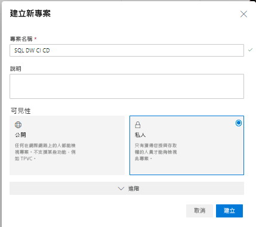
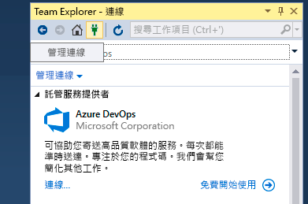
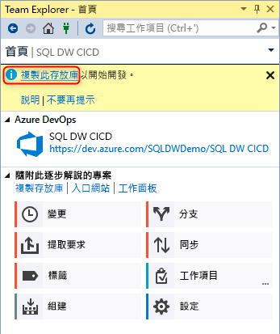
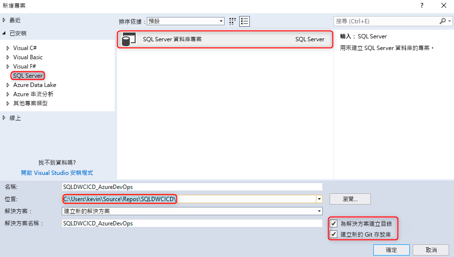
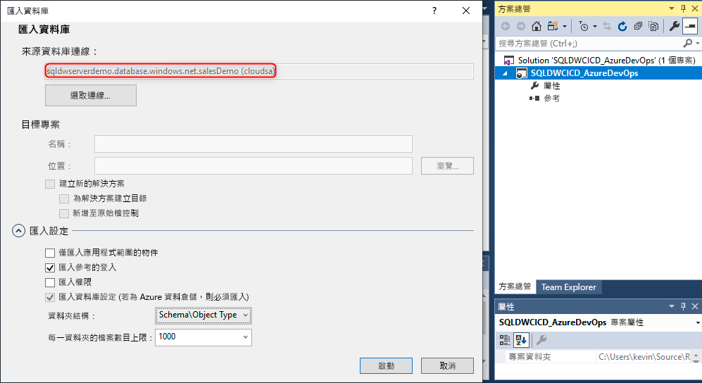
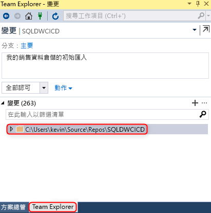
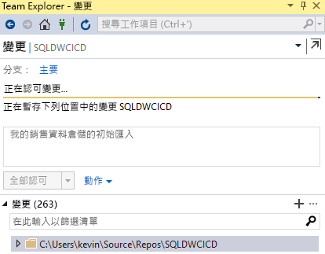
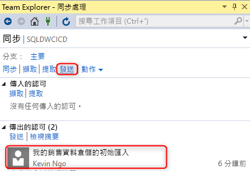
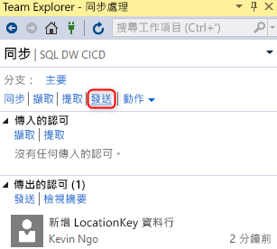
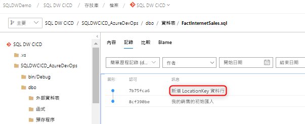

# SQL 集區的原始檔控制整合

本教學課程概述如何將您的 SQL Server Data Tools (SSDT) 資料庫專案與原始檔控制整合。  原始檔控制整合是在 Azure Synapse Analytics 中為 SQL 集區資源建置持續整合和部署管線的第一個步驟。 

## 開始之前

- 註冊 [Azure DevOps 組織](https://azure.microsoft.com/services/devops/)
- 完成[建立和連線](https://docs.microsoft.com/azure/sql-data-warehouse/create-data-warehouse-portal)教學課程
-  [安裝 Visual Studio 2019](https://visualstudio.microsoft.com/vs/older-downloads/) 

## 設定及連線至 Azure DevOps

1. 在您的 Azure DevOps 組織中，建立可透過 Azure Repo 存放庫裝載 SSDT 資料庫專案的專案

   

2. 選取 [管理連線]，以開啟 Visual Studio 並連線到步驟 1 中的 Azure DevOps 組織和專案

   

   ![[連接]](./media/sql-data-warehouse-source-control-integration/3-connect.png "連線")

3. 將您的 Azure Repo 存放庫從您的專案複製到本機電腦

   

## 建立及連結您的專案

1. 在 Visual Studio 中，建立新的 SQL Server 資料庫專案，並在**複製到本機的存放庫**中包含目錄和本機 Git 存放庫

     

2. 以滑鼠右鍵按一下空白的 sqlproject，並將資料倉儲匯入資料庫專案中

     

3. 在 Visual Studio 的 Team Explorer 中，將您的所有變更認可至本機 Git 存放庫 

     

4. 現在您已在複製的存放庫中將變更認可到本機，接著請同步您的變更並將變更推送至 Azure DevOps 專案中的 Azure Repo 存放庫。

   

     

## 驗證

1. 從 Visual Studio SQL Server Data Tools (SSDT) 中更新資料庫專案中的資料表欄，以確認變更是否已推送至您的 Azure Repo

   

2. 認可變更並將變更從本機存放庫推送至 Azure Repo

   

3. 確認變更已推送至您的 Azure Repo 存放庫

   

4. (**選擇性**) 使用 [結構描述比較]，並使用 SSDT 更新目標資料倉儲的變更，以確保 Azure Repo 存放庫和本機存放庫中的物件定義會反映您的資料倉儲

## 後續步驟

- [SQL 集區的開發](sql-data-warehouse-overview-develop.md)
