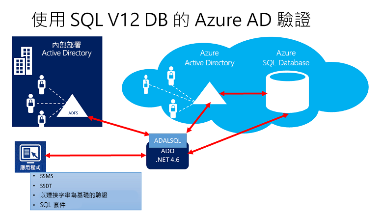
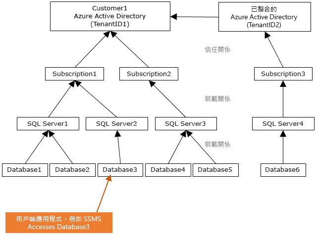
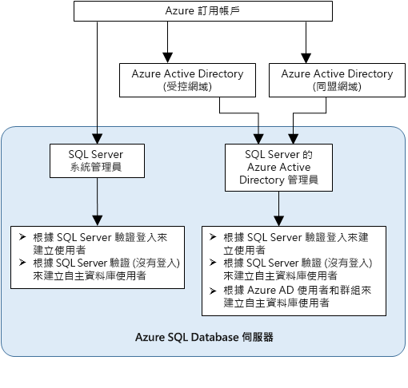

# 使用 Azure Active Directory 驗證向 Synapse SQL 進行驗證

Azure Active Directory 驗證機制會使用 Azure Active Directory (Azure AD) 中的身分識別連線至 [Azure Synapse Analytics](../overview-faq.md)。

透過 Azure AD 驗證，您可以集中管理可存取 Azure Synapse 的使用者身分識別，以簡化權限管理。 包括以下優點：

- 提供替代一般使用者名稱和密碼驗證的方法。
- 協助停止跨伺服器使用過多的使用者身分識別。
- 允許在單一位置變換密碼。
- 客戶可以使用外部 (Azure AD) 群組來管理權限。
- 它可以藉由啟用整合式 Windows 驗證和 Azure Active Directory 支援的其他形式驗證來避免儲存密碼。
- Azure AD 可對連線到 Azure Synapse 的應用程式支援權杖型驗證。
- Azure AD 驗證本機 Azure Active Directory 的 ADFS (網域同盟) 或原生使用者/密碼驗證，而不需進行網域同步處理。
- Azure AD 支援來自 SQL Server Management Studio 的連線，其中使用包含 Multi-Factor Authentication (MFA) 的 Active Directory 通用驗證。  MFA 包含增強式驗證功能，其中提供一系列簡易的驗證選項，包括電話、簡訊、含有 PIN 的智慧卡或行動應用程式通知。 如需詳細資訊，請參閱[對 Synapse SQL 使用 Azure AD MFA 的 SSMS 支援](mfa-authentication.md)。
- Azure AD 支援從 SQL Server Data Tools (SSDT) 使用 Active Directory 互動式驗證的類似連線。 如需詳細資訊，請參閱 [SQL Server Data Tools (SSDT) 中的 Azure Active Directory 支援](/sql/ssdt/azure-active-directory?toc=/azure/synapse-analytics/toc.json&bc=/azure/synapse-analytics/breadcrumb/toc.json&view=azure-sqldw-latest&preserve-view=true)。

設定步驟包括以下設定和使用 Azure Active Directory 驗證的程序。

1. 建立和填入 Azure AD。
2. 建立 Azure Active Directory 身分識別
3. 將角色指派給 Synapse 工作區中建立的 Azure Active Directory 身分識別
4. 使用 Azure AD 身分識別連線到 Synapse Studio。

## Azure Synapse Analytics 中的 Azure AD 傳遞

Azure Synapse Analytics 可讓您使用 Azure Active Directory 身分識別來存取資料湖中的資料。

若要定義不同資料引擎中相關的檔案和資料存取權限，在單一位置中定義權限 (而非在多個位置中定義權限)，可簡化資料湖解決方案。

## 信認架構

下列高階圖表摘要說明搭配使用 Azure AD 驗證與 Synapse SQL 的解決方案架構。 若要支援 Azure AD 原生使用者密碼，只會考慮雲端部分和 Azure AD/Synapse Synapse SQL。 若要支援同盟驗證 (或 Windows 認證的使用者/密碼)，需要與 ADFS 區塊進行通訊。 箭頭表示通訊路徑。

下圖表示允許用戶端藉由提交權杖連線到資料庫的同盟、信任和主控關聯性。 此權杖是由 Azure AD 所驗證，並受到資料庫信任。 

客戶 1 可以代表具有原生使用者的 Azure AD 或具有同盟使用者的 Azure Active Directory。 客戶 2 代表包含已匯入使用者的可能解決方案；在此範例中，來自同盟 Azure Active Directory 且 ADFS 正與 Azure Active Directory 進行同步處理。 

請務必了解使用 Azure AD 驗證存取資料庫的必要條件是裝載訂用帳戶要與 Azure AD 相關聯。 您必須使用相同的訂用帳戶來建立裝載 Azure SQL Database 或專用 SQL 集區的 SQL Server。

## 系統管理員結構

使用 Azure AD 驗證時，Synapse SQL 會有兩個系統管理員帳戶：原始的 SQL Server 系統管理員和 Azure AD 系統管理員。 只有以 Azure AD 帳戶為基礎的系統管理員可以在使用者資料庫中建立第一個 Azure AD 自主資料庫使用者。 

Azure AD 系統管理員登入可以是 Azure AD 使用者或 Azure AD 群組。 當系統管理員是群組帳戶時，其可供任何群組成員使用，啟用 Synapse SQL 執行個體的多個 Azure AD 系統管理員。 

以系統管理員的身分使用群組帳戶，可讓您集中新增和移除 Azure AD 中的群組成員，而不需要變更 Azure Synapse Analytics 工作區中的使用者或權限，藉以增強管理性。 一律只能設定一個 Azure AD 系統管理員 (使用者或群組)。

## 權限

若要建立新的使用者，您必須具有資料庫中的 `ALTER ANY USER` 權限。 任何資料庫使用者皆可授與 `ALTER ANY USER` 權限。 `ALTER ANY USER` 權限的擁有者還包括伺服器系統管理員帳戶、具備資料庫之 `CONTROL ON DATABASE` 或 `ALTER ON DATABASE` 權限的資料庫使用者，以及 `db_owner` 資料庫角色的成員。

若要在 Synapse SQL 中建立自主資料庫使用者，您必須使用 Azure AD 身分識別來連線到資料庫或執行個體。 若要建立第一個自主資料庫使用者，您必須使用 Azure AD 系統管理員 (資料庫的擁有者) 連接到資料庫。 

只有在為 Synapse SQL 建立 Azure AD 系統管理員後，才可以進行任何 Azure AD 驗證。 如果已從伺服器移除 Azure Active Directory 系統管理員，則先前在 Synapse SQL 內建立的現有 Azure Active Directory 使用者便無法再使用其 Azure Active Directory 認證連線到資料庫。
 
## Azure AD 功能和限制

- 下列 Azure AD 成員可以在 Synapse SQL 中佈建：

  - 原生成員：在受控網域或客戶網域的 Azure AD 中建立的成員。 如需詳細資訊，請參閱 [將您自己的網域名稱新增至 Azure AD](../../active-directory/fundamentals/add-custom-domain.md?toc=/azure/synapse-analytics/toc.json&bc=/azure/synapse-analytics/breadcrumb/toc.json)。
  - 同盟網域成員：利用同盟網域在 Azure AD 中建立的成員。 如需詳細資訊，請參閱 [Microsoft Azure 現在支援 Windows Server Active Directory 的同盟](https://azure.microsoft.com/blog/20../../windows-azure-now-supports-federation-with-windows-server-active-directory/)。
  - 從其他 Azure AD 匯入，且為原生網域或同盟網域成員者。
  - 建立 Active Directory 群組作為安全性群組。

- 在具有 `db_owner` 伺服器角色的群組中，Azure AD 使用者無法針對 Synapse SQL 使用 **[CREATE DATABASE SCOPED CREDENTIAL](/sql/t-sql/statements/create-database-scoped-credential-transact-sql?toc=/azure/synapse-analytics/toc.json&bc=/azure/synapse-analytics/breadcrumb/toc.json&view=azure-sqldw-latest&preserve-view=true)** 語法。 您會看到下列錯誤︰

    `SQL Error [2760] [S0001]: The specified schema name 'user@mydomain.com' either does not exist or you do not have permission to use it.`

    直接將 `db_owner` 角色授與給個別 Azure AD 使用者，以減輕 **CREATE DATABASE SCOPED CREDENTIAL** 問題。

- 下列系統函式在 Azure AD 主體下執行時會傳回 NULL：

  - `SUSER_ID()`
  - `SUSER_NAME(<admin ID>)`
  - `SUSER_SNAME(<admin SID>)`
  - `SUSER_ID(<admin name>)`
  - `SUSER_SID(<admin name>)`

## 使用 Azure AD 身分識別連線

Azure Active Directory 驗證支援下列方法，使用 Azure AD 身分識別連接至資料庫：

- Azure Active Directory 密碼
- Azure Active Directory 整合式
- 包含 MFA 的 Active Directory 通用驗證
- 使用應用程式權杖驗證

Azure AD 伺服器主體 (登入) 支援下列驗證方法：

- Azure Active Directory 密碼
- Azure Active Directory 整合式
- 包含 MFA 的 Active Directory 通用驗證

### 其他考量

- 若要增強管理性，建議您以系統管理員身分佈建專用的 Azure AD 群組。
- 任何時候都只能為 Synapse SQL 集區設定一個 Azure AD 系統管理員 (使用者或群組)。
  - Azure AD 伺服器主體 (登入) 新增到 Synapse SQL 之後，就能建立可以加入 `sysadmin` 角色的多個 Azure AD 伺服器主體 (登入)。
- 只有 Synapse SQL 的 Azure AD 系統管理員可以在一開始使用 Azure Active Directory 帳戶連線到 Synapse SQL。 Active Directory 系統管理員可以設定後續的 Azure AD 資料庫使用者。
- 建議將連接逾時設定為 30 秒。
- SQL Server 2016 Management Studio 和 SQL Server Data Tools for Visual Studio 2015 (版本 14.0.60311.1 (2016 年 4 月) 或更新版本) 支援 Azure Active Directory 驗證。 ( **.NET Framework Data Provider for SqlServer** 支援 Azure AD 驗證，最低版本 .NET Framework 4.6)。 因此，這些工具和資料層應用程式 (DAC 和 .BACPAC) 的最新版本可以使用 Azure AD 驗證。
- 從 15.0.1 版起，[sqlcmd 公用程式](/sql/tools/sqlcmd-utility?toc=/azure/synapse-analytics/toc.json&bc=/azure/synapse-analytics/breadcrumb/toc.json&view=azure-sqldw-latest&preserve-view=true)和 [bcp 公用程式](/sql/tools/bcp-utility?toc=/azure/synapse-analytics/toc.json&bc=/azure/synapse-analytics/breadcrumb/toc.json&view=azure-sqldw-latest&preserve-view=true)都支援搭配 MFA 的 Active Directory 互動式驗證。
- SQL Server Data Tools for Visual Studio 2015 至少需要 2016 年 4 月版本的 Data Tools (版本 14.0.60311.1)。 Azure AD 使用者目前不會顯示在 SSDT 物件總管中。 解決方法是在 [sys.database_principals](/sql/relational-databases/system-catalog-views/sys-database-principals-transact-sql?toc=/azure/synapse-analytics/toc.json&bc=/azure/synapse-analytics/breadcrumb/toc.json&view=azure-sqldw-latest&preserve-view=true) 中檢視使用者。
- [Microsoft JDBC Driver 6.0 for SQL Server](https://www.microsoft.com/download/details.aspx?id=11774) 支援 Azure AD 驗證。 此外，請參閱 [設定連接屬性](/sql/connect/jdbc/setting-the-connection-properties?toc=/azure/synapse-analytics/toc.json&bc=/azure/synapse-analytics/breadcrumb/toc.json&view=azure-sqldw-latest&preserve-view=true)。

## 後續步驟

- 如需 Synapse SQL 中的存取和控制概觀，請參閱 [Synapse SQL 存取控制](../security/synapse-workspace-access-control-overview.md)。
- 如需資料庫主體的詳細資訊，請參閱[主體](/sql/relational-databases/security/authentication-access/principals-database-engine?toc=/azure/synapse-analytics/toc.json&bc=/azure/synapse-analytics/breadcrumb/toc.json&view=azure-sqldw-latest&preserve-view=true)。
- 如需資料庫角色的詳細資訊，請參閱[資料庫角色](/sql/relational-databases/security/authentication-access/database-level-roles?toc=/azure/synapse-analytics/toc.json&bc=/azure/synapse-analytics/breadcrumb/toc.json&view=azure-sqldw-latest&preserve-view=true)。

