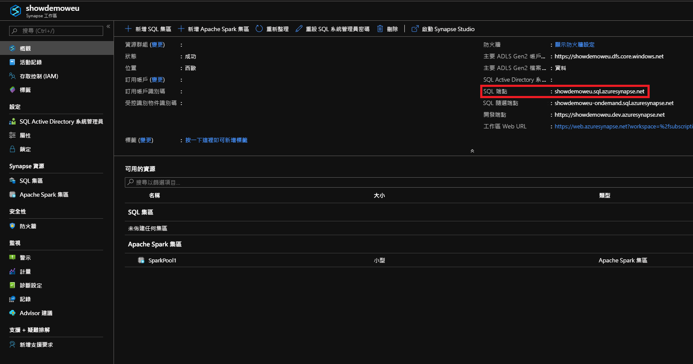
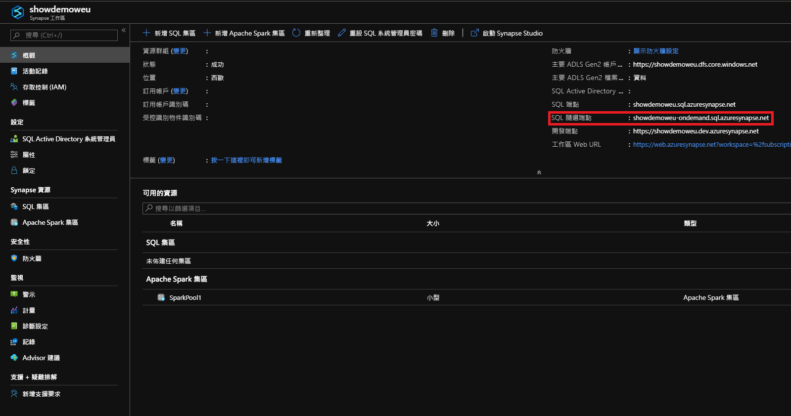

# <a name="connect-to-synapse-sql"></a>連線到 Synapse SQL
連線到 Azure Synapse Analytics 中的 Synapse SQL 功能。

## <a name="supported-tools-for-sql-on-demand-preview"></a>支援 SQL 隨選的工具 (預覽)

[Azure Data Studio](/sql/azure-data-studio/download-azure-data-studio) 從 1.18.0 版開始便已獲得完整支援。 SSMS 從 18.5 版開始只獲得部分支援，因此只能用來連線和查詢。

> [!NOTE]
> 如果 AAD 登入在執行查詢時開啟連線超過 1 小時，任何仰賴 AAD 的查詢都會失敗。 這包括使用 AAD 傳遞以及會與 AAD 互動的陳述式 (例如 CREATE EXTERNAL PROVIDER) 來查詢儲存體。 這會影響每個讓連線保持開啟的工具，例如 SSMS 和 ADS 中的查詢編輯器。 開啟新連線以執行查詢的工具 (例如 Synapse Studio) 則不受影響。

> 您可以重新啟動 SSMS，或在 ADS 中連線再中斷連線，以減輕這個問題。 

## <a name="find-your-server-name"></a>尋找您的伺服器名稱

在下列範例中，SQL 集區的伺服器名稱為：showdemoweu.sql.azuresynapse.net。
下列範例中的 SQL 隨選伺服器名稱為：showdemoweu-ondemand.sql.azuresynapse.net。

若要尋找完整的伺服器名稱：

1. 移至 [Azure 入口網站](https://portal.azure.com)。
2. 按一下 [Synapse 工作區]。
3. 按一下您想要連線的工作區。
4. 移至概觀。
5. 找出完整的伺服器名稱。

## <a name="sql-pool"></a>**SQL 集區**



## <a name="sql-on-demand"></a>**SQL 隨選**



## <a name="supported-drivers-and-connection-strings"></a>支援的驅動程式和連接字串
Synapse SQL 支援 [ADO.NET](https://msdn.microsoft.com/library/e80y5yhx(v=vs.110).aspx)、[ODBC](https://msdn.microsoft.com/library/jj730314.aspx)、[PHP](https://msdn.microsoft.com/library/cc296172.aspx?f=255&MSPPError=-2147217396) 和 [JDBC](https://msdn.microsoft.com/library/mt484311(v=sql.110).aspx)。 若要尋找最新版本和文件，請按一下前述的其中一個驅動程式。 若要從 Azure 入口網站自動為您使用的驅動程式產生連接字串，按一下前述範例中的 [顯示資料庫連接字串]。 下列一些範例顯示每個驅動程式的連接字串。

> [!NOTE]
> 請考慮將連線逾時設定為 300 秒，以便在短時間無法使用時能夠維持連線。

### <a name="adonet-connection-string-example"></a>ADO.NET 連接字串範例

```csharp
Server=tcp:{your_server}.sql.azuresynapse.net,1433;Database={your_database};User ID={your_user_name};Password={your_password_here};Encrypt=True;TrustServerCertificate=False;Connection Timeout=30;
```

### <a name="odbc-connection-string-example"></a>ODBC 連接字串範例

```csharp
Driver={SQL Server Native Client 11.0};Server=tcp:{your_server}.sql.azuresynapse.net,1433;Database={your_database};Uid={your_user_name};Pwd={your_password_here};Encrypt=yes;TrustServerCertificate=no;Connection Timeout=30;
```

### <a name="php-connection-string-example"></a>PHP 連接字串範例

```PHP
Server: {your_server}.sql.azuresynapse.net,1433 \r\nSQL Database: {your_database}\r\nUser Name: {your_user_name}\r\n\r\nPHP Data Objects(PDO) Sample Code:\r\n\r\ntry {\r\n   $conn = new PDO ( \"sqlsrv:server = tcp:{your_server}.sql.azuresynapse.net,1433; Database = {your_database}\", \"{your_user_name}\", \"{your_password_here}\");\r\n    $conn->setAttribute( PDO::ATTR_ERRMODE, PDO::ERRMODE_EXCEPTION );\r\n}\r\ncatch ( PDOException $e ) {\r\n   print( \"Error connecting to SQL Server.\" );\r\n   die(print_r($e));\r\n}\r\n\rSQL Server Extension Sample Code:\r\n\r\n$connectionInfo = array(\"UID\" => \"{your_user_name}\", \"pwd\" => \"{your_password_here}\", \"Database\" => \"{your_database}\", \"LoginTimeout\" => 30, \"Encrypt\" => 1, \"TrustServerCertificate\" => 0);\r\n$serverName = \"tcp:{your_server}.sql.azuresynapse.net,1433\";\r\n$conn = sqlsrv_connect($serverName, $connectionInfo);
```

### <a name="jdbc-connection-string-example"></a>JDBC 連接字串範例

```Java
jdbc:sqlserver://yourserver.sql.azuresynapse.net:1433;database=yourdatabase;user={your_user_name};password={your_password_here};encrypt=true;trustServerCertificate=false;hostNameInCertificate=*.sql.azuresynapse.net;loginTimeout=30;
```

## <a name="connection-settings"></a>連線設定
Synapse SQL 會在連線和物件建立期間將一些設定標準化。 這些設定不能覆寫，其中包括︰

| 資料庫設定 | 值 |
|:--- |:--- |
| [ANSI_NULLS](/sql/t-sql/statements/set-ansi-nulls-transact-sql?toc=/azure/synapse-analytics/toc.json&bc=/azure/synapse-analytics/breadcrumb/toc.json&view=azure-sqldw-latest) |開啟 |
| [QUOTED_IDENTIFIERS](/sql/t-sql/statements/set-quoted-identifier-transact-sql?toc=/azure/synapse-analytics/toc.json&bc=/azure/synapse-analytics/breadcrumb/toc.json&view=azure-sqldw-latest) |開啟 |
| [DATEFORMAT](/sql/t-sql/statements/set-dateformat-transact-sql?toc=/azure/synapse-analytics/toc.json&bc=/azure/synapse-analytics/breadcrumb/toc.json&view=azure-sqldw-latest) |mdy |
| [DATEFIRST](/sql/t-sql/statements/set-datefirst-transact-sql?toc=/azure/synapse-analytics/toc.json&bc=/azure/synapse-analytics/breadcrumb/toc.json&view=azure-sqldw-latest) |7 |

## <a name="recommendations"></a>建議

若要執行 **SQL 隨選**查詢，建議的工具為 [Azure Data Studio](get-started-azure-data-studio.md) 和 Azure Synapse Studio。

## <a name="next-steps"></a>後續步驟
若要使用 Visual Studio 連接及查詢，請參閱 [使用 Visual Studio 查詢](../sql-data-warehouse/sql-data-warehouse-query-visual-studio.md?toc=/azure/synapse-analytics/toc.json&bc=/azure/synapse-analytics/breadcrumb/toc.json)。 若要深入了解驗證選項，請參閱[適用於 Synapse SQL 的驗證](../sql-data-warehouse/sql-data-warehouse-authentication.md?toc=/azure/synapse-analytics/toc.json&bc=/azure/synapse-analytics/breadcrumb/toc.json)。