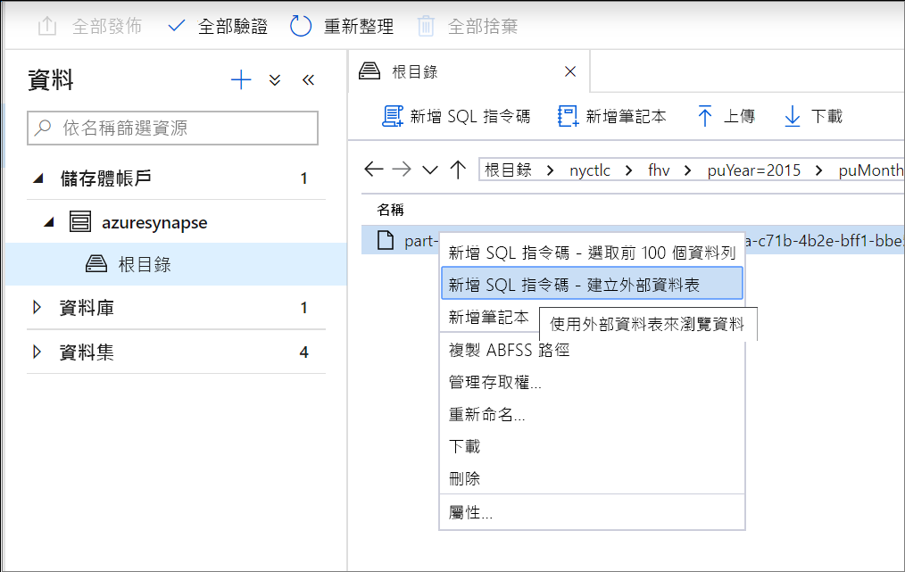
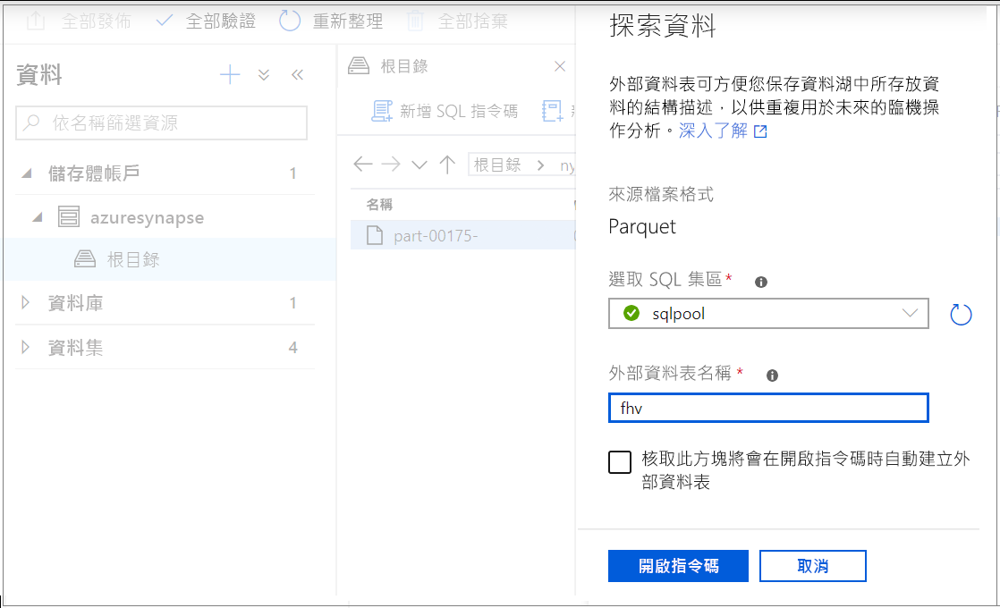
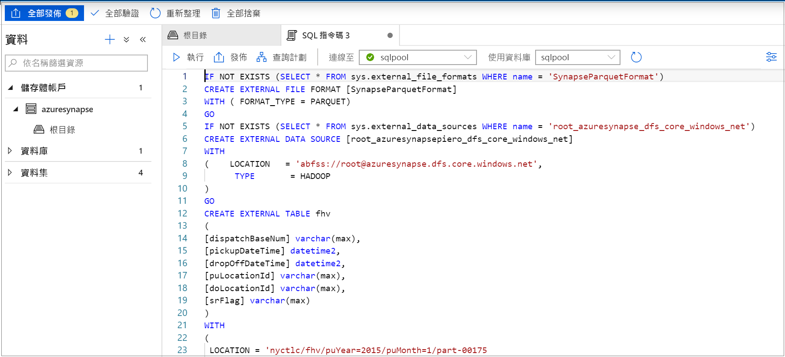
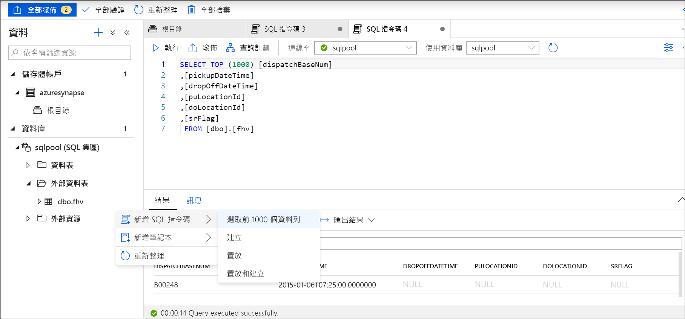

# <a name="use-external-tables-with-synapse-sql"></a>搭配 Synapse SQL 使用外部資料表

外部資料表會指向位於 Hadoop、Azure 儲存體 Blob 或 Azure Data Lake Store 中的資料。 外部資料表是用來從檔案讀取資料，或將資料寫入 Azure 儲存體中的檔案。 透過 Synapse SQL，您可以使用外部資料表來讀取資料，並將其寫入 SQL 集區或 SQL 隨選 (預覽)。

## <a name="external-tables-in-synapse-sql-pool-and-on-demand"></a>Synapse SQL 集區和 SQL 隨選中的外部資料表

### <a name="sql-pool"></a>[SQL 集區](#tab/sql-pool) 

在 SQL 集區中，您可以使用外部資料表來執行下列動作：

- 使用 Transact-SQL 陳述式查詢 Azure Blob 儲存體和 Azure Data Lake Gen2。
- 從 Azure Blob 儲存體和 Azure Data Lake Storage 匯入資料，並儲存到 SQL 集區。

與 [CREATE TABLE AS SELECT](../sql-data-warehouse/sql-data-warehouse-develop-ctas.md?toc=/azure/synapse-analytics/toc.json&bc=/azure/synapse-analytics/breadcrumb/toc.json) 陳述式搭配使用時，選取從外部資料表將資料匯入 SQL 集區中。 除了 [COPY 陳述式](/sql/t-sql/statements/copy-into-transact-sql?toc=/azure/synapse-analytics/toc.json&bc=/azure/synapse-analytics/breadcrumb/toc.json&view=azure-sqldw-latest&preserve-view=true)，外部資料表也很適合載入資料。 

如需載入的教學課程，請參閱[使用 PolyBase 從 Azure Blob 儲存體載入資料](../sql-data-warehouse/load-data-from-azure-blob-storage-using-polybase.md?toc=/azure/synapse-analytics/toc.json&bc=/azure/synapse-analytics/breadcrumb/toc.json)。

### <a name="sql-on-demand"></a>[SQL 隨選](#tab/sql-on-demand)

針對 SQL 隨選，您將使用外部資料表來執行下列動作：

- 使用 Transact-SQL 陳述式查詢 Azure Blob 儲存體或 Azure Data Lake Storage 中的資料
- 使用 [CETAS](develop-tables-cetas.md)，將 SQL 隨選查詢結果儲存到 Azure Blob 儲存體或 Azure Data Lake Storage 中的檔案

您可以透過下列步驟，使用 SQL 隨選建立外部資料表：

1. CREATE EXTERNAL DATA SOURCE
2. CREATE EXTERNAL FILE FORMAT
3. CREATE EXTERNAL TABLE

---

### <a name="security"></a>安全性

使用者必須擁有外部資料表的 `SELECT` 權限才能讀取資料。
外部資料表會以下列規則，使用資料來源中定義的資料庫範圍認證來存取基礎 Azure 儲存體：
- 沒有認證的資料來源可讓外部資料表存取 Azure 儲存體上公開可用的檔案。
- 資料來源可以有認證，讓外部資料表只能使用 SAS 權杖或工作區受控識別來存取 Azure 儲存體上的檔案 - 如需範例，請參閱[開發儲存體檔案儲存體存取控制](develop-storage-files-storage-access-control.md#examples)一文。

> [!IMPORTANT]
> 在 SQL 集區中，不含認證的資料來源可讓 Azure AD 使用者使用其 Azure AD 身分識別來存取儲存體檔案。 在 SQL 隨選中，您必須使用具有 `IDENTITY='User Identity'` 屬性的資料庫範圍認證來建立資料來源 - 請參閱[這裡的範例](develop-storage-files-storage-access-control.md#examples)。

## <a name="create-external-data-source"></a>CREATE EXTERNAL DATA SOURCE

外部資料源是用來連線到儲存體帳戶。 您可[在此](/sql/t-sql/statements/create-external-data-source-transact-sql?toc=/azure/synapse-analytics/toc.json&bc=/azure/synapse-analytics/breadcrumb/toc.json&view=azure-sqldw-latest&preserve-view=true)找到完整文件概述。

### <a name="syntax-for-create-external-data-source"></a>CREATE EXTERNAL DATA SOURCE 語法

#### <a name="sql-pool"></a>[SQL 集區](#tab/sql-pool)

```syntaxsql
CREATE EXTERNAL DATA SOURCE <data_source_name>
WITH
(    LOCATION         = '<prefix>://<path>'
     [, CREDENTIAL = <database scoped credential> ]
     , TYPE = HADOOP
)
[;]
```

#### <a name="sql-on-demand"></a>[SQL 隨選](#tab/sql-on-demand)

```syntaxsql
CREATE EXTERNAL DATA SOURCE <data_source_name>
WITH
(    LOCATION         = '<prefix>://<path>'
     [, CREDENTIAL = <database scoped credential> ]
)
[;]
```

---

### <a name="arguments-for-create-external-data-source"></a>CREATE EXTERNAL DATA SOURCE 引數

data_source_name

指定資料來源的使用者定義名稱。 這個名稱在資料庫內必須是唯一的。

#### <a name="location"></a>Location
LOCATION = `'<prefix>://<path>'` - 提供連線通訊協定和路徑給外部資料來源。 下列模式可用於位置中：

| 外部資料來源        | 位置前置詞 | 位置路徑                                         |
| --------------------------- | --------------- | ----------------------------------------------------- |
| Azure Blob 儲存體          | `wasb[s]`       | `<container>@<storage_account>.blob.core.windows.net` |
| Azure Blob 儲存體          | `http[s]`       | `<storage_account>.blob.core.windows.net/<container>/subfolders` |
| Azure Data Lake Store Gen 1 | `http[s]`       | `<storage_account>.azuredatalakestore.net/webhdfs/v1` |
| Azure Data Lake Store Gen 2 | `http[s]`       | `<storage_account>.dfs.core.windows.net/<container>/subfolders`  |

`https:` 前置詞可讓您在路徑中使用子資料夾。

#### <a name="credential"></a>認證
CREDENTIAL = `<database scoped credential>` 是選擇性認證，將用來在 Azure 儲存體上進行驗證。 沒有認證的外部資料來源可以存取公用儲存體帳戶。 

SQL 集區中沒有認證的外部資料來源也可以使用呼叫者 Azure AD 身分識別來存取儲存體上的檔案。 具有認證的外部資料來源會使用認證中指定的身分識別來存取檔案。
- 在 SQL 集區中，資料庫範圍認證可以指定自訂應用程式識別、工作區受控識別或 SAK 金鑰。 
- 在 SQL 隨選中，資料庫範圍認證可以指定呼叫者的 Azure AD 身分識別、工作區受控識別或 SAS 金鑰。 

#### <a name="type"></a>TYPE
在 SQL 集區中，TYPE = `HADOOP` 是強制性選項，會指定使用 Polybase 技術來存取基礎檔案。 此參數不能用於使用內建原生讀取器的 SQL 隨選服務。

### <a name="example-for-create-external-data-source"></a>CREATE EXTERNAL DATA SOURCE 範例

#### <a name="sql-pool"></a>[SQL 集區](#tab/sql-pool)

下列範例會針對指向紐約資料集的 Azure Data Lake Gen2 建立外部資料來源：

```sql
CREATE EXTERNAL DATA SOURCE AzureDataLakeStore
WITH
  -- Please note the abfss endpoint when your account has secure transfer enabled
  ( LOCATION = 'abfss://data@newyorktaxidataset.dfs.core.windows.net' ,
    CREDENTIAL = ADLS_credential ,
    TYPE = HADOOP
  ) ;
```

#### <a name="sql-on-demand"></a>[SQL 隨選](#tab/sql-on-demand)

下列範例會建立可使用 SAS 認證加以存取的 Azure Data Lake Gen2 外部資料來源：

```sql
CREATE DATABASE SCOPED CREDENTIAL [sqlondemand]
WITH IDENTITY='SHARED ACCESS SIGNATURE',  
SECRET = 'sv=2018-03-28&ss=bf&srt=sco&sp=rl&st=2019-10-14T12%3A10%3A25Z&se=2061-12-31T12%3A10%3A00Z&sig=KlSU2ullCscyTS0An0nozEpo4tO5JAgGBvw%2FJX2lguw%3D'
GO

CREATE EXTERNAL DATA SOURCE SqlOnDemandDemo WITH (
    LOCATION = 'https://sqlondemandstorage.blob.core.windows.net',
    CREDENTIAL = sqlondemand
);
```

下列範例會針對指向公開可用紐約資料集的 Azure Data Lake Gen2 建立外部資料來源：

```sql
CREATE EXTERNAL DATA SOURCE YellowTaxi
WITH ( LOCATION = 'https://azureopendatastorage.blob.core.windows.net/nyctlc/yellow/')
```
---

## <a name="create-external-file-format"></a>CREATE EXTERNAL FILE FORMAT

建立外部檔案格式物件來定義儲存於 Azure Blob 儲存體或 Azure Data Lake Store 的外部資料。 建立外部檔案格式是建立外部資料表的先決條件。 您可[在此](/sql/t-sql/statements/create-external-file-format-transact-sql?toc=/azure/synapse-analytics/toc.json&bc=/azure/synapse-analytics/breadcrumb/toc.json&view=azure-sqldw-latest&preserve-view=true)找到完整文件。

透過建立外部檔案格式，您可以指定外部資料表所參考資料的實際配置。

### <a name="syntax-for-create-external-file-format"></a>CREATE EXTERNAL FILE FORMAT 語法

#### <a name="sql-pool"></a>[SQL 集區](#tab/sql-pool)

```syntaxsql
-- Create an external file format for PARQUET files.  
CREATE EXTERNAL FILE FORMAT file_format_name  
WITH (  
    FORMAT_TYPE = PARQUET  
    [ , DATA_COMPRESSION = {  
        'org.apache.hadoop.io.compress.SnappyCodec'  
      | 'org.apache.hadoop.io.compress.GzipCodec'      }  
    ]);  

--Create an external file format for DELIMITED TEXT files
CREATE EXTERNAL FILE FORMAT file_format_name  
WITH (  
    FORMAT_TYPE = DELIMITEDTEXT  
    [ , DATA_COMPRESSION = 'org.apache.hadoop.io.compress.GzipCodec' ]
    [ , FORMAT_OPTIONS ( <format_options> [ ,...n  ] ) ]  
    );  

<format_options> ::=  
{  
    FIELD_TERMINATOR = field_terminator  
    | STRING_DELIMITER = string_delimiter
    | First_Row = integer
    | USE_TYPE_DEFAULT = { TRUE | FALSE }
    | Encoding = {'UTF8' | 'UTF16'}
}
```

#### <a name="sql-on-demand"></a>[SQL 隨選](#tab/sql-on-demand)

```syntaxsql
-- Create an external file format for PARQUET files.  
CREATE EXTERNAL FILE FORMAT file_format_name  
WITH (  
    FORMAT_TYPE = PARQUET  
    [ , DATA_COMPRESSION = {  
        'org.apache.hadoop.io.compress.SnappyCodec'  
      | 'org.apache.hadoop.io.compress.GzipCodec'      }  
    ]);  

--Create an external file format for DELIMITED TEXT files
CREATE EXTERNAL FILE FORMAT file_format_name  
WITH (  
    FORMAT_TYPE = DELIMITEDTEXT  
    [ , DATA_COMPRESSION = 'org.apache.hadoop.io.compress.GzipCodec' ]
    [ , FORMAT_OPTIONS ( <format_options> [ ,...n  ] ) ]  
    );  

<format_options> ::=  
{  
    FIELD_TERMINATOR = field_terminator  
    | STRING_DELIMITER = string_delimiter
    | First_Row = integer
    | USE_TYPE_DEFAULT = { TRUE | FALSE }
    | Encoding = {'UTF8' | 'UTF16'}
    | PARSER_VERSION = {'parser_version'}
}
```

---


### <a name="arguments-for-create-external-file-format"></a>CREATE EXTERNAL FILE FORMAT 引數

file_format_name - 指定外部檔案格式的名稱。

FORMAT_TYPE = [ PARQUET | DELIMITEDTEXT]- 指定外部資料的格式。

- PARQUET - 指定 Parquet 格式。
- DELIMITEDTEXT - 指定具有欄分隔符號的文字格式，也稱為欄位結束字元。

FIELD_TERMINATOR = *field_terminator* - 僅適用於分隔符號文字檔。 欄位結束字元會指定一或多個字元，在文字分隔檔案中標記每個欄位 (欄) 的結尾。 預設值是管道字元 (ꞌ|ꞌ)。

範例：

- FIELD_TERMINATOR = '|'
- FIELD_TERMINATOR = ' '
- FIELD_TERMINATOR = ꞌ\tꞌ

STRING_DELIMITER = *string_delimiter* - 針對文字分隔檔案中類型字串的資料指定欄位結束字元。 字串分隔符號的長度為一或多個字元，且要以單引號括起來。 預設值為空字串 ("")。

範例：

- STRING_DELIMITER = '"'
- STRING_DELIMITER = '*'
- STRING_DELIMITER = ꞌ,ꞌ

FIRST_ROW = *First_row_int* - 指定先讀取並套用至所有檔案的資料列編號。 將值設定為二會在載入資料時，略過每個檔案中的第一個資料列 (標題列)。 如果資料列具有資料列結束字元 (/r/n、/r、/n)，就會略過。

USE_TYPE_DEFAULT = { TRUE | **FALSE** } - 指定從文字檔擷取資料時，如何處理分隔符號文字檔中遺漏的值。

TRUE - 若從文字檔擷取資料，使用外部資料表定義中對應資料行之資料類型的預設值來儲存每個遺漏值。 例如，使用下列項目來取代遺漏值：

- 如果將資料行定義為數值資料行，使用 0。 不支援十進位資料行，且會出現錯誤。
- 如果資料行為字串資料行，使用空字串 ("")。
- 如果資料行為日期資料行，使用 1900-01-01。

FALSE - 將所有遺漏值儲存為 NULL。 在分隔符號文字檔中使用 NULL 一字儲存的任何 NULL 值都會以 'NULL' 字串匯入。

Encoding = {'UTF8' | 'UTF16'} - SQL 隨選可讀取以 UTF8 和 UTF16 編碼的分隔符號文字檔。

DATA_COMPRESSION = *data_compression_method* - 此引數會指定外部資料的資料壓縮方法。 

PARQUET 檔案格式類型支援下列壓縮方法：

- DATA_COMPRESSION = 'org.apache.hadoop.io.compress.GzipCodec'
- DATA_COMPRESSION = 'org.apache.hadoop.io.compress.SnappyCodec'

從 PARQUET 外部資料表讀取時會忽略這個引數，但在使用 [CETAS](develop-tables-cetas.md) 寫入至外部資料表時則會使用這個引數。

DELIMITEDTEXT 檔案格式類型支援下列壓縮方法：

- DATA_COMPRESSION = 'org.apache.hadoop.io.compress.GzipCodec'

PARSER_VERSION = 'parser_version' 指定讀取檔案時所要使用的剖析器版本。 請檢查 [OPENROWSET 引數](develop-openrowset.md#arguments)中的 PARSER_VERSION 引數以取得詳細資料。

### <a name="example-for-create-external-file-format"></a>CREATE EXTERNAL FILE FORMAT 範例

下列範例會建立普查檔案的外部檔案格式：

```sql
CREATE EXTERNAL FILE FORMAT census_file_format
WITH
(  
    FORMAT_TYPE = PARQUET,
    DATA_COMPRESSION = 'org.apache.hadoop.io.compress.SnappyCodec'
)
```

## <a name="create-external-table"></a>CREATE EXTERNAL TABLE

CREATE EXTERNAL TABLE 命令會建立外部資料表，讓 Synapse SQL 存取儲存在 Azure Blob 儲存體或 Azure Data Lake Storage 中的資料。 

### <a name="syntax-for-create-external-table"></a>CREATE EXTERNAL TABLE 語法

```sql
CREATE EXTERNAL TABLE { database_name.schema_name.table_name | schema_name.table_name | table_name }
    ( <column_definition> [ ,...n ] )  
    WITH (
        LOCATION = 'folder_or_filepath',  
        DATA_SOURCE = external_data_source_name,  
        FILE_FORMAT = external_file_format_name
    )  
[;]  

<column_definition> ::=
column_name <data_type>
    [ COLLATE collation_name ]
```

### <a name="arguments-create-external-table"></a>CREATE EXTERNAL TABLE 引數

*{ database_name.schema_name.table_name | schema_name.table_name | table_name }*

要建立之資料表名稱的第一到第三部分。 針對外部資料表，SQL 隨選只會儲存資料表中繼資料。 不會在 SQL 隨選中移動或儲存任何實際資料。

<column_definition>, ... *n* ]

CREATE EXTERNAL TABLE 支援設定資料行名稱、資料類型、可 NULL 性和定序功能。 您無法在外部資料表上使用 DEFAULT CONSTRAINT。

>[!IMPORTANT]
>資料行定義 (包括資料類型及資料行數目) 必須符合外部檔案中的資料。 若有不相符的情形，系統在查詢實際資料時將會拒絕檔案資料列。

從 Parquet 檔案讀取時，您只能指定要讀取的資料行，並略過其餘部分。

LOCATION = ' *folder_or_filepath* '

指定位於 Azure Blob 儲存體中之實際資料的資料夾或檔案路徑，以及檔案名稱。 位置會從根資料夾開始。 根資料夾是在外部資料來源中指定的資料位置。

如果您指定資料夾 LOCATION，SQL 隨選查詢將會從外部資料表中選取，並從資料夾中擷取檔案。

> [!NOTE]
> 與 Hadoop 和 PolyBase 不同的是，SQL 隨選不會傳回子資料夾； 而是會傳回檔案名稱是以底線 (_) 或句號 (.) 開始的檔案。

在此範例中，若 LOCATION='/webdata/'，SQL 隨選查詢將會傳回來自 mydata.txt 和 _hidden.txt 的資料列， 而不會傳回 mydata2 .txt 和 mydata3.txt，因為位於子資料夾中。


DATA_SOURCE = *external_data_source_name* - 指定包含外部資料位置的外部資料來源名稱。 若要建立外部資料來源，請使用 [CREATE EXTERNAL DATA SOURCE](#create-external-data-source)。

FILE_FORMAT = *external_file_format_name* - 指定儲存外部資料檔案類型和壓縮方法的外部檔案格式物件名稱。 若要建立外部檔案格式，請使用 [CREATE EXTERNAL FILE FORMAT](#create-external-file-format)。

### <a name="permissions-create-external-table"></a>CREATE EXTERNAL TABLE 權限

若要從外部資料表中選取，您需要具有清單和讀取權限的適當認證。

### <a name="example-create-external-table"></a>CREATE EXTERNAL TABLE 範例

下列範例會建立外部資料表， 並會傳回第一個資料列：

```sql
CREATE EXTERNAL TABLE census_external_table
(
    decennialTime varchar(20),
    stateName varchar(100),
    countyName varchar(100),
    population int,
    race varchar(50),
    sex    varchar(10),
    minAge int,
    maxAge int
)  
WITH (
    LOCATION = '/parquet/',
    DATA_SOURCE = population_ds,  
    FILE_FORMAT = census_file_format
)
GO

SELECT TOP 1 * FROM census_external_table
```

## <a name="create-and-query-external-tables-from-a-file-in-azure-data-lake"></a>從 Azure Data Lake 中的檔案建立和查詢外部資料表

使用 Data Lake 探索功能，您現在可以使用 SQL 集區或 SQL 隨選建立並查詢外部資料表，只要在檔案上按一下滑鼠右鍵即可。

### <a name="prerequisites"></a>必要條件

- 您必須擁有至少具有 ADLS Gen2 帳戶之儲存體 Blob 資料參與者 ARM 存取角色的工作區存取權

- 您必須至少擁有[建立權限](/sql/t-sql/statements/create-external-table-transact-sql?toc=/azure/synapse-analytics/toc.json&bc=/azure/synapse-analytics/breadcrumb/toc.json&view=azure-sqldw-latest#permissions-2&preserve-view=true)，才能在 SQL 集區或 SQL OD 上建立和查詢外部資料表

- 與 ADLS Gen2 帳戶相關聯的連結服務 **必須具有檔案的存取權** 。 例如，如果連結的服務驗證機制是受控識別，則工作區受控識別必須至少有儲存體帳戶的儲存體 Blob 讀者權限

從 [資料] 面板中，選取想建立外部資料表的來源檔案：
> [!div class="mx-imgBorder"]
>

對話視窗隨即開啟。 選取 [SQL 集區] 或 [SQL 隨選]，為資料表指定名稱，然後選取 [開啟指令碼]：

> [!div class="mx-imgBorder"]
>

SQL 指令碼會從檔案推斷結構描述並自動產生：
> [!div class="mx-imgBorder"]
>

執行指令碼。 指令碼會自動執行前 100 項選取*。：
> [!div class="mx-imgBorder"]
>

現在已建立外部資料表，以供日後探索此外部資料表的內容時，使用者可以直接從 [資料] 窗格查詢：
> [!div class="mx-imgBorder"]
>

## <a name="next-steps"></a>後續步驟

請參閱 [CETAS](develop-tables-cetas.md) 一文，以了解如何將查詢結果儲存至 Azure 儲存體中的外部資料表。 或者，您也可以開始查詢 [Apache Spark for Azure Synapse 外部資料表](develop-storage-files-spark-tables.md)。
