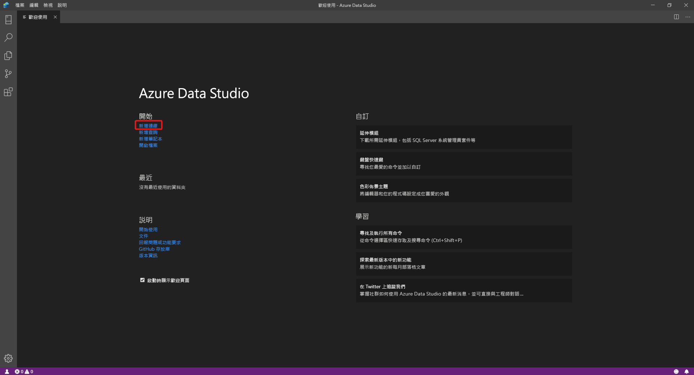
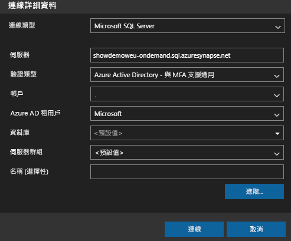
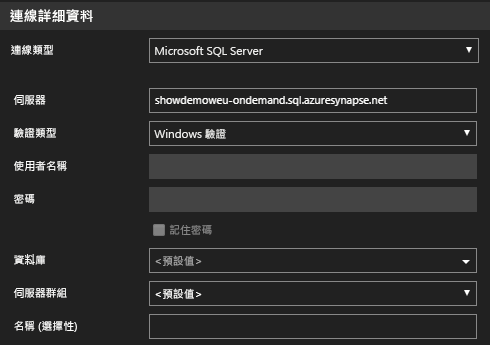
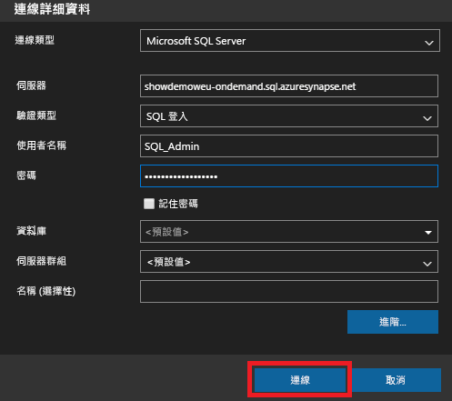
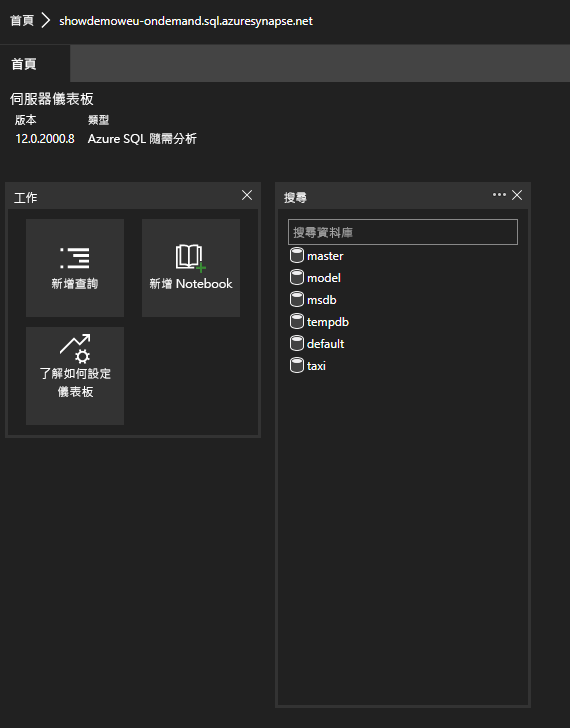
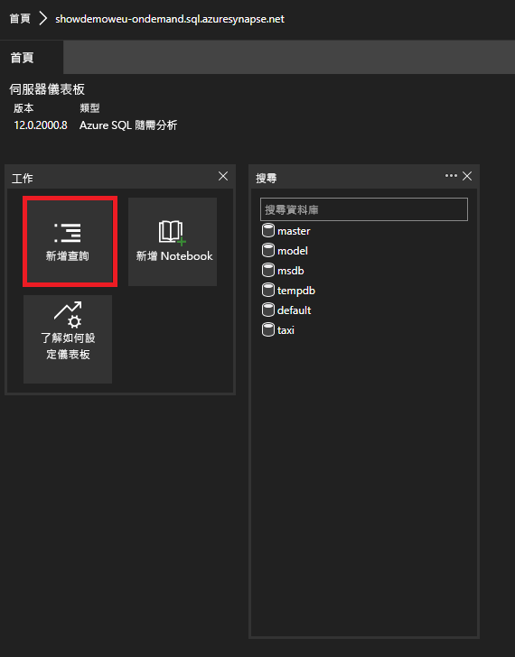

# <a name="connect-to-synapse-sql-with-azure-data-studio"></a>使用 Azure Data Studio 連線至 Synapse SQL

> [!div class="op_single_selector"]
>
> * [Azure Data Studio](get-started-azure-data-studio.md)
> * [Power BI](get-started-power-bi-professional.md)
> * [Visual Studio](../sql-data-warehouse/sql-data-warehouse-query-visual-studio.md?toc=/azure/synapse-analytics/toc.json&bc=/azure/synapse-analytics/breadcrumb/toc.json)
> * [sqlcmd](get-started-connect-sqlcmd.md)
> * [SSMS](get-started-ssms.md)

您可以使用使用 [Azure Data Studio](/sql/azure-data-studio/download-azure-data-studio?toc=/azure/synapse-analytics/toc.json&bc=/azure/synapse-analytics/breadcrumb/toc.json&view=azure-sqldw-latest) 連線及查詢 Azure Synapse Analytics 中的 Synapse SQL。 

## <a name="connect"></a>連線

若要連線到 Synapse SQL，請開啟 Azure Data Studio，然後選取 [新增連線]  。



選擇 [Microsoft SQL Server]  作為 [連線類型]  。

連線需要下列參數：

* **伺服器：** 格式為 `<Azure Synapse workspace name>`-ondemand.sql.azuresynapse.net 的伺服器
* **資料庫：** 資料庫名稱

> [!NOTE]
> 如果您想要使用 **無伺服器 SQL 集區**，URL 應如下所示：
>
> - `<Azure Synapse workspace name>`-ondemand.sql.azuresynapse.net。
>
> 如果您想要使用 **專用 SQL 集區**，URL 應如下所示：
>
> - `<Azure Synapse workspace name>`.sql.azuresynapse.net

選擇 [Windows 驗證]  、[Azure Active Directory]  或 [SQL 登入]  作為 [驗證類型]  。

若要使用 **SQL 登入** 作為驗證類型，請新增使用者名稱/密碼參數：

* **使用者：** `<User>` 格式的伺服器使用者
* **密碼：** 與使用者相關聯的密碼

若要使用 Azure Active Directory，您必須選擇所需的驗證類型。



下列螢幕擷取畫面顯示 **Windows 驗證** 的 **連線詳細資料**：



下列螢幕擷取畫面顯示使用 **SQL 登入** 的 **連線詳細資料**：



成功登入之後，您應該會看到如下所示的儀表板：

## <a name="query"></a>查詢

連線之後，您就可以使用支援的 [Transact-SQL (T-SQL)](/sql/t-sql/language-reference?toc=/azure/synapse-analytics/toc.json&bc=/azure/synapse-analytics/breadcrumb/toc.json&view=azure-sqldw-latest) 陳述式來針對執行個體查詢 Synapse SQL。 從 [儀表板] 檢視中選取 [新增查詢]  ，即可開始進行查詢。



例如，您可以使用下列 Transact-SQL 陳述式，透過無伺服器 SQL 集區[查詢 Parquet 檔案](query-parquet-files.md)：

```sql
SELECT COUNT(*)
FROM  
OPENROWSET(
    BULK 'https://azureopendatastorage.blob.core.windows.net/censusdatacontainer/release/us_population_county/year=20*/*.parquet',
    FORMAT='PARQUET'
)
```
## <a name="next-steps"></a>後續步驟 
探索連線到 Synapse SQL 的其他方式： 

- [SSMS](get-started-ssms.md)
- [Power BI](get-started-power-bi-professional.md)
- [Visual Studio](../sql-data-warehouse/sql-data-warehouse-query-visual-studio.md?toc=/azure/synapse-analytics/toc.json&bc=/azure/synapse-analytics/breadcrumb/toc.json)
- [sqlcmd](get-started-connect-sqlcmd.md)

如需詳細資訊，請造訪[使用 Azure Data Studio 以連線及查詢在 Azure Synapse Analytics 中使用專用 SQL 集區的資料](/sql/azure-data-studio/quickstart-sql-dw)。