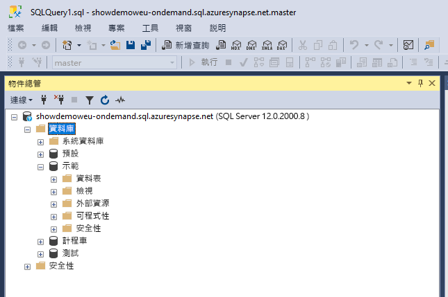
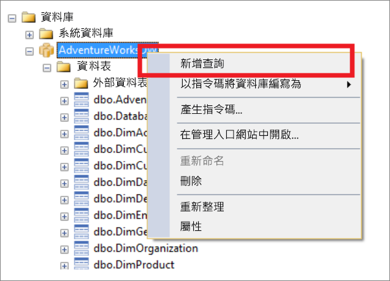
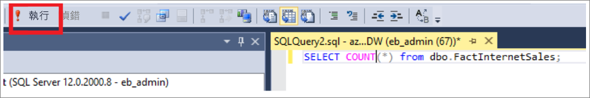
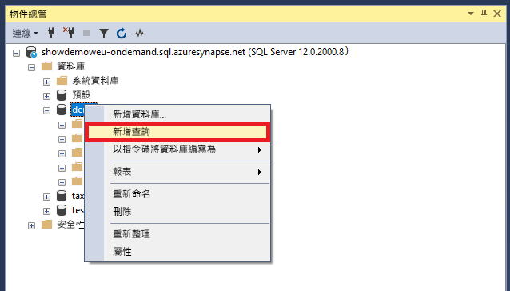
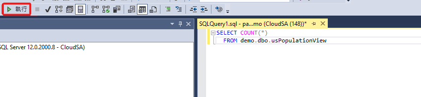
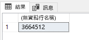

# <a name="connect-to-synapse-sql-with-sql-server-management-studio-ssms"></a>使用 SQL Server Management Studio (SSMS) 連線到 Synapse SQL
> [!div class="op_single_selector"]
> * [Azure Data Studio](get-started-azure-data-studio.md)
> * [Power BI](get-started-power-bi-professional.md)
> * [Visual Studio](../sql-data-warehouse/sql-data-warehouse-query-visual-studio.md?toc=/azure/synapse-analytics/toc.json&bc=/azure/synapse-analytics/breadcrumb/toc.json)
> * [sqlcmd](../sql/get-started-connect-sqlcmd.md)
> * [SSMS](get-started-ssms.md)
> 
> 

您可以使用 [SQL Server Management Studio (SSMS)](/sql/ssms/download-sql-server-management-studio-ssms)，透過無伺服器 SQL 集區 (預覽) 或 SQL 集區資源，連線至 Azure Synapse Analytics 中的專用 SQL 並加以查詢。 

### <a name="supported-tools-for-serverless-sql-pool-preview"></a>無伺服器 SQL 集區支援的工具 (預覽)

[Azure Data Studio](/sql/azure-data-studio/download-azure-data-studio) 從 1.18.0 版開始便已獲得完整支援。 SSMS 從 18.5 版開始只獲得部分支援，因此只能用來連線和查詢。

> [!NOTE]
> 如果 AAD 登入在執行查詢時開啟連線超過 1 小時，任何仰賴 AAD 的查詢都會失敗。 這包括使用 AAD 傳遞以及會與 AAD 互動的陳述式 (例如 CREATE EXTERNAL PROVIDER) 來查詢儲存體。 這會影響每個讓連線保持開啟的工具，例如 SSMS 和 ADS 中的查詢編輯器。 開啟新連線以執行查詢的工具則不受影響，例如 Synapse Studio。
> 您可以重新啟動 SSMS，或在 ADS 中連線再中斷連線，以減輕這個問題。 。
## <a name="prerequisites"></a>Prerequisites

開始之前，請先確定您已擁有下列必要條件：  

* [SQL Server Management Studio (SSMS)](/sql/ssms/download-sql-server-management-studio-ssms)。 
* 針對專用 SQL 集區，您需要現有的資料倉儲。 若要建立資料倉儲，請參閱[建立專用 SQL 集區](../quickstart-create-sql-pool-portal.md)。 在建立時，您的工作區中已佈建了一個名稱內建的無伺服器 SQL 集區。 
* 完整的 SQL 伺服器名稱。 若要尋找此名稱，請參閱[連線至 Synapse SQL](connect-overview.md)。

## <a name="connect"></a>連線

### <a name="dedicated-sql-pool"></a>專用 SQL 集區

若要使用專用 SQL 集區連線到 Synapse SQL，請遵循下列步驟： 

1. 開啟 SQL Server Management Studio (SSMS)。 
1. 在 [連線至伺服器] 對話方塊中填妥欄位，然後選取 [連線]： 
  
    
   
   * **伺服器名稱** ：輸入先前找到的 **伺服器名稱** 。
   * **驗證** ：選取驗證類型，像是 [SQL Server 驗證] 或 [Active Directory 整合式驗證]。
   * **使用者名稱** 和 **密碼** ：如果上面已選取 [SQL Server 驗證]，請輸入使用者名稱和密碼。

1. 在 **物件總管** 中展開您的 Azure SQL Server。 您可以檢視與伺服器相關聯的資料庫，例如範例 AdventureWorksDW 資料庫。 您可以展開資料庫以查看資料表：
   
    


### <a name="serverless-sql-pool-preview"></a>無伺服器 SQL 集區 (預覽)

若要使用無伺服器 SQL 集區連線到 Synapse SQL，請遵循下列步驟： 

1. 開啟 SQL Server Management Studio (SSMS)。
1. 在 [連線至伺服器] 對話方塊中填妥欄位，然後選取 [連線]： 
   
    
   
   * **伺服器名稱** ：輸入先前找到的 **伺服器名稱** 。
   * **驗證** ：選取驗證類型，像是 [SQL Server 驗證] 或 [Active Directory 整合式驗證]：
   * **使用者名稱** 和 **密碼** ：如果上面已選取 [SQL Server 驗證]，請輸入使用者名稱和密碼。
   * 選取 [連接]  。

4. 若要瀏覽，請展開您的 Azure SQL 伺服器。 您可以檢視與伺服器相關聯的資料庫。 展開 *示範* 以查看範例資料庫中的內容。
   
    


## <a name="run-a-sample-query"></a>執行範例查詢

### <a name="dedicated-sql-pool"></a>專用 SQL 集區

既然已建立資料庫連線，您現在可以查詢資料。

1. 在 [SQL Server 物件總管] 中您的資料庫上按一下滑鼠右鍵。
2. 選取 [新增查詢]。 隨即開啟 [新增查詢] 視窗。
   
    
3. 將下列 T-SQL 查詢複製到查詢視窗：
   
    ```sql
    SELECT COUNT(*) FROM dbo.FactInternetSales;
    ```
4. 選取 `Execute` 或使用下列鍵盤快速鍵來執行查詢：`F5`。
   
    
5. 查看查詢結果。 在下列範例中，FactInternetSales 資料表有 60398 個資料列。
   
    

### <a name="serverless-sql-pool"></a>無伺服器 SQL 集區

既然已建立資料庫連線，您現在可以查詢資料。

1. 在 [SQL Server 物件總管] 中您的資料庫上按一下滑鼠右鍵。
2. 選取 [新增查詢]  。 隨即開啟 [新增查詢] 視窗。
   
    
3. 將下列 T-SQL 查詢複製到查詢視窗：
   
    ```sql
    SELECT COUNT(*) FROM demo.dbo.usPopulationView
    ```
4. 選取 `Execute` 或使用下列鍵盤快速鍵來執行查詢：`F5`。
   
    
5. 查看查詢結果。 在此範例中，usPopulationView 檢視有 3664512 個資料列。
   
    

## <a name="next-steps"></a>後續步驟
您現在可以連線並查詢，請嘗試[使用 Power BI 將資料視覺化](get-started-power-bi-professional.md)。

若要針對 Azure Active Directory 驗證設定您的環境，請參閱[驗證 Synapse SQL](../sql-data-warehouse/sql-data-warehouse-authentication.md?toc=/azure/synapse-analytics/toc.json&bc=/azure/synapse-analytics/breadcrumb/toc.json)。

