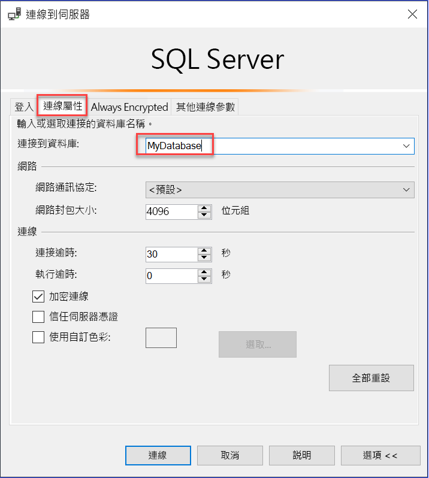

# 搭配使用多重要素 AAD 驗證與 Synapse SQL (MFA 的 SSMS 支援)

Synapse SQL 支援使用 *Active Directory 通用驗證*從 SQL Server Management Studio (SSMS) 進行連線。 

本文討論各種驗證選項之間的差異，以及與使用通用驗證相關聯的限制。 

**下載最新的 SSMS** - 在用戶端電腦上，從[下載 SQL Server Management Studio (SSMS)](/sql/ssms/download-sql-server-management-studio-ssms?toc=/azure/synapse-analytics/toc.json&bc=/azure/synapse-analytics/breadcrumb/toc.json&view=azure-sqldw-latest&preserve-view=true) 下載最新版的 SSMS。

對於本文討論的所有功能，請至少使用 2017 年 7 月的 17.2 版。  最近的連線對話方塊看起來應該會類似下圖：

![此螢幕擷取畫面顯示 [連線至伺服器] 對話方塊，您可以在其中選取伺服器名稱和驗證選項。](./media/mfa-authentication/1mfa-universal-connect.png "完成 [使用者名稱] 方塊。")  

## 五個驗證選項  

Active Directory 通用驗證支援兩種非互動式驗證方法：
    - `Active Directory - Password` 驗證
    - `Active Directory - Integrated` 驗證

另外也有兩種非互動式驗證模型可用於許多不同的應用程式 (ADO.NET、JDCB、ODC 等等)。 這兩種方法絕對不會產生快顯對話方塊：

- `Active Directory - Password`
- `Active Directory - Integrated`

同樣支援 Azure 多重要素驗證 (MFA) 的互動式方法是：

- `Active Directory - Universal with MFA`

Azure MFA 有助於保護資料和應用程式的存取，同時又滿足使用者對簡單登入程序的需求。 它利用各種簡單的驗證選項來提供強大的驗證 (包括電話、簡訊、含有 Pin 的智慧卡或行動應用程式通知)，讓使用者能夠選擇自己喜歡的方式。 搭配 Azure AD 使用互動式 MFA 時，會出現快顯對話方塊以進行驗證。

如需 Multi-Factor Authentication 的說明，請參閱 [Multi-Factor Authentication](../../active-directory/authentication//concept-mfa-howitworks.md?toc=/azure/synapse-analytics/toc.json&bc=/azure/synapse-analytics/breadcrumb/toc.json)。

### Azure AD 網域名稱或租用戶 ID 參數

從 [SSMS 第 17 版](/sql/ssms/download-sql-server-management-studio-ssms?toc=/azure/synapse-analytics/toc.json&bc=/azure/synapse-analytics/breadcrumb/toc.json&view=azure-sqldw-latest&preserve-view=true)開始，從其他 Azure Active Directory 匯入目前 Active Directory 的使用者 (如來賓使用者)，可以在連線時提供 Azure AD 網域名稱或租用戶 ID。 

來賓使用者包括從其他 Azure AD、Microsoft 帳戶 (例如 outlook.com、hotmail.com、live.com) 或其他帳戶 (例如 gmail.com) 邀請的使用者。 此資訊可讓 [Active Directory 通用驗證搭配 MFA 驗證]  識別正確的驗證授權單位。 支援 Microsoft 帳戶 (MSA) (如 outlook.com、hotmail.com、live.com) 或非 MSA 帳戶時也需要此選項。 

所有要使用通用驗證來進行驗證的這些使用者，皆必須輸入他們的 Azure AD 網域名稱或租用戶 ID。 此參數代表目前與 Azure 伺服器連結的 Azure AD 網域名稱/租用戶 ID。 

例如，如果 Azure 伺服器與 Azure AD 網域 `contosotest.onmicrosoft.com` 相關聯，其中託管的使用者 `joe@contosodev.onmicrosoft.com` 是從 Azure AD 網域 `contosodev.onmicrosoft.com` 匯入，則用於驗證此使用者的必要網域名稱為 `contosotest.onmicrosoft.com`。 

如果使用者是 Azure AD (與 Azure 伺服器連結) 的原生使用者，不是 MSA 帳戶，則不需要網域名稱或租用戶 ID。 

若要輸入參數 (從 SSMS 第 17.2 版開始)，請在 [連線到資料庫] 對話方塊中完成對話方塊，並選取 [Active Directory - Universal with MFA]，選取 [選項]，完成 [使用者名稱] 方塊，然後選取 [連線屬性] 索引標籤。 

核取 [AD 網域名稱或租用戶 ID]  方塊並提供驗證授權單位，如網域名稱 (**contosotest.onmicrosoft.com**) 或租用戶 ID 的 GUID。  

   ![此螢幕擷取畫面顯示 [連線屬性] 索引標籤中的 [連線至伺服器]，已在其中輸入值。](./media/mfa-authentication/mfa-tenant-ssms.png)

如果您執行的是 SSMS 18.x 或更新版本，則來賓使用者不再需要 AD 網域名稱或租用戶識別碼，因為 18.x 或更新版本能自動辨識。

   

### Azure AD 企業對企業支援   
在 Azure AD B2B 案例中，以來賓使用者身分支援的 Azure AD 使用者 (請參閱[什麼是 Azure B2B 共同作業](../../active-directory/b2b/what-is-b2b.md?toc=/azure/synapse-analytics/toc.json&bc=/azure/synapse-analytics/breadcrumb/toc.json)，只能以在目前 Azure AD 中建立之群組的成員連線至 Synapse SQL，並且在指定的資料庫中使用 Transact-SQL `CREATE USER` 手動對應。 

例如，如果 `steve@gmail.com` 受邀加入 Azure AD `contosotest` (與 Azure Ad 網域`contosotest.onmicrosoft.com`)，則必須在 Azure AD 中建立包含 `steve@gmail.com` 成員的 Azure AD 群組 (例如 `usergroup`)。 然後，Azure AD SQL 系統管理員或 Azure AD DBO 必須藉由執行 Transact-SQL `CREATE USER [usergroup] FROM EXTERNAL PROVIDER` 陳述式，針對特定資料庫 (也就是 MyDatabase) 建立此群組。 

建立資料庫使用者後，使用者 `steve@gmail.com` 就可以使用 SSMS 驗證選項 `Active Directory – Universal with MFA support` 來登入 `MyDatabase`。 

根據預設，使用者群組只有 connect 權限，而任何進一步的資料存取權則需以一般方式進行授與。 

身為來賓使用者，`steve@gmail.com` 必須核取此方塊，並且在 SSMS [連線屬性] 對話方塊中新增 AD 網域名稱 `contosotest.onmicrosoft.com`。 [AD 網域名稱或租用戶 ID]  選項僅對 [通用驗證搭配 MFA 連線] 選項提供支援，否則會呈現灰色。

## Synapse SQL 的通用驗證限制

- SSMS 和 SqlPackage.exe 是目前唯一透過 Active Directory 通用驗證，針對 MFA 啟用的工具。
- SSMS 17.2 版支援使用通用驗證搭配 MFA 的多使用者同時存取。 17.0 和 17.1 版，使用通用驗證將 SSMS 的登入限制為單一 Azure Active Directory 帳戶。 若要以另一個 Azure AD 帳戶登入，您必須使用另一個 SSMS 執行個體 (這項限制僅限於 Active Directory 通用驗證；您可以使用 Active Directory 密碼驗證、Active Directory 整合式驗證或 SQL Server 驗證來登入不同的伺服器)。
- SSMS 支援 Active Directory 通用驗證，可使用物件總管、查詢編輯器及查詢存放區視覺效果。
- SSMS 17.2 版針對匯出/擷取/部署資料資料庫提供 DacFx 精靈支援。 特定使用者使用通用驗證透過初始驗證對話方塊進行驗證後，DacFx 精靈的運作方式與所有其他驗證方法相同。
- SSMS 資料表設計工具不支援通用驗證。
- 除了您必須使用支援的 SSMS 版本之外，Active Directory 通用驗證並沒有其他軟體需求。  
- 通用驗證的 Active Directory 驗證程式庫 (ADAL) 版本已更新為最新的 ADAL.dll 3.13.9 可用發行版本。 請參閱 [Active Directory Authentication Library 3.14.1](https://www.nuget.org/packages/Microsoft.IdentityModel.Clients.ActiveDirectory/)。  

## 後續步驟
如需詳細資訊，請參閱[使用 SQL Server Management Studio 連線到 Synapse SQL](get-started-ssms.md) 一文。 

