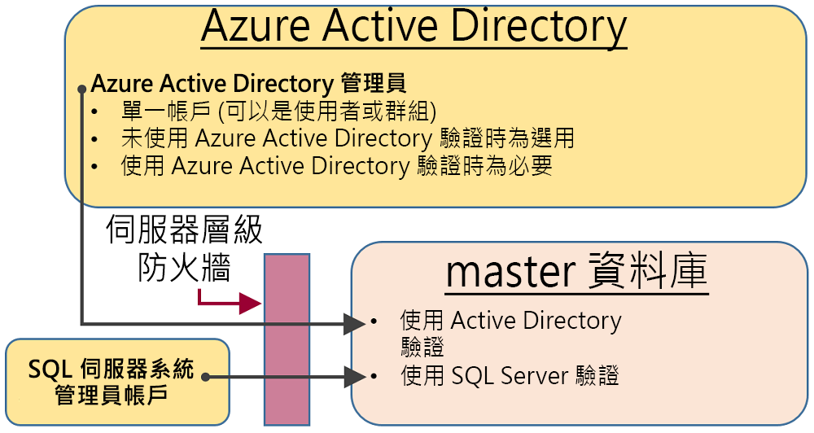

# <a name="sql-authentication"></a>SQL 驗證

Azure Synapse Analytics 有兩種 SQL 規格可讓您控制資源耗用量。 本文說明這兩種規格如何控制使用者驗證。

若要向 Synapse SQL 授權，您可以使用兩種授權類型：

- Azure Active Directory 授權
- SQL 授權

Azure Active Directory 可讓您在單一位置管理使用者。 SQL 授權則可讓繼承應用程式以極為熟悉的方式使用 Synapse SQL。

## <a name="administrative-accounts"></a>系統管理帳戶

做為系統管理員的系統管理帳戶有兩個 (**伺服器管理員** 和 **Active Directory 管理員**)。 若要識別 SQL server 的系統管理員帳戶，請開啟 Azure 入口網站，然後瀏覽至 Synapse SQL 的 [屬性] 索引標籤。


- **伺服器管理員**

  當您建立 Azure Synapse Analytics 時，您必須命名 **伺服器管理員登入**。 SQL Server 會將該帳戶建立為 master 資料庫中的登入。 此帳戶會使用 SQL Server 驗證 (使用者名稱和密碼) 連接。 只有其中一個帳戶可以存在。

- **Azure Active Directory 管理員**

  一個 Azure Active Directory 帳戶 (個人或安全性群組帳戶) 也可以設定為系統管理員。 選擇性地設定 Azure AD 系統管理員，但是如果您想要使用 Azure AD 帳戶連線到 Synapse SQL，則 **必須** 設定 Azure AD 系統管理員。

**伺服器管理員** 和 **Azure AD 管理員** 帳戶具有下列特性︰

- 是唯一可以自動連線到伺服器上任何 SQL Database 的帳戶。 (若要連接至使用者資料庫，其他帳戶必須是資料庫的擁有者，或在使用者資料庫中擁有使用者帳戶。)
- 這些帳戶會輸入使用者資料庫做為 `dbo` 使用者，而且具有使用者資料庫中的所有權限。 (使用者資料庫的擁有者也會進入資料庫做為 `dbo` 使用者。)
- 不會輸入 `master` 資料庫作為 `dbo` 使用者，而且具有 master 的有限權限。
- **不是** 標準 SQL Server `sysadmin` 固定伺服器角色的成員，該角色不適用於 SQL Database。  
- 可以建立、改變和卸除 master 中的資料庫、登入、使用者，以及伺服器層級 IP 防火牆規則。
- 可以新增和移除 `dbmanager` 和 `loginmanager` 角色的成員。
- 可以檢視 `sys.sql_logins` 系統資料表。

## <a name="serverless-sql-pool"></a>[無伺服器 SQL 集區](#tab/serverless)

若要管理可存取無伺服器 SQL 集區的使用者，您可以使用下列指示。

若要建立無伺服器 SQL 集區的登入，請使用下列語法：

```sql
CREATE LOGIN Mary WITH PASSWORD = '<strong_password>';
-- or
CREATE LOGIN Mary@domainname.net FROM EXTERNAL PROVIDER;
```
登入存在後，您就可以在無伺服器 SQL 集區端點內的個別資料庫中建立使用者，並將必要的權限授與給這些使用者。 若要建立使用者，您可以使用下列語法：
```sql
CREATE USER Mary FROM LOGIN Mary;
-- or
CREATE USER Mary FROM LOGIN Mary@domainname.net;
-- or
CREATE USER [mike@contoso.com] FROM EXTERNAL PROVIDER;
```

登入和使用者建立好之後，您就可以使用一般 SQL Server 語法來授與權限。

## <a name="sql-pool"></a>[SQL 集區](#tab/provisioned)

### <a name="administrator-access-path"></a>系統管理員存取路徑

正確設定伺服器層級防火牆後，**SQL Database 管理員** 和 **Azure Active Directory 管理員** 可以使用用戶端工具 (例如 SQL Server Management Studio 或 SQL Server Data Tools) 進行連接。 只有最新的工具會提供所有的功能。 

下圖顯示兩個系統管理員帳戶的一般設定：
 


在伺服器層級防火牆中使用開啟的連接埠時，系統管理員可以連接到任何 SQL Database。

### <a name="database-creators"></a>資料庫建立者

其中一個系統管理角色是 **dbmanager** 角色。 此角色的成員可以建立新的資料庫。 若要使用此角色，您可在 `master` 資料庫中建立使用者，然後將該使用者新增至 **dbmanager** 資料庫角色。 

若要建立資料庫，使用者必須是 `master` 資料庫中以 SQL Server 登入為基礎的使用者，或是以 Azure Active Directory 使用者為基礎的容器資料庫使用者。

1. 使用系統管理員帳戶連線到 `master` 資料庫。
2. 使用 [CREATE LOGIN](/sql/t-sql/statements/create-login-transact-sql?toc=/azure/synapse-analytics/toc.json&bc=/azure/synapse-analytics/breadcrumb/toc.json&view=azure-sqldw-latest&preserve-view=true) 陳述式來建立 SQL Server 驗證登入。 範例陳述式︰

   ```sql
   CREATE LOGIN Mary WITH PASSWORD = '<strong_password>';
   ```

   > [!NOTE]
   > 建立登入或自主資料庫使用者時，請使用強式密碼。 如需詳細資訊，請參閱 [Strong Passwords](/sql/relational-databases/security/strong-passwords?toc=/azure/synapse-analytics/toc.json&bc=/azure/synapse-analytics/breadcrumb/toc.json&view=azure-sqldw-latest&preserve-view=true)。

   為了改進效能，系統會暫時在資料庫層級快取登入 (伺服器層級主體)。 若要重新整理驗證快取，請參閱 [DBCC FLUSHAUTHCACHE](/sql/t-sql/database-console-commands/dbcc-flushauthcache-transact-sql?toc=/azure/synapse-analytics/toc.json&bc=/azure/synapse-analytics/breadcrumb/toc.json&view=azure-sqldw-latest&preserve-view=true)。

3. 使用 [CREATE USER](/sql/t-sql/statements/create-user-transact-sql?toc=/azure/synapse-analytics/toc.json&bc=/azure/synapse-analytics/breadcrumb/toc.json&view=azure-sqldw-latest&preserve-view=true) 陳述式來建立使用者。 使用者可以是 Azure Active Directory 驗證自主資料庫使用者 (如果您已針對 Azure AD 驗證設定您的環境)，或 SQL Server 驗證自主資料庫使用者，或根據 SQL Server 驗證登入 (在上一個步驟中建立) 的 SQL Server 驗證使用者。範例陳述式︰

   ```sql
   CREATE USER [mike@contoso.com] FROM EXTERNAL PROVIDER; -- To create a user with Azure Active Directory
   CREATE USER Ann WITH PASSWORD = '<strong_password>'; -- To create a SQL Database contained database user
   CREATE USER Mary FROM LOGIN Mary;  -- To create a SQL Server user based on a SQL Server authentication login
   ```

4. 使用 [sp_addrolemember](/sql/relational-databases/system-stored-procedures/sp-addrolemember-transact-sql?view=azure-sqldw-latest&preserve-view=true) 程序將新的使用者新增至 `master` 中的 **dbmanager** 資料庫角色 (請注意，已佈建的 SQL 中不支援 [ALTER ROLE](/sql/t-sql/statements/alter-role-transact-sql?toc=/azure/synapse-analytics/toc.json&bc=/azure/synapse-analytics/breadcrumb/toc.json&view=azure-sqldw-latest&preserve-view=true) 陳述式)。 範例陳述式︰

   ```sql
   EXEC sp_addrolemember 'dbmanager', 'Mary'; 
   EXEC sp_addrolemember 'dbmanager', 'mike@contoso.com]'; 
   ```

   > [!NOTE]
   > dbmanager 是 master 資料庫中的資料庫角色，因此您只可以將資料庫使用者新增至 dbmanager 角色。 您無法將伺服器層級登入新增至資料庫層級角色。

5. 必要時，設定防火牆規則以允許新使用者連接。 (現有的防火牆規則可能會涵蓋新使用者。)

現在使用者可以連線至 `master` 資料庫，而且可以建立新的資料庫。 建立資料庫的帳戶會成為資料庫的擁有者。

### <a name="login-managers"></a>登入管理員

另一個系統管理角色是登入管理員角色。 此角色的成員可以在 master 資料庫中建立新的登入。 如果您想要的話，可以完成相同的步驟 (建立登入和使用者，並將使用者新增至 **loginmanager** 角色)，讓使用者能夠在 master 資料庫中建立新的登入。 通常不需要登入，因為 Microsoft 建議使用自主資料庫使用者，這會在資料庫層級進行驗證，而不是根據登入來使用使用者。 如需詳細資訊，請參閱 [自主的資料庫使用者 - 使資料庫可攜](/sql/relational-databases/security/contained-database-users-making-your-database-portable?toc=/azure/synapse-analytics/toc.json&bc=/azure/synapse-analytics/breadcrumb/toc.json&view=azure-sqldw-latest&preserve-view=true)。

---

## <a name="non-administrator-users"></a>非系統管理員的使用者

一般而言，非系統管理員帳戶不需要 master 資料庫的存取權。 請使用 [CREATE USER (Transact-SQL)](/sql/t-sql/statements/create-user-transact-sql) 陳述式，在資料庫層級建立自主資料庫使用者。 

使用者可以是 Azure Active Directory 驗證自主資料庫使用者 (如果您已針對 Azure AD 驗證設定您的環境)，或 SQL Server 驗證自主資料庫使用者，或根據 SQL Server 驗證登入 (在上一個步驟中建立) 的 SQL Server 驗證使用者。  

若要建立使用者，請連線到資料庫，然後執行類似以下範例的陳述式︰

```sql
CREATE USER Mary FROM LOGIN Mary;
CREATE USER [mike@contoso.com] FROM EXTERNAL PROVIDER;
```

一開始，只有其中一個系統管理員或資料庫擁有者可以建立使用者。 若要授權讓其他使用者建立新的使用者，請授與該選取的使用者 `ALTER ANY USER` 權限，例如使用下列陳述式︰

```sql
GRANT ALTER ANY USER TO Mary;
```

若要將資料庫的完整控制授與其他使用者，請讓他們成為 **db_owner** 固定資料庫角色的成員。

在 Azure SQL Database 或 Synapse 無伺服器中，使用 `ALTER ROLE` 陳述式。

```sql
ALTER ROLE db_owner ADD MEMBER Mary;
```

在專用 SQL 集區中，請使用 [EXEC sp_addrolemember](/sql/relational-databases/system-stored-procedures/sp-addrolemember-transact-sql?toc=/azure/synapse-analytics/toc.json&bc=/azure/synapse-analytics/breadcrumb/toc.json&view=azure-sqldw-latest&preserve-view=true)。

```sql
EXEC sp_addrolemember 'db_owner', 'Mary';
```

> [!NOTE]
> 需根據伺服器登入來建立資料庫使用者的其中一個常見原因是，使用者需要存取多個資料庫。 由於自主資料庫使用者是個別的實體，所以每個資料庫都會維護它自己的使用者和密碼。 如果使用者之後必須記住每個資料庫的每組密碼，如此會造成額外負擔，而且在必須變更多個資料庫的多組密碼時這會變得不可行。 不過，使用 SQL Server 登入和高可用性 (作用中的地理複寫和容錯移轉群組) 時，必須手動設定每個伺服器的 SQL Server 登入。 否則，發生容錯移轉之後，資料庫使用者將無法再對應到伺服器登入，而且在容錯移轉後將無法存取資料庫。 

如需有關設定用於異地複寫的登入詳細資訊，請參閱[設定和管理異地還原或容錯移轉的 Azure SQL Database 安全性](../../azure-sql/database/active-geo-replication-security-configure.md?toc=/azure/synapse-analytics/toc.json&bc=/azure/synapse-analytics/breadcrumb/toc.json)。

### <a name="configuring-the-database-level-firewall"></a>設定資料庫層級防火牆規則

最佳做法是，非系統管理員的使用者應該只能透過防火牆來存取所使用的資料庫。 做法是不透過伺服器層級防火牆授權其 IP 位址來讓他們存取所有資料庫，而是改用 [sp_set_database_firewall_rule](/sql/relational-databases/system-stored-procedures/sp-set-database-firewall-rule-azure-sql-database?toc=/azure/synapse-analytics/toc.json&bc=/azure/synapse-analytics/breadcrumb/toc.json&view=azure-sqldw-latest&preserve-view=true) 陳述式來設定資料庫層級防火牆。 無法藉由使用入口網站設定資料庫層級防火牆。

### <a name="non-administrator-access-path"></a>非系統管理員存取路徑

當資料庫層級防火牆設定正確時，資料庫使用者可以使用如 SQL Server Management Studio 或 SQL Server Data Tools 之類的用戶端工具來連接。 只有最新的工具會提供所有的功能。 下圖顯示一個典型的非系統管理員存取途徑。


## <a name="groups-and-roles"></a>群組和角色

有效率存取管理會使用指派給群組和角色的權限，而不是指派給個別使用者的權限。

- 使用 Azure Active Directory 驗證時，將 Azure Active Directory 使用者放入 Azure Active Directory 群組中。 建立群組的自主資料庫使用者。 將一或多個資料庫使用者放入[資料庫角色](/sql/relational-databases/security/authentication-access/database-level-roles?toc=/azure/synapse-analytics/toc.json&bc=/azure/synapse-analytics/breadcrumb/toc.json&view=azure-sqldw-latest&preserve-view=true)中，然後將[權限](/sql/relational-databases/security/permissions-database-engine?toc=/azure/synapse-analytics/toc.json&bc=/azure/synapse-analytics/breadcrumb/toc.json&view=azure-sqldw-latest&preserve-view=true)指派給資料庫角色。

- 使用 SQL Server 驗證時，在資料庫中建立自主資料庫使用者。 將一或多個資料庫使用者放入[資料庫角色](/sql/relational-databases/security/authentication-access/database-level-roles?toc=/azure/synapse-analytics/toc.json&bc=/azure/synapse-analytics/breadcrumb/toc.json&view=azure-sqldw-latest&preserve-view=true)中，然後將[權限](/sql/relational-databases/security/permissions-database-engine?toc=/azure/synapse-analytics/toc.json&bc=/azure/synapse-analytics/breadcrumb/toc.json&view=azure-sqldw-latest&preserve-view=true)指派給資料庫角色。

資料庫角色可以是內建的角色，例如 **db_owner**、**db_ddladmin**、**db_datawriter**、**db_datareader**、**db_denydatawriter** 和 **db_denydatareader**。 **db_owner** 通常是用來將完整權限授與少數幾個使用者。 其他固定的資料庫角色適用於快速開發簡單的資料庫，但不建議用於大多數實際執行資料庫。 

例如，**db_datareader** 固定資料庫角色可授與資料庫中每個資料表的讀取存取權，這通常並非絕對必要。 

最好是使用 [CREATE ROLE](/sql/t-sql/statements/create-role-transact-sql) 陳述式來建立您自己的使用者定義資料庫角色，並謹慎地授與每個角色在業務需求上所需的最小權限。 當使用者是多個角色的成員時，會集所有這些角色的權限在一身。

## <a name="permissions"></a>權限

有超過 100 個權限可在 SQL Database 中分別授與或拒絕。 這些權限有許多為巢狀。 例如，結構描述上的 `UPDATE` 權限包括該結構描述中每個資料表的 `UPDATE` 權限。 如同大多數的權限系統，拒絕權限會覆寫授與權限。 

因為權限的巢狀本質和數目，可能需要仔細研究，設計適當的權限系統以便適當地保護您的資料庫。 

請從[權限 (Database Engine)](/sql/relational-databases/security/permissions-database-engine) 的權限清單開始著手，然後檢閱[海報大小的權限圖](/sql/relational-databases/security/media/database-engine-permissions.png)。

### <a name="considerations-and-restrictions"></a>考量與限制

在 SQL Database 中管理登入和使用者時，請考慮下列幾點︰

- 執行 `CREATE/ALTER/DROP DATABASE` 陳述式時，您必須連接到 **master** 資料庫。
- 無法更改或刪除與 **伺服器管理員** 登入對應的資料庫使用者。
- 英文 (美國) 是 **伺服器管理員** 登入的預設語言。
- 只有系統管理員 (**伺服器管理員** 登入或 Azure AD 系統管理員) 及 **master** 資料庫中 **dbmanager** 資料庫角色的成員，才具備執行 `CREATE DATABASE` 和 `DROP DATABASE` 陳述式的權限。
- 執行 `CREATE/ALTER/DROP LOGIN` 陳述式時，您必須連接到 master 資料庫。 不過，不建議使用登入。 請改為使用自主資料庫使用者。
- 若要連接到使用者資料庫，您必須在連接字串中提供資料庫名稱。
- 只有伺服器層級的主體登入及 **master** 資料庫中 **loginmanager** 資料庫角色的成員，才具備執行 `CREATE LOGIN`、`ALTER LOGIN` 及 `DROP LOGIN` 陳述式的權限。
- 在 ADO.NET 應用程式中執行 `CREATE/ALTER/DROP LOGIN` 和 `CREATE/ALTER/DROP DATABASE` 陳述式時，不允許使用參數化的命令。 如需詳細資訊，請參閱 [命令和參數](/dotnet/framework/data/adonet/commands-and-parameters?toc=/azure/synapse-analytics/toc.json&bc=/azure/synapse-analytics/breadcrumb/toc.json)。
- 執行 `CREATE/ALTER/DROP DATABASE` 和 `CREATE/ALTER/DROP LOGIN` 陳述式時，這其中每一個陳述式在 Transact-SQL 批次中都必須是唯一的陳述式。 否則，系統將發生錯誤。 例如，下列 Transact-SQL 會檢查資料庫是否存在。 如果資料庫存在，則會呼叫 `DROP DATABASE` 陳述式來移除資料庫。 因為 `DROP DATABASE` 陳述式不是批次中唯一的陳述式，所以執行下列 Transact-SQL 陳述式時會產生錯誤。

  ```sql
  IF EXISTS (SELECT [name]
           FROM   [sys].[databases]
           WHERE  [name] = N'database_name')
  DROP DATABASE [database_name];
  GO
  ```
  
  請改用下列 Transact-SQL 陳述式：
  
  ```sql
  DROP DATABASE IF EXISTS [database_name]
  ```

- 搭配執行 `CREATE USER` 陳述式和 `FOR/FROM LOGIN` 選項時，它必須是 Transact-SQL 批次中唯一的陳述式。
- 搭配執行 `ALTER USER` 陳述式和 `WITH LOGIN` 選項時，它必須是 Transact-SQL 批次中唯一的陳述式。
- 若要 `CREATE/ALTER/DROP`，使用者必須擁有資料庫的 `ALTER ANY USER` 權限。
- 當資料庫角色的擁有者嘗試對該資料庫角色新增或移除另一個資料庫使用者時，可能會發生下列錯誤：**使用者或角色 'Name' 並不存在於此資料庫中。** 因為擁有者看不到使用者，所以會發生此錯誤。 若要解決這個問題，請為角色擁有者授與使用者的 `VIEW DEFINITION` 權限。 

## <a name="next-steps"></a>後續步驟

如需詳細資訊，請參閱 [自主的資料庫使用者 - 使資料庫可攜](/sql/relational-databases/security/contained-database-users-making-your-database-portable)。
