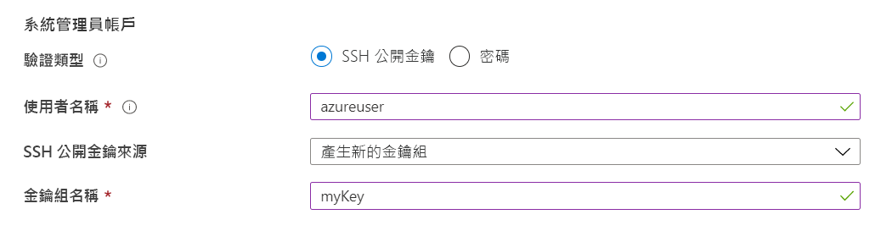

# <a name="quickstart-create-a-linux-virtual-machine-in-the-azure-portal"></a>快速入門：在 Azure 入口網站中建立 Linux 虛擬機器

您可以透過 Azure 入口網站建立 Azure 虛擬機器 (VM)。 Azure 入口網站是以瀏覽器為基礎的使用者介面，可用來建立 Azure 資源。 本快速入門說明如何使用 Azure 入口網站，來部署執行 Ubuntu 18.04 LTS 的 Linux 虛擬機器 (VM)。 為了查看作用中的 VM，您還會以 SSH 連線至 VM，並安裝 NGINX 網頁伺服器。

如果您沒有 Azure 訂用帳戶，請在開始前建立[免費帳戶](https://azure.microsoft.com/free/?WT.mc_id=A261C142F)。

## <a name="sign-in-to-azure"></a>登入 Azure

請先登入 [Azure 入口網站](https://portal.azure.com) (如果您尚未登入)。

## <a name="create-virtual-machine"></a>建立虛擬機器

1. 在搜尋中輸入 **虛擬機器**。
1. 在 [服務] 底下，選取 [虛擬機器]。
1. 在 [虛擬機器]  頁面中，選取 [新增]  。 [建立虛擬機器] 頁面隨即開啟。
1. 在 [基本資料]  索引標籤中的 [專案詳細資料]  底下，確認已選取正確的訂用帳戶，然後選擇 [新建]  資源群組。 輸入 *myResourceGroup* 作為名稱*。 

    

1. 在 [執行個體詳細資料] 底下，輸入 *myVM* 作為 [虛擬機器名稱]、然後選擇 [美國東部] 作為您的 [區域]，然後選擇 [Ubuntu 18.04 LTS] 作為您的 [映像]。 其他部分保留預設值。

    

1. 在 [Administrator 帳戶] 底下，選取 [SSH 公開金鑰]。

1. 在 [使用者名稱] 中輸入「azureuser」。

1. 針對 [SSH 公開金鑰來源]，保留預設值 [產生新的金鑰組]，然後針對 [金鑰組名稱] 輸入「myKey」。

    

1. 在 [輸入連接埠規則] > [公用輸入連接埠] 下方，選擇 [允許選取的連接埠]，然後從下拉式清單中選取 [SSH (22)] 和 [HTTP (80)]。 

    

1. 保留其餘預設值，然後在頁面底部選取 [檢閱 + 建立] 按鈕。

1. 在 [建立虛擬機器] 頁面上，您可以看到即將建立的 VM 詳細資料。 準備完成後，請選取 [建立]。

1. 當 [產生新的金鑰組] 視窗開啟時，請選取 [下載私密金鑰並建立資源]。 您的金鑰檔會下載為 **myKey.pem**。 請確定您知道 `.pem` 檔案的下載位置，您在下一個步驟中將需要該檔案的路徑。

1. 部署完成之後，請選取 [移至資源]。

1. 在新 VM 的頁面上，選取公用 IP 位址，並將其複製到剪貼簿。


    

## <a name="connect-to-virtual-machine"></a>連線至虛擬機器

建立與 VM 的 SSH 連線。

1. 如果您是使用 Mac 或 Linux 電腦，請開啟 Bash 提示字元。 如果您是使用 Windows 電腦，請開啟 PowerShell 提示字元。 

1. 在您的提示字元中，開啟與虛擬機器的 SSH 連線。 將 IP 位址取代為您 VM 的位址，並且以下載金鑰檔案的路徑取代 `.pem` 的路徑。

```console
ssh -i .\Downloads\myKey1.pem azureuser@10.111.12.123
```

> [!TIP]
> 下一次在 Azure 中建立 VM 時，就可以使用您所建立的 SSH 金鑰。 下一次您建立 VM 時，只要針對 [SSH 公開金鑰來源] 選取 [使用儲存在 Azure 中的金鑰] 即可。 您的電腦上已經有私密金鑰，所以您不需要下載任何項目。

## <a name="install-web-server"></a>安裝 Web 伺服器

若要查看作用中的 VM，請安裝 NGINX 網頁伺服器。 從 SSH 工作階段更新套件來源，然後安裝最新的 NGINX 套件。

```bash
sudo apt-get -y update
sudo apt-get -y install nginx
```

完成時，輸入 `exit` 來離開 SSH 工作階段。


## <a name="view-the-web-server-in-action"></a>檢視作用中的網頁伺服器

使用所選的網頁瀏覽器來查看預設 NGINX 歡迎使用頁面。 輸入 VM 的公用 IP 位址作為網址。 您可以在 VM 的 [概觀] 頁面找到公用 IP 位址，也可以在您稍早使用的 SSH 連接字串中找到。


## <a name="clean-up-resources"></a>清除資源

若不再需要，您可以刪除資源群組、虛擬機器和所有相關資源。 若要這樣做，請選取虛擬機器的資源群組，選取 [刪除]，然後確認要刪除的資源群組名稱。

## <a name="next-steps"></a>後續步驟

在此快速入門中，您已部署簡單的虛擬機器、建立網路安全性群組和規則，並已安裝基本的 Web 伺服器。 若要深入了解 Azure 虛擬機器，請繼續 Linux VM 的教學課程。

> [!div class="nextstepaction"]
> [Azure Linux 虛擬機器教學課程](./tutorial-manage-vm.md)
