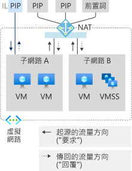
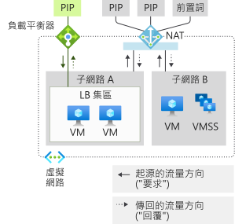
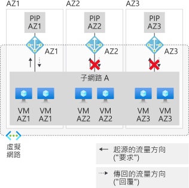
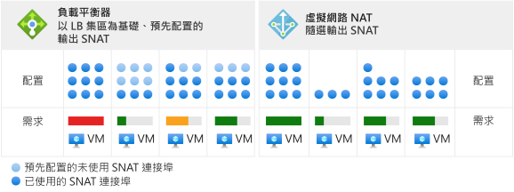
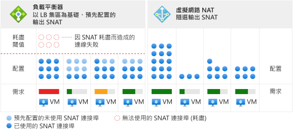

# 使用 NAT 閘道資源設計虛擬網路

NAT 閘道資源是[虛擬網路 NAT](nat-overview.md) 的一部分，可為虛擬網路的一或多個子網提供輸出網際網路連線能力。 虛擬網路的子網路會指出將使用哪個 NAT 閘道。 NAT 會為子網路提供來源網路位址轉譯 (SNAT)。  NAT 閘道資源會指定虛擬機器在建立輸出流量時所使用的靜態 IP 位址。 靜態 IP 位址來自公用 IP 位址資源、公用 IP 前置詞資源或兩者。 如果使用公用 IP 首碼資源，則 NAT 閘道資源會使用整個公用 IP 首碼資源的所有 IP 位址。 NAT 閘道資源最多可以使用來自任一資源的 16 個靜態 IP 位址。

  

*圖：可供輸出到網際網路的虛擬網路 NAT*

## 如何部署 NAT

已刻意簡化 NAT 閘道的設定和使用：  

NAT 閘道資源：
- 建立地區性或區域性 (區域隔離) NAT 閘道資源，
- 指派 IP 位址，
- 若需要，修改 TCP 閒置逾時 (選用)。  在變更預設值<ins>之前</ins>，請先檢閱[計時器](#timers)。

虛擬網路：
- 設定要使用 NAT 閘道的虛擬網路子網路。

不需要使用者定義的路由。

## 資源

您可以從使用類似範本格式的下列 Azure Resource Manager 範例中看出，資源的設計簡單明瞭。  此類似範本的格式如下所示，以說明概念和結構。  修改範例以滿足您的需求。  本文件不打算作為教學課程。

下圖顯示不同 Azure Resource Manager 資源之間的可寫入參考。  箭號表示參考的方向，其源自可寫入的位置。 檢閱 

  

*圖：虛擬網路 NAT 物件模型*

除非您有特定的[集區型負載平衡器輸出連線](../load-balancer/load-balancer-outbound-connections.md)相依性，否則建議對大部分的工作負載使用 NAT。  

您可以從標準負載平衡器案例 (包括[輸出規則](../load-balancer/load-balancer-outbound-rules-overview.md)) 遷移到 NAT 閘道。 若要遷移，請將公用 IP 和公用 IP 前置詞資源從負載平衡器前端移到 NAT 閘道。 不需要 NAT 閘道的新 IP 位址。 只要總計不超過 16 個 IP 位址，就可以重複使用標準公用 IP 資源和公用 IP 首碼資源。 在轉換期間，請針對已考量服務中斷情形的移轉進行規劃。  您可藉由程序自動化將中斷情形降至最低。 先在預備環境中測試移轉。  在轉換期間，源自的輸入流量不受影響。

下列範例是來自 Azure Resource Manager 範本的程式碼片段。  此範本會部署數個資源，包括 NAT 閘道。  此範本在此範例中具有下列參數：

- **natgatewayname** - NAT 閘道的名稱。
- **位置** - 資源所在的 Azure 區域。
- **publicipname** - 與 NAT 閘道相關聯的輸出公用 IP 名稱。
- **vnetname** - 虛擬網路的名稱。
- **subnetname** - 與 NAT 閘道相關聯的子網路名稱。

所有 IP 位址資源和首碼資源所提供的 IP 位址總數不能超過 16 個 IP 位址總計。 允許的 IP 位址數目介於 1 到 16 之間。

:::code language="json" source="~/quickstart-templates/101-nat-gateway-vnet/azuredeploy.json" range="81-96":::

建立 NAT 閘道資源後，即可將其使用於虛擬網路的一或多個子網路。 指定哪些子網路使用此 NAT 閘道資源。 NAT 閘道無法跨越一個以上的虛擬網路。 不需要將相同的 NAT 閘道指派給虛擬網路的所有子網路。 可以設定具有不同 NAT 閘道資源的個別子網路。

未使用可用性區域的案例會是地區性 (未指定區域)。 如果您使用可用性區域，則可指定區域以將 NAT 隔離到特定區域。 不支援區域備援。 檢閱 NAT [可用性區域](#availability-zones)。

:::code language="json" source="~/quickstart-templates/101-nat-gateway-vnet/azuredeploy.json" range="1-146" highlight="81-96":::

NAT 閘道是以虛擬網路內子網路上的屬性來定義。 虛擬機器在虛擬網路**vnetname**的子網路 **subnetname** 上建立的流量將會使用 NAT 閘道。 所有輸出連線都會使用與 **natgatewayname** 相關聯的 IP 位址作為來源 IP 位址。

如需此範例中使用的 Azure Resource Manager 範本詳細資訊，請參閱：

- [快速入門：建立 NAT 閘道 - Resource Manager 範本](quickstart-create-nat-gateway-template.md)
- [虛擬網路 NAT](https://azure.microsoft.com/resources/templates/101-nat-gateway-1-vm/)

## 設計指導

請回顧這一節，以熟悉使用 NAT 設計虛擬網路時的考慮事項。  

1. [成本最佳化](#cost-optimization)
1. [輸入和輸出共存](#coexistence-of-inbound-and-outbound)
2. [管理基本資源](#managing-basic-resources)
3. [可用性區域](#availability-zones)

### 成本最佳化

[服務端點](virtual-network-service-endpoints-overview.md)和[私人連結](../private-link/private-link-overview.md)是將成本最佳化所要考慮的選項。 這些服務不需要 NAT。 虛擬網路的 NAT 不會處理導向服務端點或私人連結的流量。  

服務端點會將 Azure 服務資源繫結至您的虛擬網路，並控制對您 Azure 服務資源的存取。 例如，當您存取 Azure 儲存體時，請使用儲存體的服務端點來避免已資料處理的 NAT 費用。 服務端點是免費的。

私人連結會公開 Azure PaaS 服務 (或其他以私人連結裝載的服務) 作為虛擬網路內的私人端點。  私人連結會根據持續時間和已處理的資料來計費。

評估這兩種方法是否適合您的案例，並視需要使用。

### 輸入和輸出共存

NAT 閘道與下列項目相容：

 - 標準負載平衡器
 - 標準公用 IP
 - 標準公用 IP 前置詞

開發新的部署時，請從標準 SKU 開始。

  

*圖：可供輸出到網際網路的虛擬網路 NAT*

NAT 閘道所提供的僅限網際網路輸出案例，可以使用從網際網路輸入功能進行擴充。 每個資源都能感知流量源自的方向。 在具有 NAT 閘道的子網路上，NAT 閘道會取代所有輸出到網際網路的案例。 從網際網路輸入案例是由各自的資源所提供。

#### 具有執行個體層級公用 IP 的 NAT 和 VM

  

*圖：具有執行個體層級公用 IP 的虛擬網路 NAT 和 VM*

| 方向 | 資源 |
|:---:|:---:|
| 輸入 | 具有執行個體層級公用 IP 的 VM |
| 輸出 | NAT 閘道 |

VM 將使用 NAT 閘道進行輸出。  源自的輸入不受影響。

#### 具有公用負載平衡器的 NAT 和 VM

  

*圖：具有公用負載平衡器的虛擬網路 NAT 和 VM*

| 方向 | 資源 |
|:---:|:---:|
| 輸入 | 公用負載平衡器 |
| 輸出 | NAT 閘道 |

負載平衡規則或輸出規則中的任何輸出組態都會由 NAT 閘道取代。  源自的輸入不受影響。

#### 具有執行個體層級公用 IP 和公用負載平衡器的 NAT 和 VM

  

*圖：具有執行個體層級公用 IP 和公用負載平衡器的虛擬網路 NAT 和 VM*

| 方向 | 資源 |
|:---:|:---:|
| 輸入 | 具有執行個體層級公用 IP 和公用負載平衡器的 VM |
| 輸出 | NAT 閘道 |

負載平衡規則或輸出規則中的任何輸出組態都會由 NAT 閘道取代。  VM 也會使用 NAT 閘道進行輸出。  源自的輸入不受影響。

### 管理基本資源

標準負載平衡器、公用 IP 和公用 IP 前置詞都與 NAT 閘道相容。 NAT 閘道會在子網路的範圍內運作。 這些服務的基本 SKU 都必須部署在沒有 NAT 閘道的子網路上。 此種區隔可讓這兩個 SKU 變體共存於相同的虛擬網路中。

NAT 閘道的優先順序高於子網路的輸出案例。 基本負載平衡器或公用 IP (及任何以其建置的受控服務) 都無法透過正確的轉譯進行調整。 NAT 閘道會控制子網路上的輸出到網際網路流量。 無法使用對基本負載平衡器和公用 IP 的輸入流量。 對基本負載平衡器的輸入流量，或對 VM 上所設公用 IP 的輸入流量將無法使用。

### 可用性區域

#### 使用區域性堆疊的區域隔離

  

*圖：* 虛擬網路 NAT 與區域隔離，建立多個「區域堆疊」

即使沒有可用性區域，NAT 也具有復原性，且可能在多個基礎結構元件失敗中倖存。  可用性區域是以此復原為依據，並具有 NAT 的區域隔離案例。

虛擬網路及其子網路是區域結構。  子網路不限於區域。

使用 NAT 閘道資源的虛擬機器執行個體位於與 NAT 閘道資源和其公用 IP 位址相同的區域時，就會有區域隔離的區域性承諾。 您要為區域隔離使用的模式是為每個可用性區域建立區域性「堆疊」。  此「區域堆疊」包含子網路上的虛擬機器執行個體、NAT 閘道資源、公用 IP 位址及/或前置詞資源，並假設為僅服務相同的區域。   控制平面作業和資料平面則會因此受限於指定的區域。 

不是您的案例所在區域中的失敗，應該不會對 NAT 造成影響。 因為區域隔離，來自相同區域中虛擬機器的輸出流量將會失敗。  

#### 整合輸入端點

如果您的案例需要輸入端點，有兩個選項可選擇：

| 選項 | 模式 | 範例 | 優點 | 缺點 |
|---|---|---|---|---|
| (1) | 以您要為輸出建立的個別**區域堆疊**將輸入端點**對齊**。 | 建立具有區域前端的標準負載平衡器。 | 輸入和輸出的健康情況模型和失敗模式相同。 操作較為簡單。 | 每個區域的個別 IP 位址可能需要以一般 DNS 名稱遮罩。 |
| (2) | 使用**跨區域**輸入端點將區域性堆疊**重疊**。 | 建立具有區域備援前端的標準負載平衡器。 | 輸入端點的單一 IP 位址。 | 輸入和輸出的健康情況模型和失敗模式不同。  操作較為複雜。 |

>[!NOTE]
> 區域隔離的 NAT 閘道會要求 IP 位址符合 NAT 閘道的區域。 不允許 IP 位址來自不同區域或沒有區域的 NAT 閘道資源。

#### 不支援跨區域輸出案例

  

*圖：虛擬網路 NAT 與區域跨區域子網路不相容*

當虛擬機器執行個體部署在相同子網路內的多個區域時，您無法達到 NAT 閘道資源的區域性承諾。   而且即使有多個區域性 NAT 閘道連結至子網路，虛擬機器執行個體也不會知道要選取哪個 NAT 閘道資源。

當 a) 虛擬機器執行個體的區域和區域性 NAT 閘道的區域未對齊，或 b) 區域 NAT 閘道資源與區域性虛擬機器執行個體搭配使用時，區域性承諾就不會存在。

雖然此案例看似正常運作，但其健康情況模型和失敗模式並未以可用性區域的觀點加以定義。 請考慮改用區域性堆疊或所有地區。

>[!NOTE]
>NAT 閘道資源的區域屬性不是可變的。  使用預定地區性或區域喜好設定來重新部署 NAT 閘道資源。

>[!NOTE] 
>如果未指定任何區域，IP 位址本身不支援區域備援。  如果未在特定區域中建立 IP 位址，則[標準負載平衡器的前端支援區域備援](../load-balancer/load-balancer-standard-availability-zones.md#frontend)。  這不適用於 NAT。  僅支援地區性或區域隔離。

## 效能

每個 NAT 閘道資源最多可提供 50 Gbps 的輸送量。 您可以將部署分割成多個子網路，並為每個子網路或子網路群組分派 NAT 閘道以進行擴增。

每個 NAT 閘道都可為每個指派的輸出 IP 位址支援 64,000 個連線。  如需詳細資訊，請參閱下一節的來源網路位址轉譯 (SNAT)，以及參閱[疑難排解文章](https://docs.microsoft.com/azure/virtual-network/troubleshoot-nat)來了解特定問題的解決指導方針。

## 來源網路位址轉譯

來源網路位址轉譯 (SNAT) 會將流量來源重寫為源自不同的 IP 位址。  NAT 閘道資源會使用 SNAT 的變體，通常稱為連接埠位址轉換 (PAT)。 PAT 會重寫來源位址和來源連接埠。 使用 SNAT，私人位址數與其轉譯的公用位址數之間沒有固定的關聯性。  

### 基礎

讓我們看一下四個流量的範例，以說明基本概念。  NAT 閘道正在使用公用 IP 位址資源 65.52.0.2。

| Flow | 來源元組 | 目的地元組 |
|:---:|:---:|:---:|
| 1 | 192.168.0.16:4283 | 65.52.0.1:80 |
| 2 | 192.168.0.16:4284 | 65.52.0.1:80 |
| 3 | 192.168.0.17.5768 | 65.52.0.1:80 |
| 4 | 192.168.0.16:4285 | 65.52.0.2:80 |

進行 PAT 之後，這些流量可能如下所示：

| Flow | 來源元組 | 已進行 SNAT 的來源元組 | 目的地元組 | 
|:---:|:---:|:---:|:---:|
| 1 | 192.168.0.16:4283 | 65.52.0.2:234 | 65.52.0.1:80 |
| 2 | 192.168.0.16:4284 | 65.52.0.2:235 | 65.52.0.1:80 |
| 3 | 192.168.0.17.5768 | 65.52.0.2:236 | 65.52.0.1:80 |
| 4 | 192.168.0.16:4285 | 65.52.0.2:237 | 65.52.0.2:80 |

目的地會看到流量的來源為 65.52.0.2 (SNAT 來源元組)，並顯示指派的連接埠。  上表所示的 PAT 也稱為連接埠偽裝 SNAT。  有多個私人來源會偽裝在 IP 和連接埠後面。

請勿依賴於特定指派來源連接埠的方式。  上述只是基本概念的說明。

NAT 所提供的 SNAT 不同於數個層面的 [Load Balancer](../load-balancer/load-balancer-outbound-connections.md)。

### 隨選

NAT 會針對新的輸出流量提供隨選 SNAT 連接埠。 透過 NAT 設定的子網路上的任何虛擬機器都會使用庫存中所有可用的 SNAT 連接埠。 

  

*圖：虛擬網路 NAT 隨選輸出 SNAT*

虛擬機器的任何 IP 組態均可視需要建立隨選輸出流量。  不需要根據執行個體規劃 (包括根據執行個體最差案例過度佈建) 預先配置。  

  

*圖：消耗案例的差異*

SNAT 連接埠一旦發行，即可供透過 NAT 設定的子網路上的任何虛擬機器使用。  隨選配置可讓子網路上的動態和分歧工作負載，視需要使用 SNAT 連接埠。  只要有 SNAT 連接埠庫存可用，SNAT 流量就會成功。 而 SNAT 連接埠作用點受惠於較大量的庫存。 SNAT 連接埠不會針對沒有積極需求的虛擬機器保留未使用。

### 調整大小

調整 NAT 主要是一項管理共用、可用 SNAT 連接埠庫存的功能。 NAT 必須要有足夠的 SNAT 連接埠庫存，才能解決連結到 NAT 閘道資源的所有子網路尖峰輸出流量。  您可以使用公用 IP 位址資源、公用 IP 前置詞資源或兩者來建立 SNAT 連接埠庫存。  

>[!NOTE]
>如果您要指派公用 IP 首碼資源，則會使用整個公用 IP 首碼。  您無法在指派公用 IP 首碼資源之後，再細分個別 IP 位址來指派給其他資源。  如果您想要從公用 IP 首碼中的個別 IP 位址指派給多個資源，您必須從公用 IP 首碼資源中建立個別的公用 IP 位址，並視需要指派這些位址，而不是指派公用 IP 首碼資源本身。

SNAT 會將私人位址對應至一或多個公用 IP 位址，並重寫流程中的來源位址和來源連接埠。 NAT 閘道資源會針對此轉譯，針對每個設定的公用 IP 位址使用 64,000 個連接埠 (SNAT 連接埠)。 NAT 閘道資源可以擴大至 16 個 IP 位址和 1 百萬個 SNAT 連接埠。 如果提供了公用 IP 前置詞資源，則前置詞中的每個 IP 位址都會提供 SNAT 連接埠庫存。 新增更多公用 IP 位址會增加可用的庫存 SNAT 連接埠。 TCP 和 UDP 是不同的 SNAT 連接埠清查而且不相關。

NAT 閘道資源會伺機重複使用來源連接埠。 基於調整目的，您應該假設每個流量都需要新的 SNAT 連接埠，並調整輸出流量的可用 IP 位址總數。

### 通訊協定

NAT 閘道資源會與 UDP 和 TCP 流量的 IP 和 IP 傳輸標頭互動，而且與應用程式層承載無關。  不支援其他 IP 通訊協定。

### 計時器

>[!IMPORTANT]
>長期閒置計時器可能會不必要地增加 SNAT 耗盡的可能性。 您指定的計時器時間越長，SNAT 連接埠上的 NAT 保留時間就會越長，直到最終閒置逾時為止。 如果您的流程處於閒置逾時狀態，則流程最終會失敗，且不必要地耗用 SNAT 連接埠庫存。  在 2 小時失敗的流程也會在預設的 4 分鐘內失敗。 增加閒置逾時是不得已而為之的最後手段，應謹慎使用。 如果流程永遠不會閒置，就不會受到閒置計時器的影響。

所有流量的 TCP 閒置逾時可以從 4 分鐘 (預設值) 調整為 120 分鐘 (2 小時)。  此外，您可以使用流量來重設閒置計時器。  重新整理長時間閒置連線和端點活躍度偵測的建議模式為 TCP Keepalive。  TCP Keepalive 會顯示為端點的重複 ACK、低負擔，且對應用程式層而言不可見。

下列計時器用於 SNAT 連接埠版本：

| 計時器 | 值 |
|---|---|
| TCP FIN | 60 秒 |
| TCP RST | 10 秒 |
| TCP 半開放 | 30 秒 |

在 5 秒後，SNAT 連接埠可供重複用於相同的目的地 IP 位址和目的地連接埠。

>[!NOTE] 
>這些計時器設定可能隨時變更。 系統會提供設定值來協助進行疑難排解，而您此時不得依賴於特定的計時器。

## 限制

- NAT 與標準 SKU 公用 IP、公用 IP 前置詞和負載平衡器資源相容。   基本資源 (例如基本負載平衡器) 及其衍生的所有產品都不會與 NAT 相容。  基本資源必須置於未透過 NAT 設定的子網路上。
- 支援 IPv4 位址系列。  NAT 不會與 IPv6 位址系列互動。  NAT 無法部署在具有 IPv6 首碼的子網路上。
- NAT 無法跨越多個虛擬網路。

## 建議

我們想要知道如何改善服務。 缺少任何功能嗎？ 請在 [適用於 NAT 的 UserVoice](https://aka.ms/natuservoice) 中提出接下來希望建置的項目建議。

## 後續步驟

* 了解[虛擬網路 NAT](nat-overview.md)。
* 了解 [NAT 閘道資源的計量和警示](nat-metrics.md)。
* 了解[針對 NAT 閘道資源進行疑難排解](troubleshoot-nat.md)。
* 驗證 NAT 閘道的教學課程
  - [Azure CLI](tutorial-create-validate-nat-gateway-cli.md)
  - [PowerShell](tutorial-create-validate-nat-gateway-powershell.md)
  - [入口網站](tutorial-create-validate-nat-gateway-portal.md)
* 部署 NAT 閘道資源的快速入門
  - [Azure CLI](./quickstart-create-nat-gateway-cli.md)
  - [PowerShell](./quickstart-create-nat-gateway-powershell.md)
  - [入口網站](./quickstart-create-nat-gateway-portal.md)
  - [範本](./quickstart-create-nat-gateway-template.md)
* 了解 NAT 閘道資源 API
  - [REST API](https://docs.microsoft.com/rest/api/virtualnetwork/natgateways)
  - [Azure CLI](https://docs.microsoft.com/cli/azure/network/nat/gateway?view=azure-cli-latest)
  - [PowerShell](https://docs.microsoft.com/powershell/module/az.network/new-aznatgateway)
* 了解[可用性區域](../availability-zones/az-overview.md)。
* 了解[標準負載平衡器](../load-balancer/load-balancer-standard-overview.md)。
* 了解[可用性區域和標準負載平衡器](../load-balancer/load-balancer-standard-availability-zones.md)。
* [在 UserVoice 中告訴我們可為虛擬網路 NAT 打造的下一項功能](https://aka.ms/natuservoice)。

