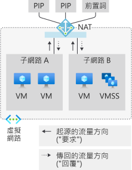

# Azure 虛擬網路 NAT 計量

Azure 虛擬網路 NAT 閘道資源可提供多維度計量。 您可以使用這些計量來觀察作業，以供進行[疑難排解](nat-metrics.md)。  您可以針對重大問題 (例如 SNAT 耗盡) 設定警示。

  

*圖：可供輸出到網際網路的虛擬網路 NAT*

>[!NOTE] 
>虛擬網路 NAT 目前可作為公開預覽版提供。 其目前僅適用於一組有限的[區域](nat-overview.md#region-availability)。 此預覽版是在沒有服務等級協定的情況下提供，不建議用於生產工作負載。 可能不支援特定功能，或可能已經限制功能。 如需詳細資訊，請參閱 [Microsoft Azure 預覽專用的補充使用條款](https://azure.microsoft.com/support/legal/preview-supplemental-terms)。

## 計量

NAT 閘道資源會在 Azure 監視器中提供下列多維度計量：

| 計量 | 描述 | 建議的彙總 | 維度 |
|---|---|---|---|
| 位元組 | 已處理的輸入和輸出位元組數 | Sum | 方向 (In；Out)、通訊協定 (6 TCP；17 UDP) |
| 封包 | 已處理的輸入和輸出的封包數 | Sum | 方向 (In；Out)、通訊協定 (6 TCP；17 UDP) |
| 丟棄的封包 | NAT 閘道丟棄的封包 | Sum | / |
| SNAT 連線計數 | 每個間隔的狀態轉換 | Sum | 連線狀態，通訊協定 (6 TCP；17 UDP) |
| SNAT 連線總計數 | 目前作用中的 SNAT 連線 (~使用中的 SNAT 連接埠) | Sum | 通訊協定 (6 TCP；17 UDP) |

## 警示

在 Azure 監視器中可以針對上述每個[計量](#metrics)設定計量的警示。

## 限制

不支援資源健康狀態。

## 後續步驟

- 了解[虛擬網路 NAT](nat-overview.md)
- 了解 [NAT 閘道資源](nat-gateway-resource.md)
- 了解 [Azure 監視器](../azure-monitor/overview.md)
- 了解[針對 NAT 閘道資源進行疑難排解](troubleshoot-nat.md)。

