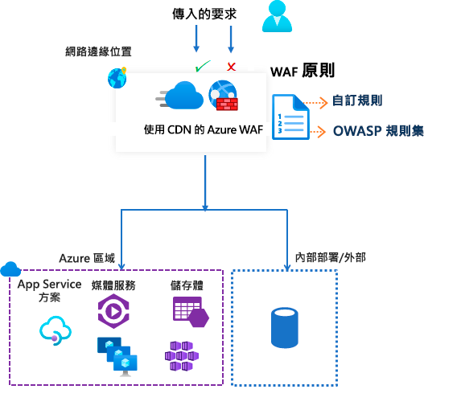

# Azure 內容傳遞網路上的 Azure Web 應用程式防火牆

Azure 內容傳遞網路 (CDN) 上的 Microsoft Azure Web 應用程式防火牆 (WAF) 可為 Web 內容提供集中式的保護。 WAF 會協助 Web 服務對抗常見的攻擊和弱點。 其可讓使用者獲得持續高度可用的服務，並協助您符合合規性需求。

> [!IMPORTANT]
> Microsoft Azure CDN 上的 WAF 目前處於公開預覽狀態，並且提供預覽服務等級的協定。 可能不支援特定功能，或可能已經限制功能。  如需詳細資訊，請參閱 [Microsoft Azure 預覽專用的補充使用條款](https://azure.microsoft.com/support/legal/preview-supplemental-terms/)。

Azure CDN 上的 WAF 是一個全域性的集中式解決方案。 其會部署在全球各地的 Azure 網路邊緣位置。 WAF 會在惡意攻擊到達您的來源之前就阻止其接近攻擊來源。 您可以獲得全球性的大規模保護，而不會犧牲效能。 

WAF 原則可輕易地連結至訂用帳戶中的任何 CDN 端點。 新規則可在幾分鐘內就部署完成，讓您可以快速回應不斷變化的威脅模式。

## WAF 原則和規則

您可以設定 WAF 原則，並將其與一或多個 CDN 端點建立關聯以進行保護。 WAF 原則包含兩種類型的安全性規則：

- 您可以建立的自訂規則。

- 由 Azure 管理且預先設定的規則集合而成的受控規則集。

當兩者都存在時，會先處理自訂規則，然後再處理受控規則集內的規則。 規則是由比對條件、優先順序和動作所組成。 支援的動作類型為：*允許*、*封鎖*、*記錄*和*重新導向*。 您可以結合受控和自訂規則，建立符合特定應用程式保護需求的完全自訂原則。

原則中的規則會依照優先順序來處理。 優先順序是一獨特數字，可定義規則的處理順序。 數字越小則優先順序越高，而這些數字較小的規則會比數字較大的規則更早進行評估。 一旦符合規則，規則中所定義的對應動作就會套用至要求。 完成此對比處理之後，優先順序較低的規則就不會再進行處理。

裝載於 Azure CDN 上的 Web 應用程式一次只能有一個相關聯的 WAF 原則。 不過，您可以擁有未關聯任何 WAF 原則的 CDN 端點。 如果有 WAF 原則，其會複寫到我們所有的邊緣位置，以確保全球的安全性原則皆一致。

## WAF 模式

WAF 原則可以設定為在下列兩種模式中執行︰

- *偵測模式*：在偵測模式中執行時，WAF 不會執行監視以外的其他任何動作，並且會將要求和其相符的 WAF 規則記錄到 WAF 記錄。 您可以為 CDN 開啟記錄診斷。 當您使用此入口網站時，請移至**診斷**一節。

- *預防模式*：在預防模式中，如果要求符合規則，WAF 便會採取指定動作。 如果找到相符的值，就不會再評估優先順序較低的規則。 所有相符的要求也會記錄在 WAF 記錄中。

## WAF 動作

當要求符合規則的條件時，您可以選擇下列其中一個動作：

- *允許*：要求可通過 WAF，並轉送至後端。 任何優先順序較低的規則都無法封鎖此要求。
- *封鎖*：要求會遭到封鎖，而 WAF 會將回應傳送至用戶端，但不會將要求轉送至後端。
- *Log*：要求會記錄在 WAF 記錄中，而 WAF 會繼續評估優先順序較低的規則。
- *重新導向*：WAF 會將要求重新導向至指定的 URI。 指定 URI 是原則層級的設定。 一旦設定之後，所有符合*重新導向*動作的要求都會傳送至該 URI。

## WAF 規則

WAF 原則可以包含兩種安全性規則：

- *自訂規則*：您自行建立的規則 
- *受控規則集*：由 Azure 管理且預先設定好的一組規則

### 自訂規則

自訂規則可擁有比對規則和速率控制規則。

您可以設定下列自訂比對規則：

- *IP 允許清單和封鎖清單*：您可以根據用戶端 IP 位址清單或 IP 位址範圍，來控制 Web 應用程式的存取權。 支援 IPv4 和 IPv6 位址類型。 此清單可設定為封鎖或允許其來源 IP 符合清單中 IP 的要求。

- *地理型存取控制*：您可以根據與用戶端 IP 位置相關聯的國家/地區代碼，來控制 Web 應用程式的存取權。

- *HTTP 參數型存取控制*：您可以讓規則以 HTTP/HTTPS 要求參數中的字串相符項目作為基礎。  例如，查詢字串、POST 引數、要求 URI、要求標頭和要求本文。

- *要求方法型存取控制*：您讓規則以要求的 HTTP 要求方法作為基礎。 例如 GET、PUT 或 HEAD。

- *大小限制*：您可以讓規則以要求的特定部分 (例如查詢字串、URI 或要求本文) 長度作為基礎。

速率控制規則會限制來自任何用戶端 IP 位址的異常高流量。

- *速率限制規則*：您可以設定用戶端 IP 位址在一分鐘內允許的 Web 要求數目閾值。 此規則與 IP 清單型的允許/封鎖自訂規則不同，該規則可允許或封鎖所有來自用戶端 IP 位址的要求。 速率限制可以與其他比對條件結合，例如用於進行細微速率控制的 HTTP(S) 參數比對。

### Azure 管理的規則集

Azure 管理的規則集可讓您以簡單的方式部署防護，以抵禦一組常見的安全性威脅。 由於這些規則集是由 Azure 所管理，因此會視需要更新規則，以防止新的攻擊簽章。 Azure 管理的預設規則集包含可防範下列威脅類別的規則：

- 跨網站指令碼處理
- Java 攻擊
- 本機檔案包含
- PHP 插入式攻擊
- 遠端命令執行
- 遠端檔案包含
- 工作階段 Fixation
- SQL 插入式攻擊保護
- 通訊協定攻擊

當新的攻擊簽章新增至規則集時，預設規則集的版本號碼將會遞增。
在 WAF 原則的*偵測*模式中，預設規則集會預設為啟用。 您可以停用或啟用預設規則集內的個別規則，以符合您的應用程式需求。 您也可以設定每個規則的特定動作 (允許/封鎖/重新導向/記錄)。 受控預設規則集的預設動作為*封鎖*。

在評估預設規則集中的規則之前，一律會套用自訂規則。 如果要求符合自訂規則，則會套用對應的規則動作。 要求會遭到封鎖，或是傳遞至後端。 系統不會處理任何其他的自訂規則或預設規則集內的規則。 您也可以從 WAF 原則中移除預設規則集。

## 組態

您可以使用 Azure 入口網站、REST API、Azure Resource Manager 範本和 Azure PowerShell 來設定和部署所有 WAF 規則類型。

## 監視

使用 CDN 來監視 WAF 的功能會與 Azure 監視器整合，以追蹤警示並輕鬆監視流量趨勢。

## 後續步驟

- [教學課程：使用 Azure 入口網站來以 Azure CDN 建立 WAF 原則](waf-cdn-create-portal.md)
