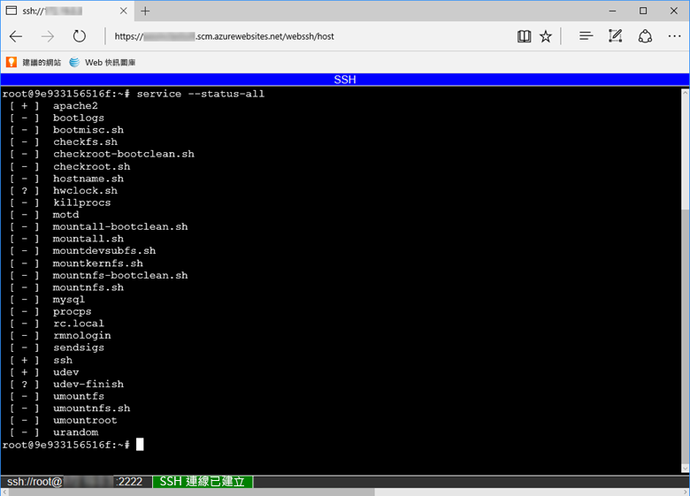

若要透過容器直接開啟 SSH 工作階段，您的應用程式應在執行中。

在瀏覽器中貼入下列 URL，並以您的應用程式名稱取代 `<app-name>`：

```
https://<app-name>.scm.azurewebsites.net/webssh/host
```

如果您尚未經過驗證，必須向您的 Azure 訂用帳戶進行驗證才能連線。 驗證之後，您會看到瀏覽器中的殼層，您可以在其中執行您容器內的命令。


