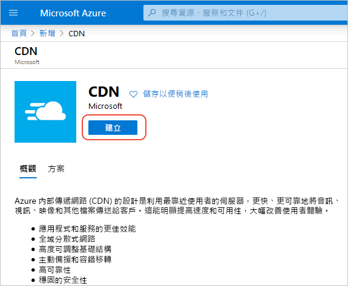
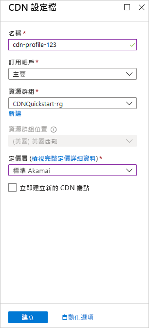

## 建立新的 CDN 設定檔

CDN 設定檔是 CDN 端點的容器，會指定定價層。

1. 在 Azure 入口網站中，選取 [建立資源] (位於左上方)。 [新增] 窗格隨即出現。
   
1. 搜尋並選取 [CDN]，然後選取 [建立]：
   
    

    此時會顯示 [CDN 設定檔] 窗格。

1. 輸入下列值：
   
    | 設定  | 值 |
    | -------- | ----- |
    | **名稱** | 輸入 *cdn-profile-123* 作為設定檔名稱。 此名稱必須是全域唯一的；如果已在使用中，您可以輸入不同的名稱。 |
    | **訂用帳戶** | 從下拉式清單中，選取 Azure 訂用帳戶。 |
    | **資源群組** | 選取 [新建]，並輸入 *CDNQuickstart-rg* 作為您的資源群組名稱，或選取 [使用現有項目]，然後選擇 [CDNQuickstart-rg] (如果您已有群組)。 | 
    | **資源群組位置** | 從下拉式清單中選取您附近的位置。 |
    | **定價層** | 從下拉式清單中選取 [標準 Akamai] 選項。 (Akamai 層的部署時間約為一分鐘。 部署 Microsoft 層大約需要 10 分鐘，而 Verizon 層大約需要 30 分鐘。) |
    | **立即建立新的 CDN 端點** | 保留為未選取。 |  
   
    

1. 選取 [建立] 以建立設定檔。

