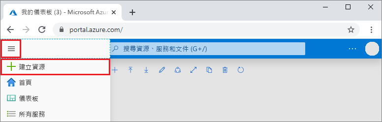
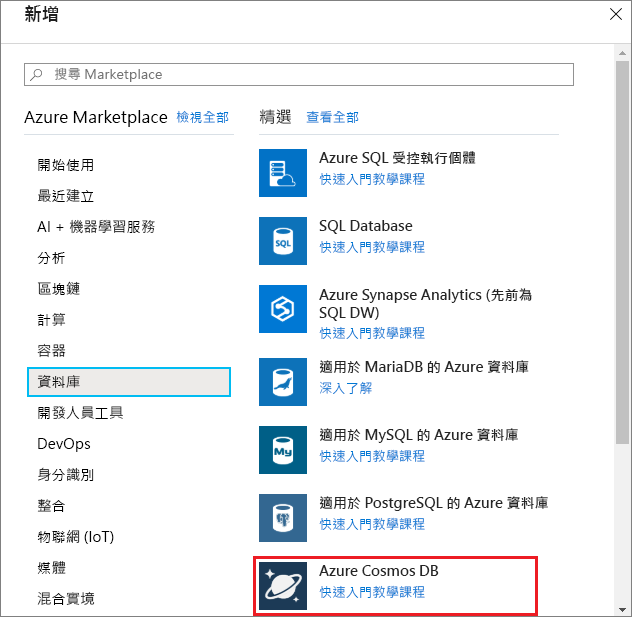
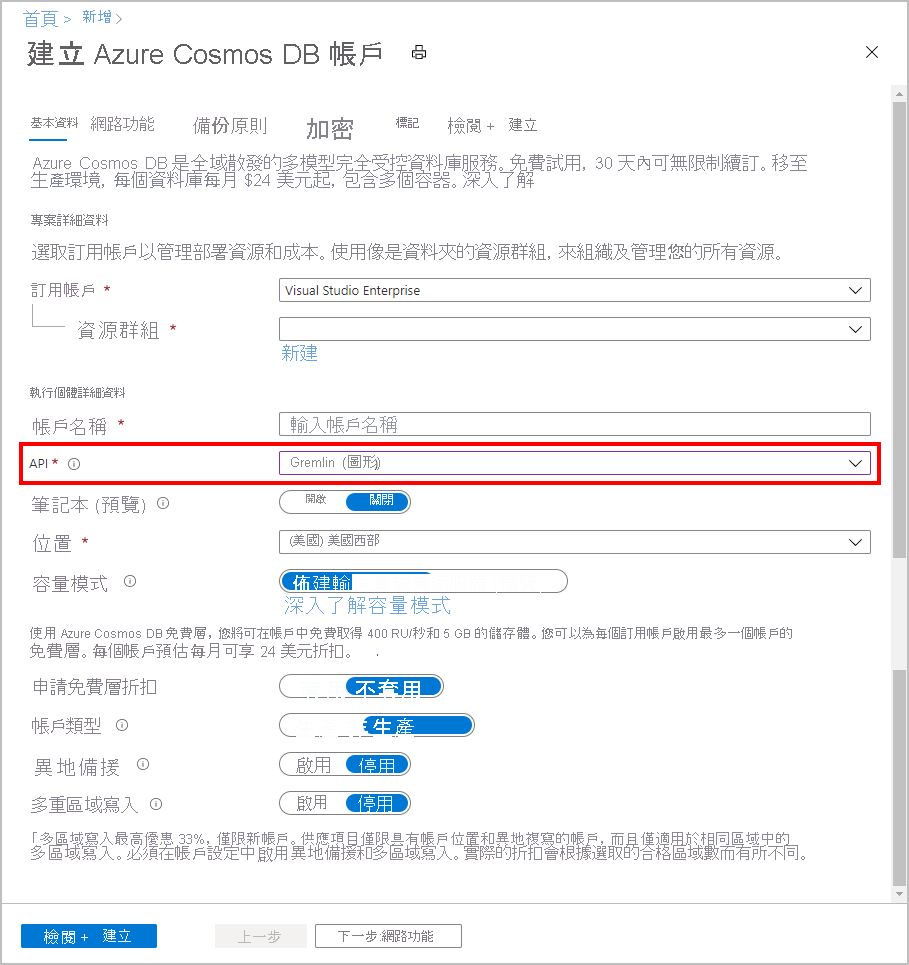
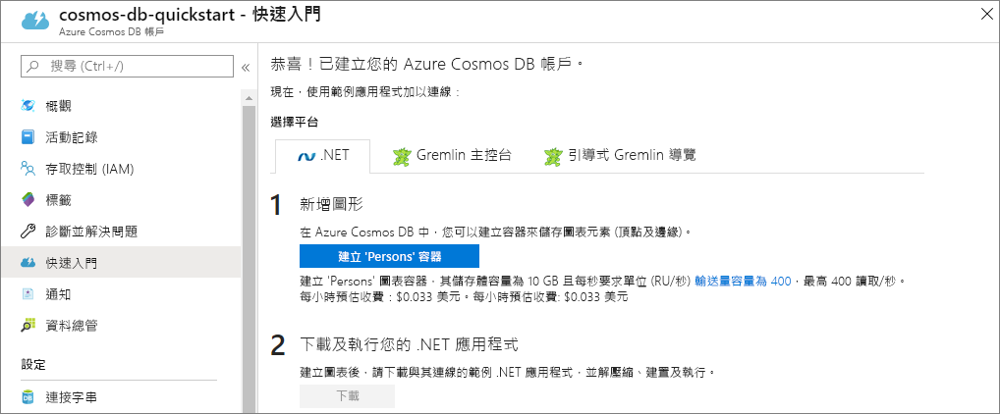

1. 在新的瀏覽器視窗中，登入 [Azure 入口網站](https://portal.azure.com/)。

2. 在左側功能表中，選取 [建立資源]  。
   
   
   
3. 在 [新增]  頁面上，選取 [資料庫]   > [Azure Cosmos DB]  。
   
   
   
3. 在 [建立 Azure Cosmos DB 帳戶]  頁面上，輸入新 Azure Cosmos DB 帳戶的設定。 
 
    設定|值|描述
    ---|---|---
    訂用帳戶|您的訂用帳戶|選取要用於此 Azure Cosmos DB 帳戶的 Azure 訂用帳戶。 
    資源群組|新建  然後，輸入與帳戶名稱相同的名稱|選取 [建立新的]  。 然後為您的帳戶輸入新的資源群組名稱。 為求簡化，請使用與 Azure Cosmos DB 帳戶名稱相同的名稱。 
    帳戶名稱|輸入唯一名稱|輸入唯一名稱來識別您的 Azure Cosmos DB 帳戶。 您的帳戶 URI 會是 gremlin.azure.com  ，並附加至您的唯一帳戶名稱。  帳戶名稱只能使用小寫字母、數字和連字號 (-)，且長度必須介於 3 到 31 個字元之間。
    API|Gremlin (圖形)|API 會決定要建立的帳戶類型。 Azure Cosmos DB 提供五個 API：Core(SQL) (適用於文件資料庫)、Gremlin (適用於圖形資料庫)、MongoDB (適用於文件資料庫)、Azure 資料表及 Cassandra。 您必須為每個 API 建立個別個帳戶。   選取 [Gremlin (圖形)]  ，因為在此快速入門中，您會建立可搭配 Gremlin API 使用的資料表。   [深入了解 Gremlin API](../articles/cosmos-db/graph-introduction.md)。|
    Location|選取最接近使用者的區域|選取用來裝載 Azure Cosmos DB 帳戶的地理位置。 使用最接近使用者的位置，以便他們能以最快速度存取資料。

    請選取 [檢閱 + 建立]  。 您可以略過 [網路]  和 [標記]  區段。 

    

4. 建立帳戶需要幾分鐘的時間。 等候入口網站顯示 [恭喜!**已建立您的 Azure Cosmos DB 帳戶]** 頁面。
   
   

