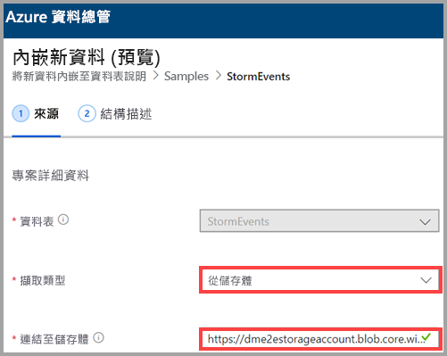
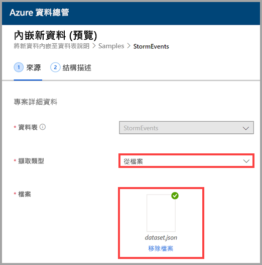
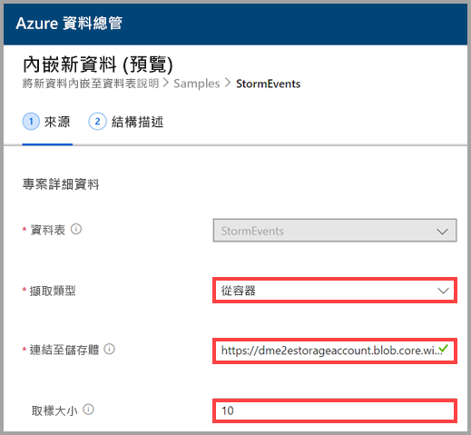
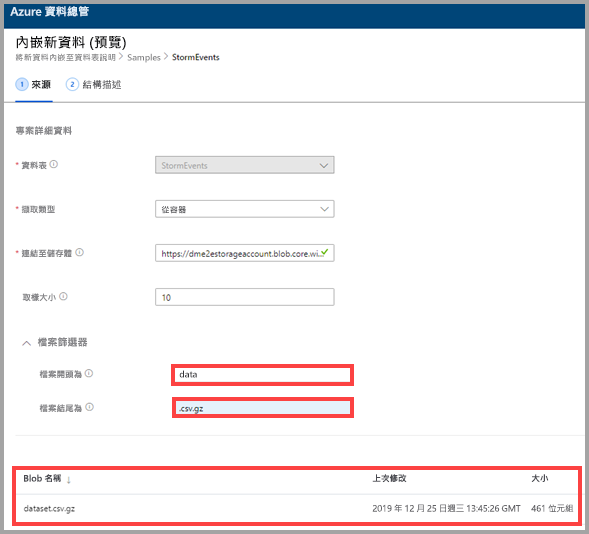

## 選取擷取類型

針對 [擷取類型]  ，選取下列其中一個選項︰
   * **從儲存體** - 在 [連結至儲存體]  欄位中，新增儲存體帳戶的 URL。 針對私人儲存體帳戶使用 [Blob SAS URL](/azurevs-azure-tools-storage-explorer-blobs#get-the-sas-for-a-blob-container)。
   
      

    * **從檔案** - 選取 [瀏覽]  以找出檔案，或將檔案拖曳到欄位中。
  
      

    * **從容器** - 在 [連結至儲存體]  欄位中，新增容器的 [SAS URL](/azure/vs-azure-tools-storage-explorer-blobs#get-the-sas-for-a-blob-container)，然後選擇性地輸入範例大小。

      

  資料的範例隨即出現。 如果想要的話，您可加以篩選，只顯示以特定字元開頭的檔案。 當您調整篩選條件時，預覽會自動更新。
  
  例如，您可篩選所有以 *data* 開頭並以 *.csv.gz* 副檔名結尾的檔案。

  
