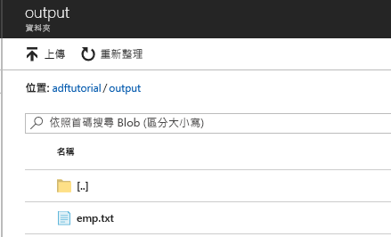

## <a name="review-deployed-resources"></a>檢閱已部署的資源

管道會自動在 adftutorial Blob 容器中建立輸出資料夾。 然後，它會將 emp.txt 檔案從輸入資料夾複製到輸出資料夾。 

1. 在 Azure 入口網站的 [adftutorial] 容器頁面上，選取 [重新整理] 可查看輸出資料夾。 
    
    

2. 在資料夾清單中，選取 [輸出]。 

3. 確認 **emp.txt** 已複製到輸出資料夾。 

    

## <a name="clean-up-resources"></a>清除資源

您有兩種方式可以清除您在本快速入門中建立的資源。 您可以刪除 [Azure 資源群組](../articles/azure-resource-manager/management/overview.md)，其中包括資源群組中的所有資源。 如果您想要讓其他資源保持不變，請僅刪除您在本教學課程中建立的資料處理站。

刪除資源群組會刪除所有資源，包含其中的 Data Factory。 執行下列命令來刪除整個資源群組： 

```powershell
Remove-AzResourceGroup -ResourceGroupName $resourcegroupname
```

> [!Note]
> 置放資源群組可能需要一些時間。 請耐心等候程序完成

如果您需要只刪除 Data Factory，而非整個資源群組，請執行下列命令： 

```powershell
Remove-AzDataFactoryV2 -Name $dataFactoryName -ResourceGroupName $resourceGroupName
```