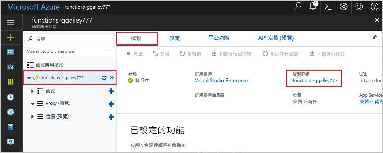

1. 在 Visual Studio Code 中按 F1 以開啟命令選擇區。 在命令選擇區中，搜尋並選取 `Azure Functions: Open in portal`。

1. 選擇您的函式應用程式，然後按 Enter。 函式應用程式頁面會在 [Azure 入口網站](https://portal.azure.com)中開啟。

1. 在 [概觀]  索引標籤中，選取 [資源群組]  底下的具名連結。

    

1. 在 [資源群組]  分頁中，檢閱包含資源的清單，並確認它們是您想要刪除的項目。
 
1. 選取 [刪除資源群組]  ，並遵循指示。

   刪除需要幾分鐘的時間。 完成時，通知會出現幾秒鐘的時間。 您也可以選取分頁頂端的鈴鐺圖示以檢視通知。