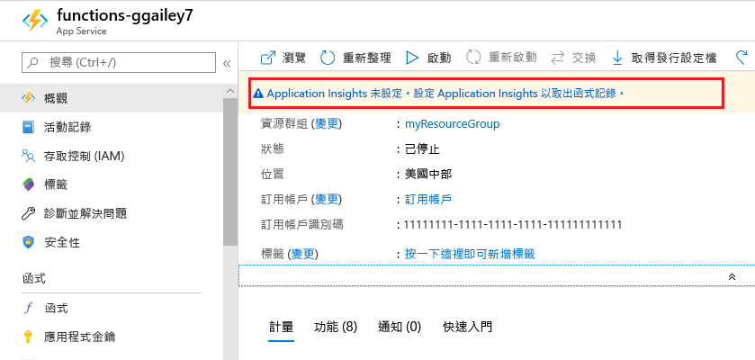
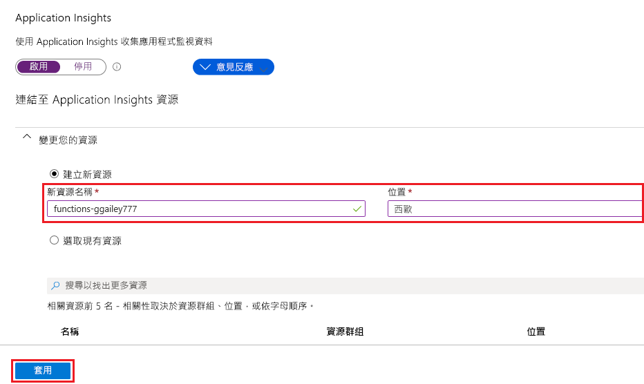

函式可讓您輕鬆地從 [Azure 入口網站]中，將 Application Insights 整合新增至函式應用程式。

1. 在[門戶][Azure 門戶]中`Function Apps`，在頁面頂部的搜索欄中鍵入，選擇函數應用，然後在視窗頂部選擇**未配置應用程式見解**的橫幅。 如果您沒有看到此橫幅，則你的應用已經啟用了應用程式見解。

    

1. 使用資料表 (圖片下方) 中指定的設定，建立 Application Insights 資源。

   

    | 設定      | 建議的值  | 描述                                        |
    | ------------ |  ------- | -------------------------------------------------- |
    | **名稱** | 唯一的應用程式名稱 | 最簡單的方式是使用與您函式應用程式一樣的名稱，而這必須是您訂用帳戶中唯一的名稱。 | 
    | **位置** | 西歐 | 可能的話，請使用與函式應用程式相同的[區域](https://azure.microsoft.com/regions/)，或該區域附近的區域。 |

1. 選取 [確定]****。 Application Insights 資源會建立在函式應用程式所在的資源群組和訂用帳戶。 建立資源之後，請關閉 Application Insights 視窗。

1. 回到您的函式應用程式中，選取 [應用程式設定]****，然後向下捲動至 [應用程式設定]****。 如果您看到名為 `APPINSIGHTS_INSTRUMENTATIONKEY` 的設定，表示 Azure 中執行的函式應用程式已啟用 Application Insights 整合。

[Azure 門戶]: https://portal.azure.com
