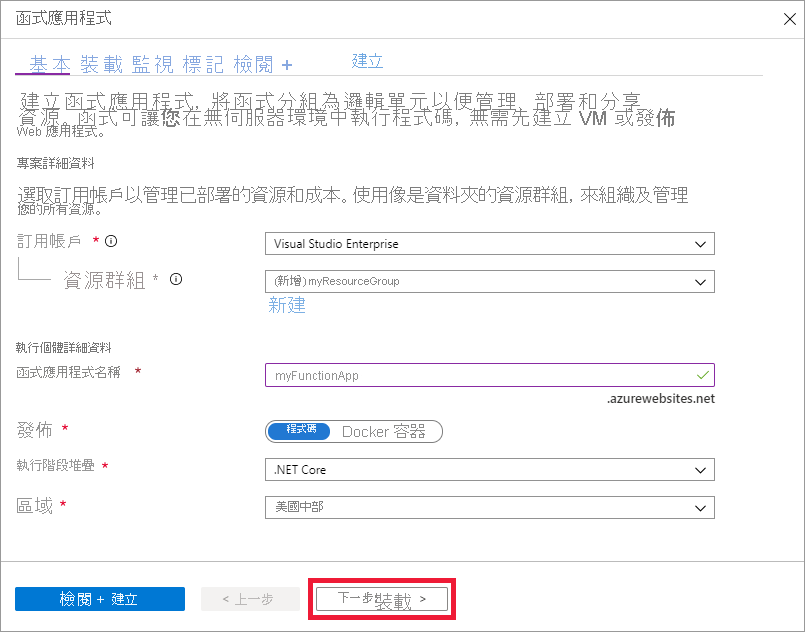
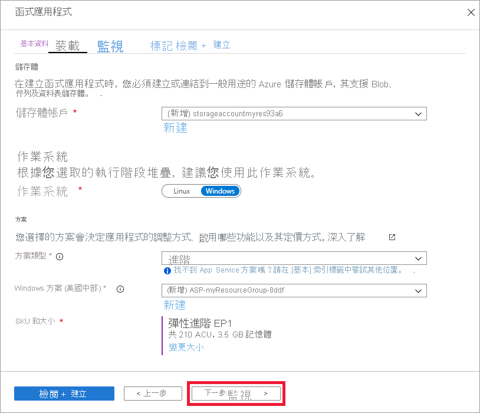

1. 從打開 Azure 門戶[https://portal.azure.com](https://portal.azure.com)

1. 選取 [建立資源]**** 按鈕

    

1. 選擇**計算** > **函數應用**。

    

1. 請使用影像下面的資料表中指定的函式應用程式設定。

    

    | 設定      | 建議的值  | 描述 |
    | ------------ | ---------------- | ----------- |
    | **訂閱** | 您的訂用帳戶 | 將在其下建立這個新函式應用程式的訂用帳戶。 |
    | **[資源組](../articles/azure-resource-manager/management/overview.md)** |  *myResourceGroup* | 要在其中建立函式應用程式的新資源群組名稱。 |
    | **函式應用程式名稱** | 全域唯一的名稱 | 用以識別新函式應用程式的名稱。 有效字元為 `a-z` (區分大小寫)、`0-9` 以及 `-`。  |
    |**發佈**| 程式碼 | 發佈程式碼檔案或 Docker 容器的選項。 |
    | **執行階段堆疊** | 慣用語言 | 選擇支援您慣用函式程式設計語言的執行階段。 選擇 **.NET**表示 C# 和 F# 函數。 |
    |**地區**| 慣用區域 | 選擇您附近的[區域](https://azure.microsoft.com/regions/)或功能訪問的其他服務附近的區域。 |

    選擇 **"下一個 ：託管>"** 按鈕。

1. 輸入以下託管設置。

    

    | 設定      | 建議的值  | 描述 |
    | ------------ | ---------------- | ----------- |
    | **[存儲帳戶](../articles/storage/common/storage-account-create.md)** |  全域唯一的名稱 |  建立您函式應用程式使用的儲存體帳戶。 儲存體帳戶名稱必須介於 3 到 24 個字元的長度，而且只能包含數字和小寫字母。 您也可以使用現有帳戶，條件是必須符合[儲存體帳戶需求](../articles/azure-functions/functions-scale.md#storage-account-requirements)。 |
    |**作業系統**| 慣用的作業系統 | 系統會根據您的執行階段堆疊選項預先選取作業系統，但您可以視需要變更設定。 |
    | **[規劃](../articles/azure-functions/functions-scale.md)** | Premium | 對於"計畫類型 **"，選擇"高級（預覽"）** 並選擇*Windows 計畫和* *Sku 和大小*選擇的預設值。 |

    選擇"**下一個：監視>"** 按鈕。

1. 輸入以下監視設置。

    

    | 設定      | 建議的值  | 描述 |
    | ------------ | ---------------- | ----------- |
    | **[應用程式洞察](../articles/azure-functions/functions-monitoring.md)** | 預設 | 在最近的支援區域中，建立相同*應用程式名稱*的 Application Insights 資源。 您可以展開此設定，變更 [新資源名稱]**** 或在 [Azure 地理位置](https://azure.microsoft.com/global-infrastructure/geographies/)中依您希望儲存資料的地點，選擇不同的**位置**。 |

    選取 [檢閱 + 建立]****，以檢閱應用程式組態選項。

1. 選取 [建立]**** 以佈建並部署函式應用程式。