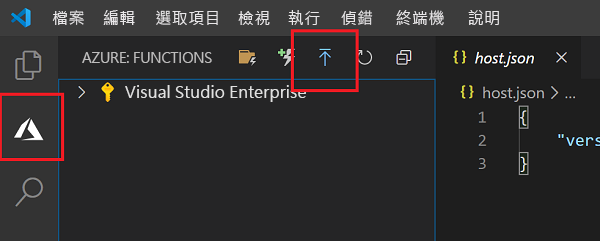
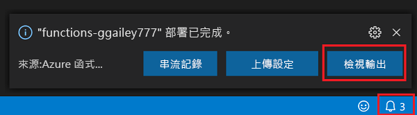

## 將專案發佈到 Azure

在這一節中，您會在 Azure 訂用帳戶中建立函式應用程式和相關資源，然後部署程式碼。 

1. 選擇活動列中的 Azure 圖示，然後在 [Azure：  函式] 區域中，選擇 [部署至函式應用程式...]  按鈕。

    

1. 依照提示提供下列資訊：

    + **選取訂用帳戶**：選擇要使用的訂用帳戶。 如果您只有一個訂用帳戶，就不會看見此選項。

    + **在 Azure 中選取函式應用程式**：選擇 `+ Create new Function App` (而非 `Advanced`)。 本文不支援[進階發佈流程](../articles/azure-functions/functions-develop-vs-code.md#enable-publishing-with-advanced-create-options)。 
    
    >[!IMPORTANT]
    > 發佈至現有的函式應用程式會覆寫該應用程式在 Azure 中的內容。 
    
    + **輸入函式應用程式的全域唯一名稱**：輸入在 URL 路徑中有效的名稱。 您輸入的名稱會進行驗證，以確定該名稱在 Azure Functions 中是唯一的。 
    
    ::: zone pivot="programming-language-python"
    + **選取執行階段**：選擇您在本機上執行的 Python 版本。 您可以使用 `python --version` 命令來檢查您的版本。
    ::: zone-end

    ::: zone pivot="programming-language-javascript,programming-language-typescript"
    + **選取執行階段**：選擇您在本機上執行的 Node.js 版本。 您可以使用 `node --version` 命令來檢查您的版本。
    ::: zone-end

    + **選取新資源的位置**：若要獲得較佳的效能，請選擇您附近的[區域](https://azure.microsoft.com/regions/)。 
    
1.  完成時，您的訂用帳戶中會建立下列 Azure 資源：

    + **[資源群組](../articles/azure-resource-manager/management/overview.md)** ：包含所有已建立的 Azure 資源。 該名稱是以您的函數應用程式名稱為根據。
    + **[儲存體帳戶](../articles//storage/common/storage-introduction.md#types-of-storage-accounts)** ：使用以您的函數應用程式名稱為根據的唯一名稱建立標準儲存體帳戶。
    + **[主控方案](../articles/azure-functions/functions-scale.md)** ：在美國西部區域建立一個取用方案，來裝載您的無伺服器函數應用程式。
    + **函數應用程式**：您的專案已部署到此新函數應用程式，並在其中執行。
    + **Application Insights**：系統會根據您的函式名稱建立連線至函式應用程式的執行個體。

    建立函式應用程式並套用部署套件之後，即會顯示通知。 
    
1. 在通知中選取 [檢視輸出]  ，即可檢視建立和部署結果，包括您所建立的 Azure 資源。 如果您錯過通知，請選取右下角的鈴鐺圖示，以再次查看。

    
