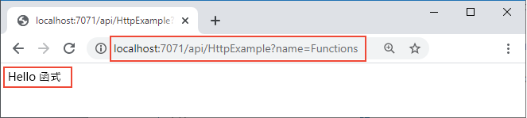

## <a name="run-the-function-locally"></a>在本機執行函式

啟動 *LocalFunctionProj* 資料夾中的本機 Azure Functions 執行階段主機，以執行您的函式：

::: zone pivot="programming-language-csharp,programming-language-powershell,programming-language-javascript,programming-language-python"
```
func start
```
::: zone-end

::: zone pivot="programming-language-typescript"
```
npm install
npm start
```
::: zone-end

::: zone pivot="programming-language-java"
```
mvn clean package 
mvn azure-functions:run
```
::: zone-end

在輸出的結尾處，應該會出現下列幾行： 

<pre>
...

Now listening on: http://0.0.0.0:7071
Application started. Press Ctrl+C to shut down.

Http Functions:

        HttpExample: [GET,POST] http://localhost:7071/api/HttpExample
...

</pre>

>[!NOTE]  
> 如果 HttpExample 未如下顯示，表示您可能不是從專案的根資料夾啟動主機。 在此情況下，請使用 **Ctrl**+**C** 停止主機，瀏覽至專案的根資料夾，然後再次執行先前的命令。

從這個輸出中將 `HttpExample` 函式的 URL 複製到瀏覽器，並附加查詢字串 `?name=<your-name>`，使其成為完整的 URL (如 `http://localhost:7071/api/HttpExample?name=Functions`)。 瀏覽器應該會顯示類似於 `Hello Functions` 的訊息：



您在其中啟動專案的終端機，也會在您提出要求時顯示記錄輸出。

準備就緒後，請使用 **Ctrl**+**C** 並選擇 `y` 以停止函式主機。
