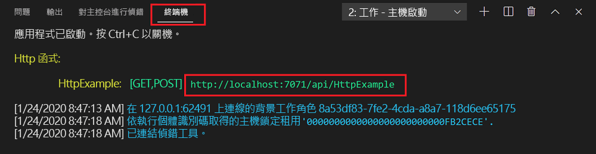
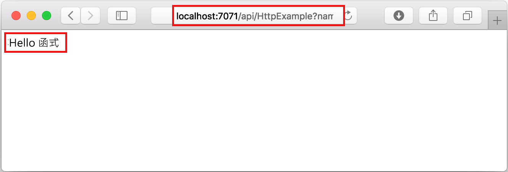
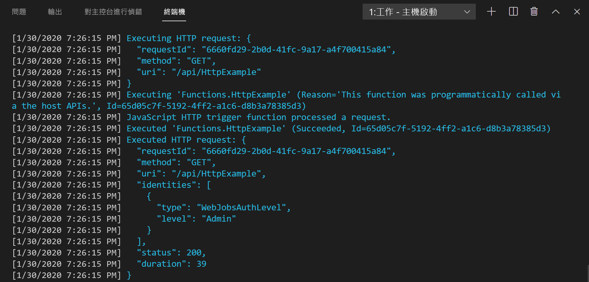

## 在本機執行函式

Visual Studio Code 可與 [Azure Functions Core 工具](../articles/azure-functions/functions-run-local.md)整合，讓您能夠先在本機開發電腦上執行此專案，再發佈至 Azure。

1. 若要呼叫您的函式，請按 <kbd>F5</kbd> 以啟動函式應用程式專案。 Core Tools 的輸出會顯示在**終端機**面板中。

1. 如果您尚未安裝 Azure Functions Core Tools，請在出現提示時選取 [安裝]  。 安裝 Core Tools 後，您的應用程式將會在 [終端機]  面板中啟動。 您可以查看在本機執行的 HTTP 觸發函式的 URL 端點。

    

1. 在 Core Tools 執行時，瀏覽至下列 URL 以執行 GET 要求 (其中包含 `?name=Functions` 查詢字串)。

    `http://localhost:7071/api/HttpExample?name=Functions`

1. 此時會傳回回應，其內容在瀏覽器中會顯示如下：

    

1. 要求的相關資訊會顯示在 [終端機]  面板中。

    

1. 按 <kbd>Ctrl + C</kbd> 以停止 Core Tools，並中斷偵錯工具的連線。
