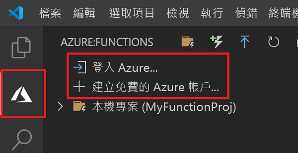

## 登入 Azure

您必須先登入 Azure，才能發佈您的應用程式。

1. 如果您尚未登入，請選擇活動列中的 Azure 圖示，然後在 [Azure:函式] 區域中，選擇 [登入 Azure...]。如果您還沒有帳戶，可以 **[建立免費的 Azure 帳戶](https://azure.microsoft.com/free/)** 。 學生可以 **[建立免費的 Azure 學生版帳戶](https://azure.microsoft.com/free/students/)** 。

    

    如果您已經登入，請移至下一個區段。

1. 在瀏覽器中出現提示時，選擇您的 Azure 帳戶，並使用您的 Azure 帳號認證登入。

1. 成功登入之後，您可以關閉新的瀏覽器視窗。 屬於您 Azure 帳戶的訂用帳戶會顯示在提要欄位中。
