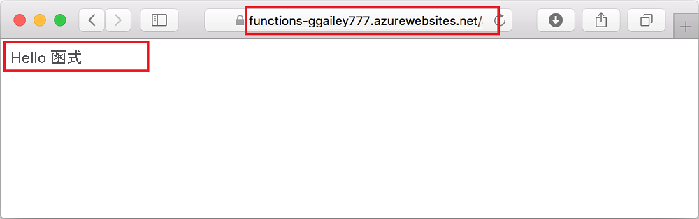

## <a name="run-the-function-in-azure"></a>在 Azure 中執行函式

1. 返回 [Azure：  函式] 區域 (位於提要欄位中)，在訂用帳戶下展開新的函式應用程式。 展開 [函式]，以滑鼠右鍵按一下 (Windows) 或按住 <kbd>Ctrl</kbd> 並在 (macOS) **HttpExample** 上按一下，然後選擇 [複製函式 URL]。

    

1. 將 HTTP 要求的這個 URL 貼到瀏覽器的網址列中，並在此 URL 的結尾處新增 `name` 查詢字串 `?name=Functions`，然後執行要求。 呼叫 HTTP URL 觸發函式的 URL 應採用下列格式：

    ```http
    http://<FUNCTION_APP_NAME>.azurewebsites.net/api/httpexample?name=Functions
    ```

    下列範例顯示瀏覽器中對於函式所傳回遠端 GET 要求所做出的回應︰

    
