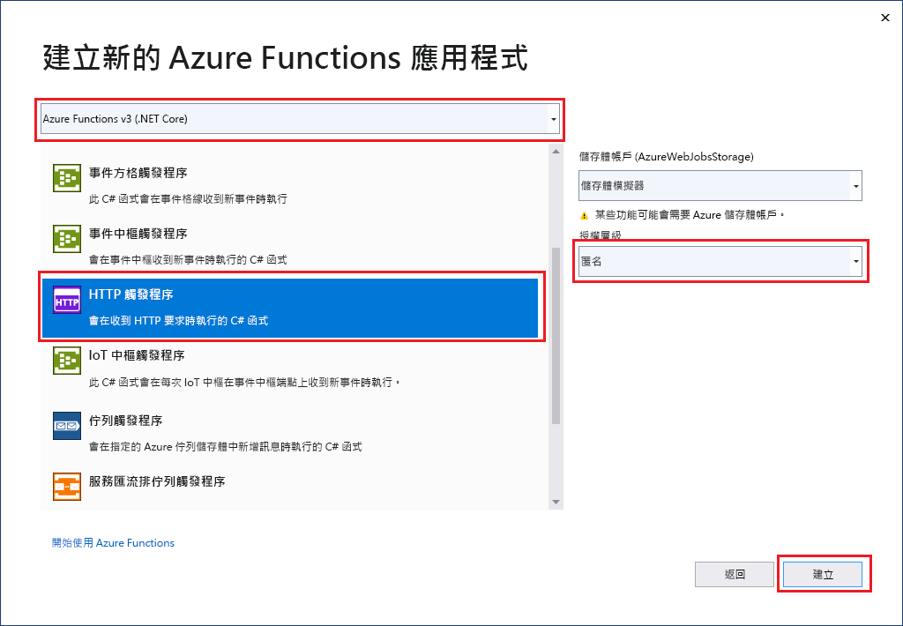

Visual Studio 中的 Azure Functions 專案範本會建立可發行至 Azure 中函式應用程式的專案。 您可以使用函式應用程式將多個函式群組為邏輯單位，以方便管理、部署、調整和共用資源。

1. 在 Visual Studio 中，於 [檔案]  功能表上選取 [新增]   > [專案]  。

1. 在 [建立新專案]  的搜尋方塊中輸入*函式*，然後選擇 [Azure Functions]  範本。

1. 在 [設定您的新專案]  中，輸入專案的**專案名稱**，然後選取 [建立]  。 函式應用程式名稱必須是有效的 C# 命名空間，因此不會使用底線、連字號或任何其他非英數字元。

1. 針對 [新專案-&lt;您的專案名稱&gt;]  設定，請使用下表中的值：

    | 設定      | 值  | 描述                      |
    | ------------ |  ------- |----------------------------------------- |
    | **Functions 執行階段** | **Azure Functions v2  (.NET Core)** | 此值會建立使用 Azure Functions 2.x 版執行階段 (支援 .NET Core) 的函式專案。 Azure Functions 1.x 支援 .NET Framework。 如需詳細資訊，請參閱 [Azure Functions 執行階段版本概觀](../articles/azure-functions/functions-versions.md)。   |
    | **函式範本** | **HTTP 觸發程序** | 此值會建立 HTTP 要求所觸發的函式。 |
    | **儲存體帳戶**  | **儲存體模擬器** | 因為 Azure Function 需要儲存體帳戶，所以當您將專案發佈至 Azure 時，就會指派或建立一個。 HTTP 觸發程式不會使用 Azure 儲存體帳戶連接字串；所有其他觸發程式類型都需要有效的 Azure 儲存體帳戶連接字串。  |
    | **存取權限** | **匿名** | 建立的函式可以由任何用戶端觸發，而不需提供金鑰。 此授權設定可以讓測試新函式變得簡單。 如需金鑰和授權的詳細資訊，請參閱 [授權金鑰](../articles/azure-functions/functions-bindings-http-webhook-trigger.md#authorization-keys)和 [HTTP 和 Webhook 繫結](../articles/azure-functions/functions-bindings-http-webhook.md)。 |
    

    
    

    請確定您將 [存取權限]  設為 [匿名]  。 如果您選擇**函式**的預設層級，必須在要求中提供[函式金鑰](../articles/azure-functions/functions-bindings-http-webhook-trigger.md#authorization-keys)以存取您的函式端點。

1. 選取 [確定]  以建立函式專案和由 HTTP 觸發的函式。
