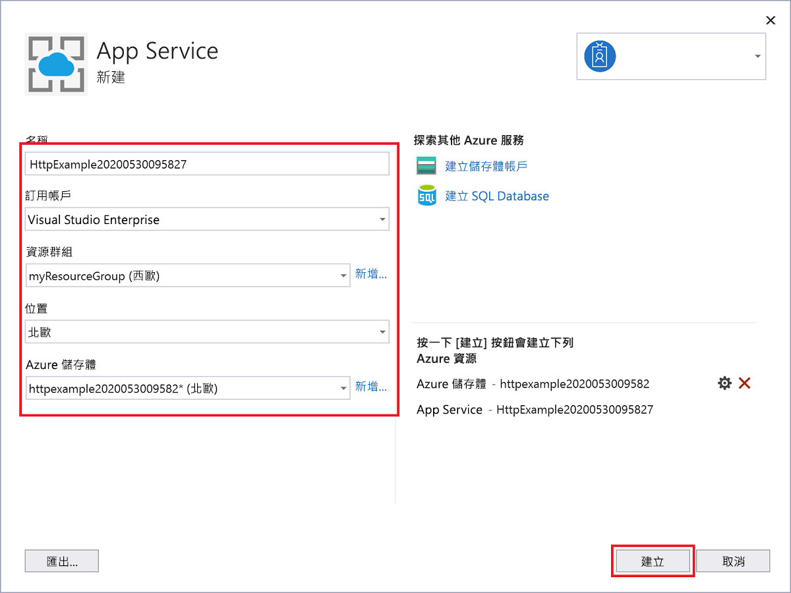

1. 在 [方案總管] 中，以滑鼠右鍵按一下專案並選取 [發佈]。

1. 在 [目標] 中，選取 [Azure] :::image type="content" source="media/functions-vstools-publish/functions-visual-studio-publish-profile-step-1.png" alt-text="選取 Azure 目標":::

1. 在 [特定目標] 中，選取 [Azure 函數應用程式 (Windows)]

    :::image type="content" source="media/functions-vstools-publish/functions-visual-studio-publish-profile-step-2.png" alt-text="選取 Azure 函數應用程式":::

1. 在 [函式執行個體] 中，選取 [建立新的 Azure Function...]，然後使用下表中指定的值：

    | 設定      | 值  | 描述                                |
    | ------------ |  ------- | -------------------------------------------------- |
    | **名稱** | 全域唯一的名稱 | 用以唯一識別新函式應用程式的名稱。 接受此名稱或輸入新的名稱。 有效字元：`a-z`、`0-9` 和 `-`。 |
    | **訂用帳戶** | 您的訂用帳戶 | 要使用的 Azure 訂用帳戶。 接受此訂用帳戶，或從下拉式清單中選取一個新的訂用帳戶。 |
    | **[資源群組](../articles/azure-resource-manager/management/overview.md)** | 資源群組的名稱 |  要在其中建立函式應用程式的資源群組。 從下拉式清單中選取現有的資源群組，或選擇 [新增] 來建立新的資源群組。|
    | **[方案類型](../articles/azure-functions/functions-scale.md)** | 耗用量 | 當您將專案發佈至在[取用方案](../articles/azure-functions/functions-scale.md#consumption-plan)中執行的函式應用程式時，您只需支付您的函式應用程式執行費用。 其他主控方案會產生較高的成本。 |
    | **位置** | App Service 的位置 | 在 [區域](https://azure.microsoft.com/regions/)中選擇 **位置**，此位置應靠近您或靠近函式會存取的其他服務。 |
    | **[Azure 儲存體](../articles/storage/common/storage-account-create.md)** | 一般用途的儲存體帳戶 | Functions 執行階段需要 Azure 儲存體帳戶。 選取 [新增] 以設定一般用途的儲存體帳戶。 您也可以選擇符合[儲存體帳戶需求](../articles/azure-functions/functions-scale.md#storage-account-requirements)的現有帳戶。  |

    

1. 選取 [建立]，以在 Azure 中建立函數應用程式及其相關資源。 
1. 在 [函式執行個體] 中，請確定已核取 [從封裝檔案執行]。 您的函式應用程式會使用已啟用[從套件執行](../articles/azure-functions/run-functions-from-deployment-package.md)模式的 [Zip 部署](../articles/azure-functions/functions-deployment-technologies.md#zip-deploy)來部署。 這是函式專案的建議部署方法，因為其可提高效能。 

    :::image type="content" source="media/functions-vstools-publish/functions-visual-studio-publish-profile-step-4.png" alt-text="完成設定檔建立":::

1. 選取 [完成]，然後在 [發佈] 頁面上選取 [發佈]，將包含專案檔的套件部署到 Azure 中的新函數應用程式。 

    部署完成之後，[發行] 索引標籤中會顯示 Azure 中函式應用程式的根 URL。 
    
1.  在 [發佈] 索引標籤中，選擇 [在 Cloud Explorer 中管理]。 這會在 Cloud Explorer 中開啟新的函式應用程式 Azure 資源。 
    
    :::image type="content" source="media/functions-vstools-publish/functions-visual-studio-publish-complete.png" alt-text="發行成功訊息":::
    
    Cloud Explorer 可讓您使用 Visual Studio 來檢視網站的內容、啟動和停止函式應用程式，以及直接瀏覽 Azure 上和 Azure 入口網站中的函式應用程式資源。 
