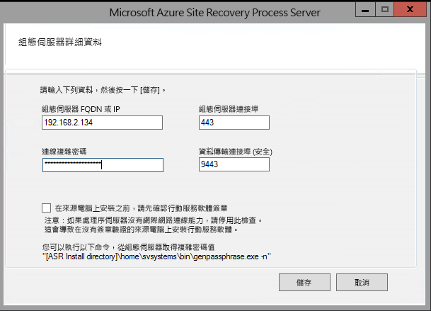

1. 建立執行進程伺服器之電腦的遠端桌面連線。 
2. 執行 cspsconfigtool.exe，以啟動 Azure Site Recovery 進程伺服器設定工具。
    - 此工具會在您第一次登入進程伺服器時自動啟動。
    - 如果未自動開啟，請在桌面上按一下其快捷方式。

3. 在 [設定**伺服器 FQDN 或 ip**] 中，指定要用來註冊處理伺服器之設定伺服器的名稱或 ip 位址。
4. 在 [設定**伺服器埠**] 中，確定已指定443。 這是設定伺服器用來接聽要求的埠。
5. 在 [**連接複雜密碼**] 中，指定設定伺服器時所指定的複雜密碼。 若要尋找複雜密碼：
    -  在設定伺服器上，流覽至 Site Recovery 安裝資料夾 **\home\svssystems\bin\**：
    ```
    cd %ProgramData%\ASR\home\svsystems\bin
    ```
    - 執行下列命令以列印出目前的複雜密碼：
    ```
    genpassphrase.exe -n
    ```

6. 在 [**資料傳輸埠**] 中，保留預設值，除非您已指定自訂埠。

7. 按一下 [**儲存**] [儲存設定]，然後註冊進程伺服器。

    
    
