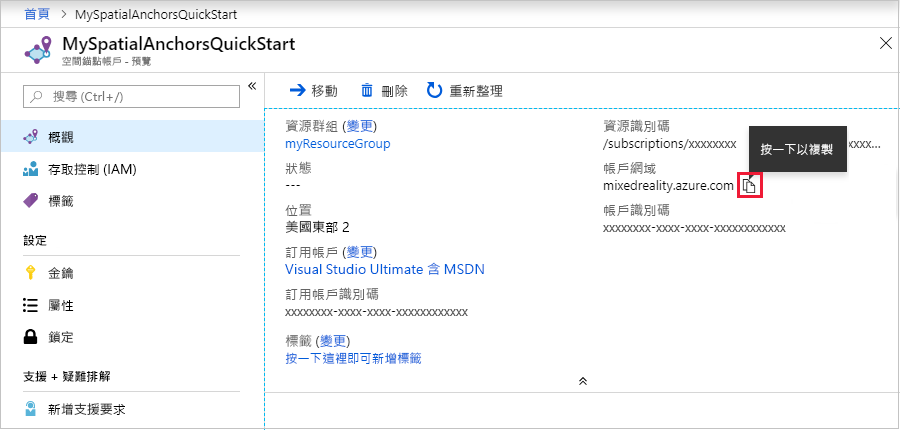

## <a name="create-a-spatial-anchors-resource"></a>建立 Spatial Anchors 資源

### <a name="portal"></a>[入口網站](#tab/azure-portal)

移至 <a href="https://portal.azure.com" target="_blank">Azure 入口網站</a>。

在左窗格上，選取 [建立資源]。

使用搜尋方塊搜尋 **Spatial Anchors**。


選取 [空間錨點]，然後選取 [建立]。

在 [空間錨點帳戶] 窗格上，執行下列動作：

* 使用規則英數字元，輸入唯一的資源名稱。
* 選取您要連結資源的訂用帳戶。
* 選取 [新建] 來建立資源群組。 將其命名為 **myResourceGroup**，然後選取 [確定]。

  [!INCLUDE [resource group intro text](resource-group.md)]

* 選取要在其中放置資源的位置 (區域)。
* 選取 [新增] 開始建立資源。

![[空間錨點] 窗格的螢幕擷取畫面，此窗格用於建立資源。](./media/spatial-anchors-get-started-create-resource/create-resource-form.png)

建立資源之後，Azure 入口網站會顯示您的部署已完成。


選取 [移至資源]。 您現在可以檢視資源屬性。

將資源的 [帳戶識別碼] 值複製到文字編輯器，以供稍後使用。


此外，也將資源的 [帳戶網域] 值複製到文字編輯器，以供稍後使用。



在 [設定] 底下，選取 [金鑰]。 將 [主要金鑰] 值、[帳戶金鑰] 複製到文字編輯器，以供稍後使用。

![帳戶 [金鑰] 窗格的螢幕擷取畫面。](./media/spatial-anchors-get-started-create-resource/view-account-key.png)

### <a name="azure-cli"></a>[Azure CLI](#tab/azure-cli)

從準備適用於 Azure CLI 的環境開始：

[!INCLUDE [azure-cli-prepare-your-environment-no-header.md](azure-cli-prepare-your-environment-no-header.md)]

1. 登入之後，請使用 [az account set](/cli/azure/account#az_account_set) 命令來選取要在其中設定空間錨點帳戶的訂用帳戶：

   ```azurecli
   az account set --subscription 00000000-0000-0000-0000-000000000000
   ```

1. 執行 [az group create](/cli/azure/group#az_group_create) 命令以建立資源群組，或使用現有的資源群組：

   ```azurecli
   az group create --name myResourceGroup --location eastus2
   ```

   [!INCLUDE [resource group intro text](resource-group.md)]

   您可以使用 [az spatial-anchors-account list](/cli/azure/ext/mixed-reality/spatial-anchors-account#ext_mixed_reality_az_spatial_anchors_account_list) 命令來檢視資源群組的目前空間錨點帳戶：

   ```azurecli
   az spatial-anchors-account list --resource-group myResourceGroup
   ```

   您也可以檢視訂用帳戶的空間錨點帳戶：

   ```azurecli
   az spatial-anchors-account list
   ```

1. 執行 [az spatial-anchors-account create](/cli/azure/ext/mixed-reality/spatial-anchors-account#ext_mixed_reality_az_spatial_anchors_account_create) 命令來建立您的空間錨點帳戶：

   ```azurecli
   az spatial-anchors-account create --resource-group myResourceGroup --name MySpatialAnchorsQuickStart --location eastus2
   ```

1. 使用 [az spatial-anchors-account show](/cli/azure/ext/mixed-reality/spatial-anchors-account#ext_mixed_reality_az_spatial_anchors_account_show) 命令來檢視資源屬性：

   ```azurecli
   az spatial-anchors-account show --resource-group myResourceGroup --name MySpatialAnchorsQuickStart
   ```

   將資源 [帳戶識別碼] 值和資源 [帳戶網域] 值複製到文字編輯器以供稍後使用。

1. 執行 [az spatial-anchors-account key show](/cli/azure/ext/mixed-reality/spatial-anchors-account/key#ext_mixed_reality_az_spatial_anchors_account_key_show) 命令來取得主要和次要金鑰：

   ```azurecli
   az spatial-anchors-account key show --resource-group myResourceGroup --name MySpatialAnchorsQuickStart
   ```

   將金鑰值複製到文字編輯器以供稍後使用。

   如果您需要重新產生金鑰，請使用 [az spatial-anchors-account key renew](/cli/azure/ext/mixed-reality/spatial-anchors-account/key#ext_mixed_reality_az_spatial_anchors_account_key_renew) 命令：

   ```azurecli
   az spatial-anchors-account key renew --resource-group myResourceGroup --name example --key primary
   az spatial-anchors-account key renew --resource-group myResourceGroup --name example --key secondary
   ```

您可以使用 [az spatial-anchors-account delete](/cli/azure/ext/mixed-reality/spatial-anchors-account#ext_mixed_reality_az_spatial_anchors_account_delete) 命令來刪除帳戶：

```azurecli
az spatial-anchors-account delete --resource-group myResourceGroup --name MySpatialAnchorsQuickStart
```

### <a name="azure-powershell"></a>[Azure PowerShell](#tab/azure-powershell)

從準備適用於 Azure PowerShell 的環境開始：

[!INCLUDE [azure-powershell-requirements-no-header.md](azure-powershell-requirements-no-header.md)]

> [!IMPORTANT]
> **Az.MixedReality** PowerShell 模組處於預覽狀態，因此必須使用 `Install-Module` Cmdlet 個別安裝。 此 PowerShell 模組正式推出後，便會成為未來 Az PowerShell 模組版本的一部分，且預設可從 Azure Cloud Shell 內使用。

```azurepowershell-interactive
Install-Module -Name Az.MixedReality
```

1. 登入之後，請使用 [Set-AzContext](/powershell/module/az.accounts/set-azcontext) Cmdlet 選取要在其中設定空間錨點帳戶的訂用帳戶：

   ```azurepowershell-interactive
   Set-AzContext -SubscriptionId 00000000-0000-0000-0000-000000000000
   ```

1. 請使用 [New-AzResourceGroup](/powershell/module/az.resources/new-azresourcegroup) Cmdlet 建立資源群組，或使用現有的資源群組：

   ```azurepowershell-interactive
   New-AzResourceGroup -Name myResourceGroup -Location eastus2
   ```

   [!INCLUDE [resource group intro text](resource-group.md)]

   您可以使用 [Get-AzSpatialAnchorsAccount](/powershell/module/az.mixedreality/get-azspatialanchorsaccount) Cmdlet 檢視資源群組目前的空間錨點帳戶：

   ```azurepowershell-interactive
   Get-AzSpatialAnchorsAccount -ResourceGroup myResourceGroup
   ```

   您也可以檢視訂用帳戶的空間錨點帳戶：

   ```azurepowershell-interactive
   Get-AzSpatialAnchorsAccount
   ```

1. 執行 [New-AzSpatialAnchorsAccount](/powershell/module/az.mixedreality/new-azspatialanchorsaccount) Cmdlet 以建立空間錨點帳戶：

   ```azurepowershell-interactive
   New-AzSpatialAnchorsAccount -ResourceGroup myResourceGroup -Name MySpatialAnchorsQuickStart -Location eastus2
   ```

1. 使用 [Get-AzSpatialAnchorsAccount](/powershell/module/az.mixedreality/get-azspatialanchorsaccount) Cmdlet 檢視資源屬性：

   ```azurepowershell-interactive
   Get-AzSpatialAnchorsAccount -ResourceGroup myResourceGroup -Name MySpatialAnchorsQuickStart
   ```

   將 **accountId** 屬性值和 **accountDomain** 屬性值複製到文字編輯器中，以供後續使用。

1. 執行 [Get-AzSpatialAnchorsAccountKey](/powershell/module/az.mixedreality/get-azspatialanchorsaccountkey) Cmdlet 以取得主要和次要金鑰：

   ```azurepowershell-interactive
   Get-AzSpatialAnchorsAccountKey -ResourceGroup myResourceGroup -Name MySpatialAnchorsQuickStart
   ```

   將金鑰值複製到文字編輯器以供稍後使用。

   如果您需要重新產生金鑰，請使用 [New-AzSpatialAnchorsAccountKey](/powershell/module/az.mixedreality/new-azspatialanchorsaccountkey) Cmdlet：

   ```azurepowershell-interactive
   New-AzSpatialAnchorsAccountKey -ResourceGroupName myResourceGroup -Name MySpatialAnchorsQuickStart -Primary
   New-AzSpatialAnchorsAccountKey -ResourceGroupName myResourceGroup -Name MySpatialAnchorsQuickStart -Secondary
   ```

您可以使用 [Remove-AzSpatialAnchorsAccount](/powershell/module/az.mixedreality/remove-azspatialanchorsaccount) Cmdlet 將帳戶刪除：

```azurepowershell-interactive
Remove-AzSpatialAnchorsAccount -ResourceGroup myResourceGroup -Name MySpatialAnchorsQuickStart
```

---
