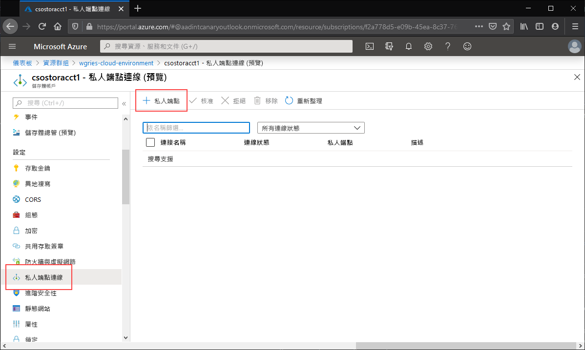
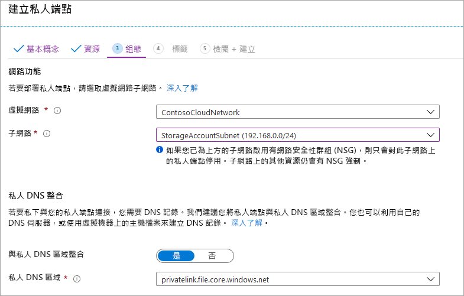

瀏覽至您想要為其建立私人端點的儲存體帳戶。 在儲存體帳戶的目錄中，選取 [私人端點連線] 和 [+ 私人端點]，以建立新的私人端點。 

產生的精靈會有多個頁面需要完成。

在 [基本] 刀鋒視窗中，為您的私人端點選取所需的資源群組、名稱和區域。 您可以任意選取這些項目，而不一定要與儲存體帳戶相符，但您建立私人端點的所在區域，必須與您要在其中建立私人端點的虛擬網路相同。

![此螢幕擷取畫面顯示 [建立私人端點] 區段的 [基本] 區段](media/storage-files-networking-endpoints-private-portal/create-private-endpoint-1.png)

在 [資源] 索引標籤上，選取 [連線到我目錄中的 Azure 資源] 的選項按鈕。 在 [資源類型] 底下，選取 [Microsoft.Storage/storageAccounts] 作為 [資源類型]。 [資源] 欄位是您要連線到的 Azure 檔案共用所屬的儲存體帳戶。 目標子資源是**檔案**，因為這是用於 Azure 檔案儲存體的。

[設定] 刀鋒視窗可讓您選取要新增私人端點的特定虛擬網路和子網路。 您必須選取與先前新增了服務端點的子網路不同的子網路。 [設定] 刀鋒視窗也包含用來建立/更新私人 DNS 區域的資訊。 我們建議您使用預設的 `privatelink.file.core.windows.net` 區域。

按一下 [檢閱 + 建立] 以建立私人端點。 