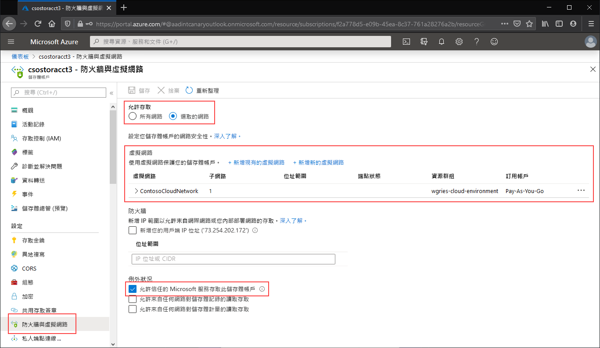

瀏覽至您想要將其公用端點限制為特定虛擬網路的儲存體帳戶。 在儲存體帳戶的目錄中，選取 [ **網路**]。 

在頁面頂端，選取 [選取的網路] 選項按鈕。 這會將一些設定取消隱藏，以控制公用端點的限制。 按一下 [+ 新增現有虛擬網路]，以選取已允許透過公用端點存取儲存體帳戶的特定虛擬網路。 這將需要選取虛擬網路和該虛擬網路的子網路。 

請核取 [允許受信任的 Microsoft 服務存取此服務帳戶]，以允許受信任的第一方 Microsoft 服務 (例如 Azure 檔案同步) 來存取儲存體帳戶。

